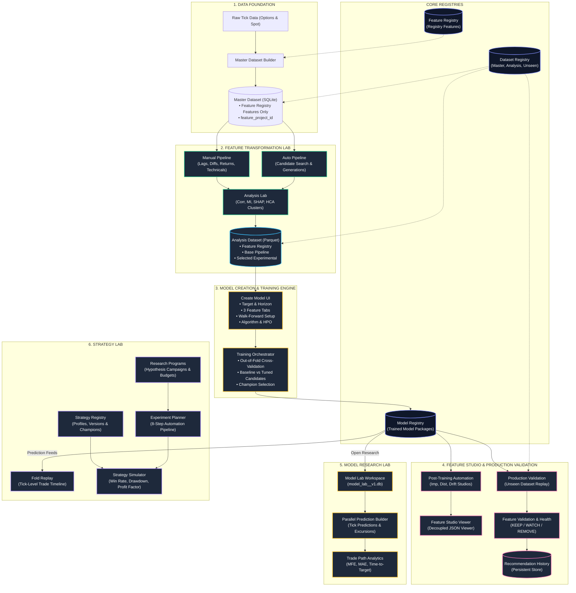
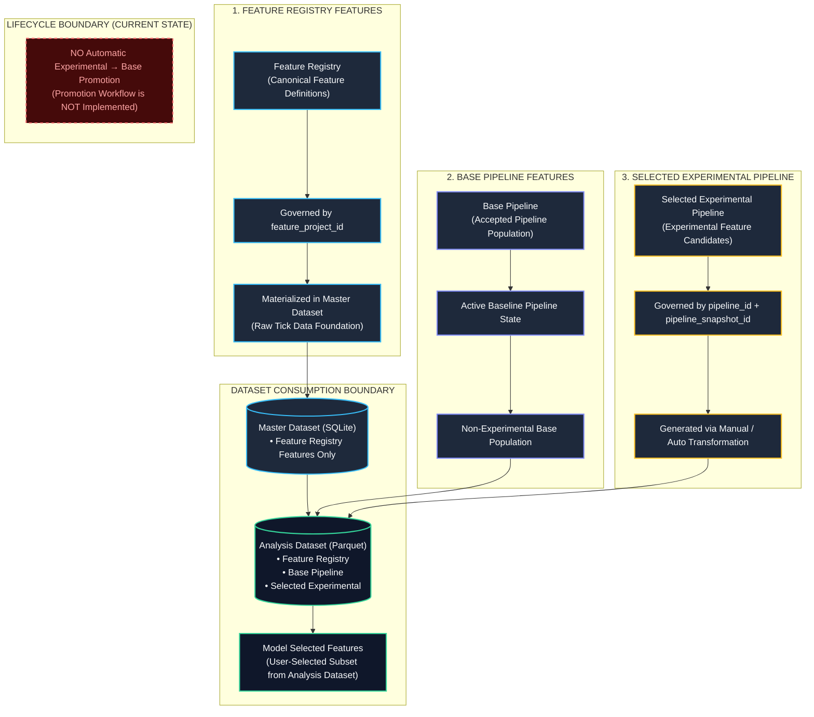
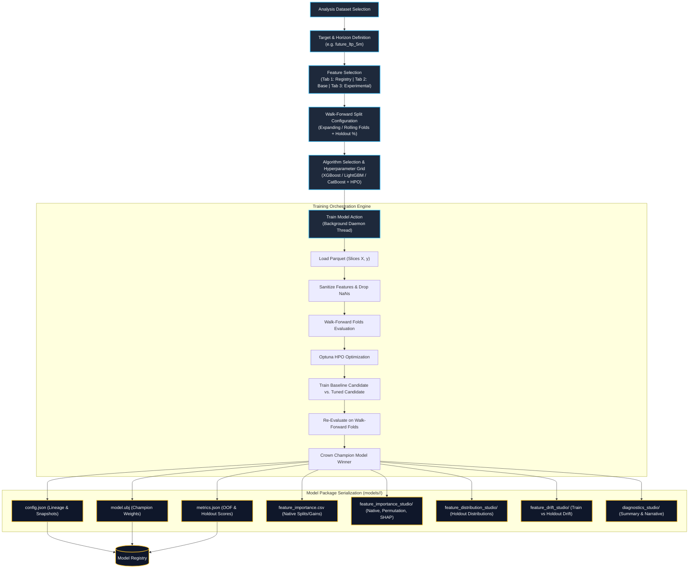
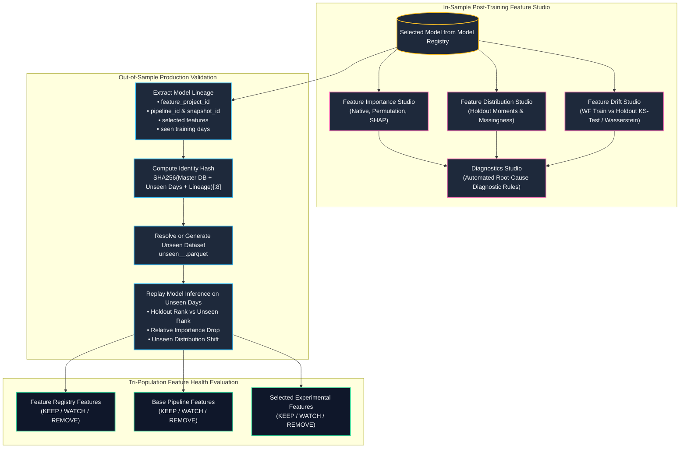
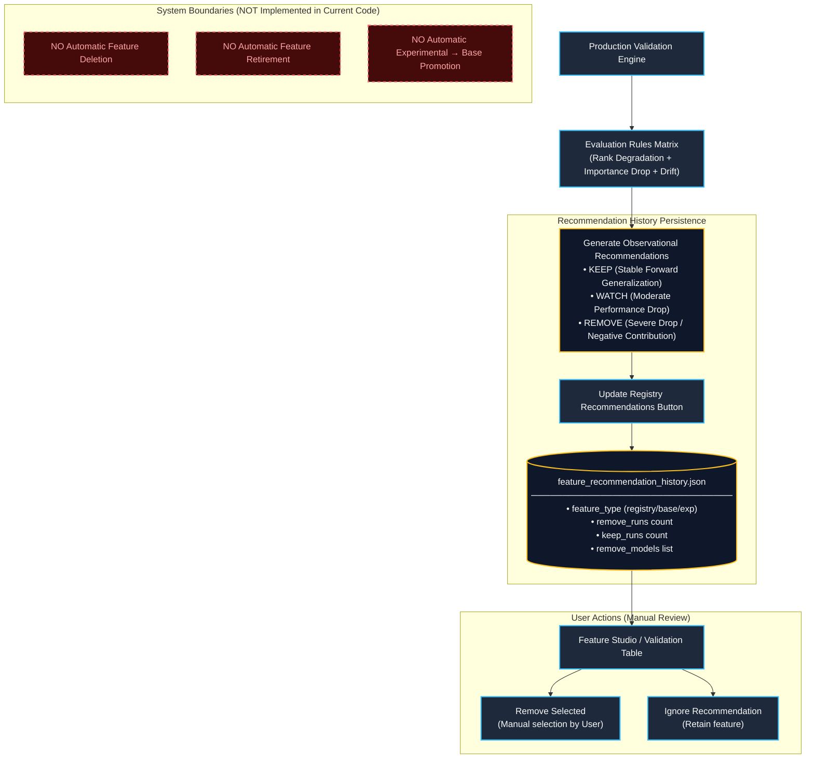
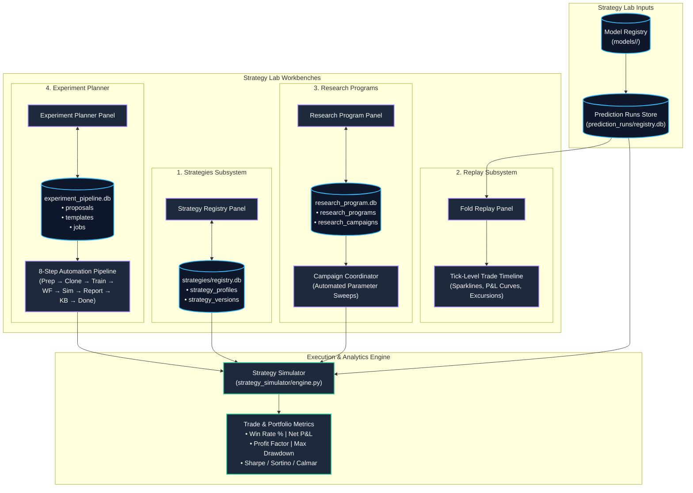
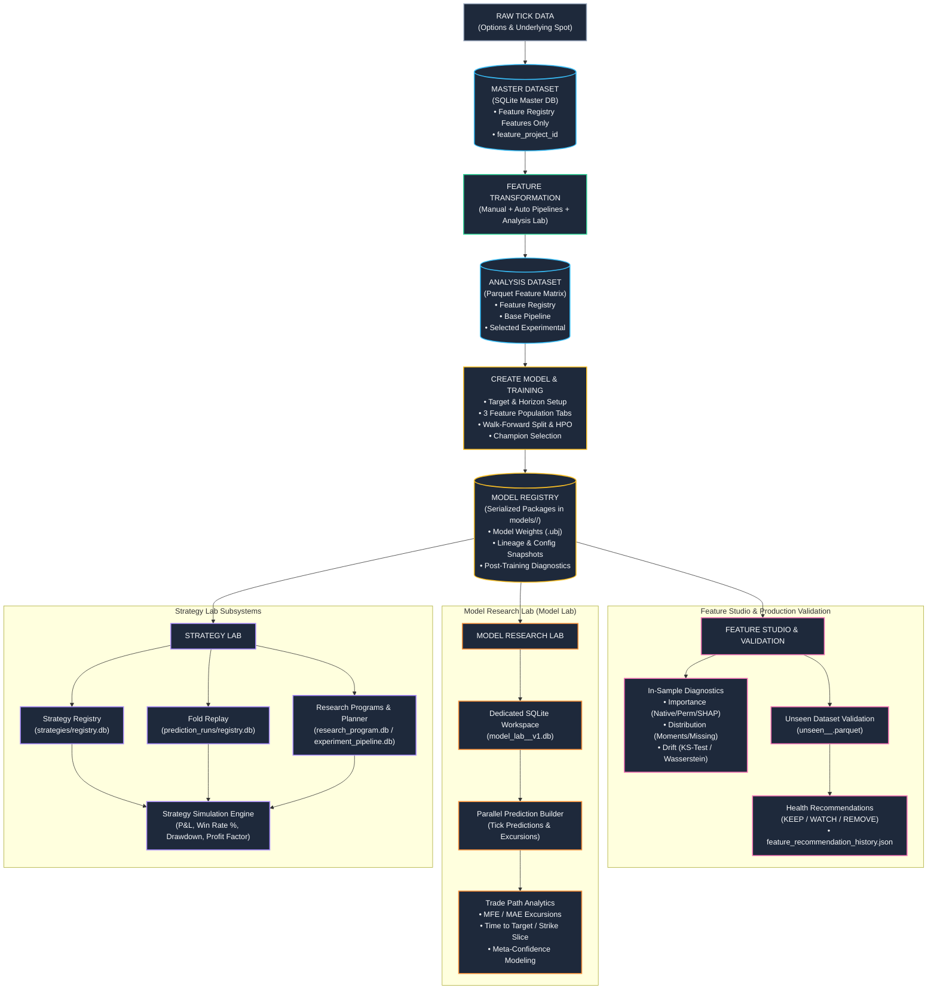

# AruMLStudio — Complete Visual System Architecture

---

## 1. Complete System Architecture Overview

---

## 2. Complete End-to-End Data Lifecycle

```mermaid
flowchart LR
    classDef stage fill:#1e293b,stroke:#38bdf8,stroke-width:2px,color:#f8fafc;
    classDef artifact fill:#0f172a,stroke:#34d399,stroke-width:2px,color:#f8fafc;

    RAW["Raw Tick Data\n(Quotes & Spreads)"]:::stage
    MASTER["Master Dataset\n(SQLite)\n─────────────\nFeature Registry\nFeatures Only"]:::artifact
    FT["Feature\nTransformation\n(Manual + Auto)"]:::stage
    ANALYSIS["Analysis Dataset\n(Parquet)\n─────────────\n• Registry Features\n• Base Pipeline\n• Selected Experimental"]:::artifact
    CREATE["Create Model\n(Feature Selection\n& WF Split)"]:::stage
    TRAIN["Training &\nWalk-Forward"]:::stage
    MODEL_PKG["Model Package\n(models/<name>/)\n─────────────\n• Weights (.ubj)\n• Lineage (config.json)\n• Diagnostics Artifacts"]:::artifact
    CONSUMERS["Downstream Consuming Studios\n─────────────\n• Feature Studio\n• Production Validation\n• Model Research Lab\n• Strategy Lab"]:::stage

    RAW --> MASTER
    MASTER --> FT
    FT --> ANALYSIS
    ANALYSIS --> CREATE
    CREATE --> TRAIN
    TRAIN --> MODEL_PKG
    MODEL_PKG --> CONSUMERS
```

---

## 3. The Three Distinct Feature Populations

---

## 4. Model Creation &rarr; Training &rarr; Model Registry

---

## 5. Model Registry &rarr; Feature Studio &rarr; Unseen Validation

---

## 6. Feature Recommendation Lifecycle (Current Implementation)

---

## 7. Strategy Lab Architecture & Subsystems

---

## 8. Complete AruMLStudio Master System Map

