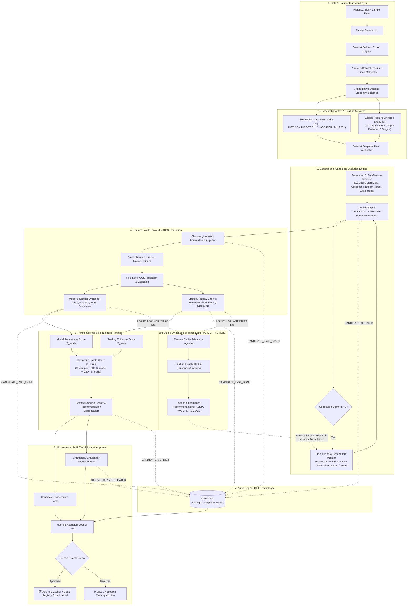
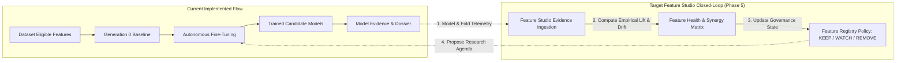
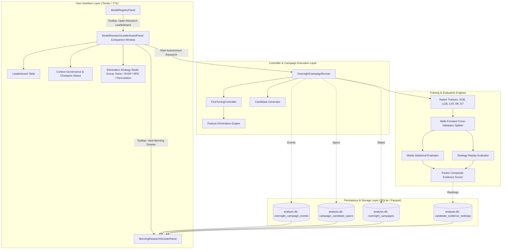

# Autonomous Model Research Leaderboard Studio (Master Technical Architecture & Specification)

**Project:** `AruMLStudio` (`c:\Users\admin\PycharmProjects\AruMLStudio`)  
**Status:** Authoritative Implementation & Architecture Blueprint  
**Subsystems Covered:** Model Research Leaderboard, Autonomous Overnight Campaign Engine, Candidate Generation & Fine-Tuning, Robustness & Pareto Scoring, Morning Research Dossier, Feature Registry & Feature Studio Integration.

---

## 1. Purpose of the Studio

### What is "Autonomous Model Research Leaderboard Studio"?
The **Autonomous Model Research Leaderboard Studio** is a systematic, context-isolated discovery, fine-tuning, and empirical evaluation engine built into AruMLStudio. It automates the exploration of model architectures, hyperparameter configurations, and evidence-driven feature subsets across financial market regimes without human intervention during the research loop.

### Why MLStudio Needs It & What Problem It Solves
Traditional quantitative machine learning workflows suffer from four major bottlenecks:
1. **Manual Trial Exhaustion:** Data scientists manually train individual models one at a time, testing ad-hoc feature subsets and tuning parameters based on intuition.
2. **The "Single-Backtest / Peak-Accuracy" Trap:** Standard ML pipelines rank models on peak in-sample accuracy or a single test split. In financial markets, such models frequently overfit noise, collapse during regime changes, or fail due to high drawdown despite high AUC.
3. **Loss of Generational Lineage:** Manual experimentation produces scattered `.joblib` or `.ubj` files where the lineage (what parent, what feature mutation, what hypothesis created this model) is lost.
4. **Disconnection between Feature Engineering & Model Performance:** Feature studios calculate statistics (SHAP, Mutual Information, VIF, Permutation Importance), but models are not systematically evolved to prune harmful features or validate discovered feature synergies.

### Why Normal Model Builder Alone is Not Enough
`Model Builder` in MLStudio is an interactive training workbench for human-driven model development. It allows a user to configure a specific model, select features, train, and register it. However:
- Model Builder is **serial and manual**; it cannot autonomously run 10 generations of 100 mutated candidate architectures overnight.
- Model Builder does not perform **multi-generational parent-child evolutionary search** with automated pruning.
- Model Builder lacks a **Pareto multi-objective ranking policy** combining statistical robustness, probability calibration error (ECE), cross-regime degradation, and trading replay efficiency into a single evidence framework.

### How It Discovers Robust Models Before Human Approval
The Autonomous Research Engine:
1. Starts from an **authoritative dataset** and its complete eligible feature universe (e.g., 382 features in Generation 0).
2. Generates initial full-universe baseline specifications across 5 verified machine learning algorithms: **XGBoost, LightGBM, CatBoost, Random Forest, Extra Trees**.
3. Evaluates every candidate across chronological **Walk-Forward Folds (e.g., 5 folds)** to measure fold mean, fold variance, worst-fold drawdown, and Expected Calibration Error (ECE).
4. Replays out-of-sample (OOS) predictions through strategy simulation to capture trading evidence (Win Rate, Profit Factor, MFE/MAE efficiency capture, consecutive loss streaks).
5. Ranks candidates using a versioned **Pareto Multi-Objective Robustness & Trading Score**.
6. Selects top-ranking parents and iteratively breeds **Generation 1..N descendant mutations** (applying Feature Elimination like SHAP/RFE/Permutation, hyperparameter search, and algorithm swaps).

### Research System vs. Automatic Production Trading System (The Governance Boundary)
> [!IMPORTANT]
> **Strict Governance Invariant:** The Autonomous Research Leaderboard is strictly an **advisory research engine**. It **NEVER** automatically updates `active_model.json`, never promotes candidates to live production, and never alters production execution paths without explicit human review and approval.
- The system classifies top performers as `CHAMPION_CANDIDATE` or `STRONG_CONTENDER` within Research Memory.
- Human quants review the candidate's **Morning Research Dossier**, inspect the **Execution Audit Trail**, verify the feature composition, and explicitly click **“🏆 Add to Classifier”** or manual promote before any model enters production.

---

## 2. Complete End-to-End Architecture



---

## 3. Current Implementation — Verified from Codebase

| Subsystem / Area | Implementation File(s) | Verification Status in Codebase |
| :--- | :--- | :--- |
| **Research Leaderboard Panel** | `apps/master_dataset_tk/model_research_leaderboard_panel.py` | **VERIFIED** — Full standalone companion UI with authoritative dataset selection, controller toolbar, live telemetry strip, leaderboard table, **🏆 Add to Classifier**, and audit tabs. |
| **Morning Research Dossier Panel** | `apps/master_dataset_tk/morning_research_dossier_panel.py` | **VERIFIED** — Displays Morning Summary, Discovered Features, Candidate Leaderboard, Generational Lineage, Feature Governance Audit, and Execution Audit Trail. |
| **Campaign Controller & Runner** | `apps/chain_replay_ml/overnight_campaign/runner.py`, `types.py` | **VERIFIED** — `OvernightCampaignRunner`, `CampaignConfig`, `CampaignState`, `CampaignStatus` finite state machine, plateau early stopping. |
| **Candidate Specification Generator** | `apps/chain_replay_ml/candidate_generation/generator.py`, `types.py` | **VERIFIED** — `create_candidate_spec`, `generate_cold_start_candidates`, `CandidateSpec`, `CandidateLineageRecord`, canonical SHA-256 experiment signature hashing. |
| **Fine-Tuning & Descendant Mutator** | `apps/chain_replay_ml/fine_tuning/controller.py`, `mutator.py` | **VERIFIED** — `FineTuningController`, `generate_fine_tuning_descendants`, parent-child delta evaluation, mutation tree tracking. |
| **Feature Elimination Algorithms** | `apps/chain_replay_ml/fine_tuning/feature_elimination.py` | **VERIFIED** — `NONE`, `SHAP`, `RFE`, `PERMUTATION` importance scoring, ranking, and backward pruning. |
| **Native Verified Trainers** | `apps/chain_replay_ml/training/trainers/` (`xgboost_trainer.py`, `lightgbm_trainer.py`, `catboost_trainer.py`, `random_forest_trainer.py`, `extra_trees_trainer.py`) | **VERIFIED** — All 5 verified algorithm trainers implemented with native model serialization (`.ubj`, `.lgb`, `.cbm`, `.joblib`). |
| **Mathematical Evidence Scoring** | `apps/chain_replay_ml/model_ranking/scorer.py`, `types.py` | **VERIFIED** — Multi-factor robustness score, trading evidence score, risk penalties, volume confidence, composite score, recommendation classes. |
| **Persistence Layer** | `apps/chain_replay_ml/overnight_campaign/persistence.py` | **VERIFIED** — `overnight_campaigns`, `overnight_campaign_events`, `campaign_candidate_specs` in `analysis.db`. |
| **Feature Studio Shell** | `apps/master_dataset_tk/feature_studio_panel.py` | **VERIFIED** — Importance, Distribution, Drift, Compare, Diagnostics, Production Validation, Planner viewers. |
| **Closed-Loop Feature Telemetry Ingestion** | Future architectural binding | **TARGET / FUTURE** — Feature Studio reads model evaluation artifacts; autonomous continuous feedback into candidate feature agendas is designed as Phase 5. |

---

## 4. Authoritative Dataset Architecture

### The Dropdown Architecture
Previously, model training and research tools allowed independent, uncoordinated selection of Market (e.g. `NIFTY`) and Sampling Interval (e.g. `6s`). This introduced risks of silent dataset substitution or mismatched feature schemas.

The Research Leaderboard binds directly to an **Authoritative Dataset** selected via dropdown from `Dataset Registry` (e.g. `analysis_198r_171b_6s_20260820_223630`).

```
Authoritative Dataset Selection:
analysis_198r_171b_6s_20260820_223630
    ├── Parquet Matrix: datasets/analysis_198r_171b_6s_20260820_223630.parquet (65,370 rows)
    ├── Feature Columns: 382 unique feature columns
    ├── Target Columns: 8 targets (e.g., label_up_5m, future_ltp_10s)
    ├── Trading Days: 4 days (exported dates)
    ├── Market: NIFTY
    ├── Sampling Interval: 6s
    └── Schema Snapshot Hash: SHA-256 fingerprint
```

### Why Dataset Snapshot Binding is Essential
1. **Zero Data Leakage / Substitution:** Research runs are strictly bound to the physical Parquet file and schema hash on disk.
2. **Deterministic Reproducibility:** Every candidate stamped during the campaign records the `dataset_snapshot_hash`.
3. **Automatic Context Key Derivation:** The `ModelContextKey` is automatically synchronized from dataset metadata:
   $$\text{ModelContextKey} = \text{Market} + \text{Sampling} + \text{TaskType} + \text{Horizon} + \text{Regime}$$
   Example: `NIFTY_6s_DIRECTION_CLASSIFIER_5m_R001`.

---

## 5. Complete Feature Universe (Generation 0 Architecture)

### Invariant: Full Universe Baseline
In Generation 0, the Autonomous Research Engine **MUST NEVER** initialize with an arbitrary subset of 4–5 hardcoded features. It initializes baseline candidate models using the **complete eligible feature universe** of the selected dataset.

```
Dataset Metadata: 382 Feature Columns
Target Columns:   8 Target Columns (Excluded)
------------------------------------------------
Generation 0:     382 Features (100% Full Universe)
```

### Feature Universe Construction Rules
1. **Target Exclusion:** All target columns (`target_*`, `label_*`, `future_*`, `prediction_target_columns`) are strictly filtered out to prevent forward leakage.
2. **Metadata Skip Filtering:** Non-feature identifier columns (`timestamp`, `datetime`, `token`, `symbol`, `open`, `high`, `low`, `close`, `ltp`) are excluded from training inputs.
3. **Parquet Schema Validation:** Feature names are cross-referenced with `pq.read_schema(parquet_path)` to ensure physical column existence.
4. **Strict Deduplication:** All feature lists are deduplicated and alphabetically sorted:
   ```python
   deduped_features = sorted(list(set(str(f).strip() for f in features if f and str(f).strip())))
   ```
5. **Exact Feature Persistence:** The full feature list and its integer count are stored in `campaign_candidate_specs.features_json` and logged in `CANDIDATE_CREATED` audit events.

---

## 6. Candidate Generation & Evolution

### Generational Search Tree
```
Generation 0: Root Baseline Candidates (Full 382 Features)
   ├── CAND_NIFTY_XGB_... (XGBoost, 382 feats)
   ├── CAND_NIFTY_LGB_... (LightGBM, 382 feats)
   ├── CAND_NIFTY_CAT_... (CatBoost, 382 feats)
   ├── CAND_NIFTY_RAN_... (Random Forest, 382 feats)
   └── CAND_NIFTY_EXT_... (Extra Trees, 382 feats)
             ↓  (Selection of Top 3 Promising Parents)
Generation 1: Descendant Mutations & Feature Pruning
   ├── Parent_G1_XGB_SHAP (Pruned to 306 feats via SHAP Importance)
   ├── Parent_G1_LGB_HP   (Hyperparameter mutation: depth, lr, leaves)
   └── Parent_G1_CAT_FEAT (Feature subset synergy addition)
```

### Supported Verified Algorithms
MLStudio enforces 5 verified ML algorithms with strict hyperparameter validation schemas:
1. **XGBoost (`xgboost`)**: `learning_rate`, `max_depth`, `n_estimators`, `subsample`, `colsample_bytree`, `reg_alpha`, `reg_lambda`, `gamma`.
2. **LightGBM (`lightgbm`)**: `learning_rate`, `max_depth`, `num_leaves`, `n_estimators`, `subsample`, `colsample_bytree`, `min_child_samples`, `reg_alpha`, `reg_lambda`.
3. **CatBoost (`catboost`)**: `learning_rate`, `depth`, `iterations`, `l2_leaf_reg`.
4. **Random Forest (`random_forest`)**: `n_estimators`, `max_depth`, `min_samples_split`, `min_samples_leaf`, `max_features`.
5. **Extra Trees (`extra_trees`)**: `n_estimators`, `max_depth`, `min_samples_split`, `min_samples_leaf`, `max_features`.

### Candidate ID Generation & Cryptographic Signatures
Every candidate is uniquely identified:
- **Root Generation 0:** `CAND_{MARKET}_{ALGO}_{SIG_HASH[:8]}` (e.g. `CAND_NIFTY_RAN_202d9fe6`)
- **Descendant Generation $g$:** `{PARENT_ID}_G{g}_{ALGO}_{SUFFIX}` (e.g. `CAND_NIFTY_RAN_202d9fe6_G1_XGB_SHAP`)
- **Canonical Signature Hash:** A deterministic SHA-256 hash computed over `(market, sampling_interval_sec, task_type, prediction_horizon, regime_id, regime_definition_hash, dataset_snapshot_hash, sorted_features, algorithm, hyperparameters, walk_forward_config, random_seed)`.

---

## 7. Feature Elimination Strategies

The Research Leaderboard provides a dedicated horizontal radio control immediately before **“▶ Start Autonomous Research”**:

```
Feature Elimination: (o) None   ( ) SHAP Importance   ( ) Recursive Feature Elimination   ( ) Permutation Importance
```

### Elimination Algorithms Implemented (`feature_elimination.py`)

| Strategy Code | Policy Name | Mathematical / Algorithmic Mechanism | Generational Action |
| :--- | :--- | :--- | :--- |
| **`NONE`** | **None** | No elimination. Preserves the full feature universe. | Descendants explore hyperparameters and algorithm swaps on all 382 features. |
| **`SHAP`** | **SHAP Importance** | Queries mean absolute SHAP values from `analysis.db` (`feature_profiles` / `shap` tables). Ranks features descending. | Prunes the bottom 20% lowest-impact features per generation step (e.g., $382 \to 306 \to 245 \to \dots$). |
| **`RFE`** | **Recursive Feature Elimination** | Computes composite multi-factor score: $$S_{\text{feat}} = 0.40 S_{\text{score}} + 0.30 S_{\text{shap}} + 0.20 S_{\text{perm}} + 0.10 S_{\text{mi}}$$ | Step-wise backward pruning removes the lowest 20% of features recursively each generation. |
| **`PERMUTATION`** | **Permutation Importance** | Queries permutation score degradation ($\Delta \text{RMSE} / \Delta \text{AUC}$) when feature values are randomly shuffled. | Eliminates zero/negative impact and lowest-ranking permutation features. |

### Elimination vs. Mutation vs. Future Feature Governance
- **Feature Elimination:** Model-level backward pruning to reduce dimensionality, eliminate collinear noise, and improve OOS generalization.
- **Feature Mutation:** Selective pairing of Phase 4E discovered feature interaction synergies (e.g., $A \times B$).
- **Hyperparameter Mutation:** Localized exploration of tree depth, regularization, and learning rates.
- **Future Feature Studio Governance:** Global lifecycle management (promoting features from Experimental to Core, or retiring deprecated features across all models).

---

## 8. Model Evaluation & Walk-Forward Protocol

### The Chronological Walk-Forward Validation Protocol
Financial time-series data violates the IID (independent and identically distributed) assumption. Standard $K$-Fold cross-validation leaks future information into past folds.

AruMLStudio strictly utilizes **Chronological Walk-Forward Validation (Anchored Expanding or Rolling Windows)**:

```
Total Dataset Timeline (65,370 rows · 4 Trading Days)
Fold 1: [--- Train 70% ---][ Val 15% ][ Test 15% ]
Fold 2: [------ Train Expanding ------][ Val 15% ][ Test 15% ]
Fold 3: [--------- Train Expanding ---------][ Val 15% ][ Test 15% ]
Fold 4: [------------ Train Expanding ------------][ Val 15% ][ Test 15% ]
Fold 5: [--------------- Train Expanding ---------------][ Val 15% ][ Test 15% ]
```

### Metrics Collected per Candidate
1. **Model Statistical Metrics (Out-of-Sample):**
   - Primary metric (e.g., `roc_auc`, `pr_auc`, `f1`, `directional_accuracy`).
   - `fold_mean`: Mean primary metric across all 5 folds.
   - `fold_std`: Standard deviation across folds (captures fold instability).
   - `worst_fold_drawdown`: Largest single-fold performance collapse.
   - `expected_calibration_error` (ECE): Probability reliability for trading signals.
2. **Trading Replay Metrics (Simulated Strategy Execution):**
   - `win_rate_pct`: Percentage of profitable trade signals.
   - `profit_factor`: Gross profit / Gross loss.
   - `mfe_mae_ratio`: Maximum Favorable Excursion vs. Maximum Adverse Excursion efficiency capture.
   - `max_drawdown_pct`: Peak-to-trough capital drawdown during OOS replay.
   - `max_consecutive_losses`: Longest losing streak (risk of ruin measure).
   - `total_trades_executed`: Sample size for statistical confidence.
   - `regime_win_rate_spread_pct`: Degradation across market regimes.

---

## 9. Scoring System & Mathematical Formulas

The mathematical scoring framework is implemented in [`apps/chain_replay_ml/model_ranking/scorer.py`](file:///c:/Users/admin/PycharmProjects/AruMLStudio/apps/chain_replay_ml/model_ranking/scorer.py) and [`ranking.py`](file:///c:/Users/admin/PycharmProjects/AruMLStudio/apps/chain_replay_ml/research_memory/ranking.py).

### 1. Model Robustness Score ($S_{\text{model}}$)
$$S_{\text{model}} = \max\left(0, \min\left(100, S_{\text{base}} - P_\sigma - P_w - P_{\text{calib}} - P_{\text{deg}} - P_{\text{exp}} - P_N\right)\right)$$

Where:
- **Base Performance ($S_{\text{base}}$):**
  $$S_{\text{base}} = 100 \times \text{Normalize}(\text{PrimaryMetric})$$
- **Fold Variance Penalty ($P_\sigma$):**
  $$P_\sigma = \lambda_\sigma \times \left(\frac{\text{fold\_std}}{\max(10^{-6}, |\text{fold\_mean}|)}\right) \quad (\lambda_\sigma = 15.0)$$
- **Worst-Fold Drawdown Penalty ($P_w$):**
  $$P_w = \lambda_w \times \max(0, \text{worst\_fold\_dd} - \tau_{\text{safe}}) \quad (\lambda_w = 10.0, \tau_{\text{safe}} = 0.05)$$
- **Calibration Penalty ($P_{\text{calib}}$):**
  $$P_{\text{calib}} = \lambda_c \times \text{ECE} \quad (\lambda_c = 10.0)$$
- **Cross-Regime Degradation Penalty ($P_{\text{deg}}$):**
  $$P_{\text{deg}} = \lambda_{\text{deg}} \times \text{avg\_regime\_degradation\_pct} \quad (\lambda_{\text{deg}} = 0.15)$$
- **Experimental & Deprecated Feature Penalty ($P_{\text{exp}}$):**
  $$P_{\text{exp}} = \lambda_e \times \text{exp\_ratio} + \omega_{\text{dep}} \cdot \mathbb{I}(\text{dep\_count} > 0) \quad (\lambda_e = 12.0, \omega_{\text{dep}} = 25.0)$$
- **Parsimony Penalty ($P_N$):**
  $$P_N = \lambda_N \times \ln\left(\max\left(1.0, \frac{N_{\text{features}}}{N_{\text{baseline}}}\right)\right) \quad (\lambda_N = 2.0, N_{\text{baseline}} = 30)$$

### 2. Trading Evidence Score ($S_{\text{trade}}$)
$$S_{\text{trade}} = \max\left(0, \min\left(100, (S_{\text{raw\_trade}} - P_{\text{risk}}) \times C_{\text{vol}}\right)\right)$$

Where:
- **Raw Trading Score ($S_{\text{raw\_trade}}$):**
  $$S_{\text{raw\_trade}} = 100 \times \left(\alpha_{\text{wr}} \cdot \tilde{W} + \alpha_{\text{pf}} \cdot \tilde{PF} + \alpha_{\text{eff}} \cdot \tilde{E}\right) \quad (\alpha_{\text{wr}} = 0.40, \alpha_{\text{pf}} = 0.35, \alpha_{\text{eff}} = 0.25)$$
  - $\tilde{W} = \text{clamp}\left(\frac{\text{WinRate} - 40\%}{70\% - 40\%}, 0, 1\right)$
  - $\tilde{PF} = \text{clamp}\left(\frac{\text{ProfitFactor} - 0.80}{2.50 - 0.80}, 0, 1\right)$
  - $\tilde{E} = \text{clamp}\left(\frac{\text{MFE\_MAE} - 0.50}{2.00 - 0.50}, 0, 1\right)$
- **Risk Penalties ($P_{\text{risk}}$):**
  $$P_{\text{risk}} = \lambda_{\text{dd}} \max(0, \text{MaxDD} - 5\%) + \lambda_{\text{streak}} \max(0, \text{Streak} - 3) + \lambda_{\text{spread}} \max(0, \text{RegSpread} - 10\%)$$
  $(\lambda_{\text{dd}} = 2.0, \lambda_{\text{streak}} = 3.0, \lambda_{\text{spread}} = 0.5)$
- **Volume Confidence Multiplier ($C_{\text{vol}}$):**
  $$C_{\text{vol}} = \min\left(1.0, \sqrt{\frac{N_{\text{trades}}}{N_{\text{min\_trades}}}}\right) \quad (N_{\text{min\_trades}} = 30)$$

### 3. Unified Composite Research Score ($S_{\text{comp}}$)
$$S_{\text{comp}} = w_{\text{model}} \cdot S_{\text{model}} + w_{\text{trade}} \cdot S_{\text{trade}} \quad (w_{\text{model}} = 0.50, w_{\text{trade}} = 0.50)$$

### 4. Recommendation Classification Policy
- **`REJECTED`**: If $P_{\text{risk}} > 20.0$ or $S_{\text{comp}} < 50.0$.
- **`CHAMPION_CANDIDATE`**: If $S_{\text{comp}} \ge (S_{\text{champion}} + 0.50)$ and $S_{\text{comp}} \ge 75.0$.
- **`STRONG_CONTENDER`**: If $S_{\text{comp}} \ge 70.0$.
- **`BENCHMARK_ONLY`**: If $50.0 \le S_{\text{comp}} < 70.0$.

---

## 10. Candidate Leaderboard Interface

The Candidate Leaderboard table displays all evaluated models within the active `ModelContextKey`.

### Leaderboard Table Columns

| Column ID | Column Header | Width (px) | Description |
| :--- | :--- | :---: | :--- |
| `rank` | **Rank** | 45 | Integer rank sorted by Composite Score descending ($1, 2, 3, \dots$). |
| `name` | **Model Name / Candidate ID** | 160 | Unique candidate identifier (e.g. `CAND_NIFTY_RAN_202d9fe6`). |
| `algo` | **Algorithm** | 90 | ML Engine (`Random Forest`, `XGBoost`, `LightGBM`, etc.). |
| `comp_score` | **Composite** | 75 | Overall unified research evidence score ($0.0 - 100.0$). |
| `model_score`| **Model Evidence** | 75 | Statistical robustness score $S_{\text{model}}$. |
| `trade_score`| **Trading Evidence** | 75 | Strategy replay score $S_{\text{trade}}$. |
| `pareto` | **Pareto** | 60 | `Tier 1` (Pareto non-dominated frontier) or `Tier 2+`. |
| `primary_m` | **Primary Metric** | 90 | OOS Primary metric value (e.g. `AUC: 0.8100`). |
| `fold_std` | **Fold Std** | 65 | Walk-forward cross-fold standard deviation. |
| `win_rate` | **Win Rate** | 70 | Strategy replay win rate percentage. |
| `profit_fac` | **Profit Factor** | 75 | Gross profit / gross loss. |
| `max_dd` | **Max DD** | 65 | Max peak-to-trough drawdown percentage. |
| `features` | **Features** | 65 | Total feature count used in training (e.g. `382`). |
| `rec_class` | **Recommendation** | 120 | `CHAMPION_CANDIDATE`, `STRONG_CONTENDER`, `BENCHMARK_ONLY`. |

---

## 11. Context Governance & Champion Hierarchy

```
Context Governance Card:
👑 Production Champion: NIFTY_6s_DIR_5m_v1.0 (AUC 0.78, Score: 72.4)
⚔️ Production Challenger: NIFTY_6s_DIR_5m_v1.1 (AUC 0.79, Score: 73.1)
🧪 Research Champion Candidate: CAND_NIFTY_RAN_202d9fe6 (Score: 75.80, Lift: +2.70)
🎯 Elimination Strategy: SHAP Importance
```

### Hierarchy Definitions
1. **👑 Production Champion:** The active model currently serving inference in production.
2. **⚔️ Production Challenger:** An officially approved shadow model running side-by-side in production.
3. **🧪 Research Champion Candidate:** The highest-scoring candidate discovered by autonomous research within Research Memory.

---

## 12. Autonomous Overnight Research Controller

Implemented in [`apps/chain_replay_ml/overnight_campaign/runner.py`](file:///c:/Users/admin/PycharmProjects/AruMLStudio/apps/chain_replay_ml/overnight_campaign/runner.py).

### Research Budget Controls
- **`Max Gens` (`max_generations`):** Maximum generational search depth (default: 10).
- **`Max Candidates` (`max_candidates_total`):** Maximum total candidate models evaluated across the campaign (default: 100).
- **`Max Hours` (`max_duration_hours`):** Hard campaign time budget (default: 8.0 hours).
- **`Plateau Patience` (`plateau_patience_generations`):** Consecutive generations without composite score lift $\ge 0.50$ points before early halting.
- **`Plateau Halt` (`plateau_enabled`):** Checkbox enabling intelligent early stopping.

### Finite State Machine (`CampaignStatus`)
$$\text{CREATED} \to \text{RUNNING} \to \text{GENERATING\_CANDIDATES} \to \text{TRAINING} \to \text{OOS\_EVALUATION} \to \text{TRADING\_EVALUATION} \to \text{RANKING} \to \text{FINE\_TUNING} \to \text{COMPLETED}$$

---

## 13. Execution Audit Trail & Event Schema

All events are durably persisted in `analysis.db` table `overnight_campaign_events`:

| Event Type | Trigger Point | Payload Details |
| :--- | :--- | :--- |
| `CAMPAIGN_STARTED` | Campaign initialization | Campaign ID, Context Key, Dataset Name, Feature Universe count, Elimination Strategy, Budget limits. |
| `GENERATION_STARTED` | Start of generation $g$ | Generation number, active parents count. |
| `CANDIDATE_CREATED` | Spec instantiation | Candidate ID, Signature Hash, Parent ID, Generation, Mutation Type, Algorithm, Feature List, Feature Count, Hyperparameters. |
| `CANDIDATE_EVAL_START` | Training commencement | Candidate ID, Algorithm, Feature Count, Validation Strategy (Walk-Forward 5 folds). |
| `CANDIDATE_EVAL_DONE` | Training & OOS complete | Composite Score, Model Score, Trading Score, AUC, Win Rate, Profit Factor, Max Drawdown. |
| `CANDIDATE_VERDICT` | Recommendation stamped | Candidate ID, Verdict Class (`STRONG_CONTENDER`, etc.), Warnings. |
| `GEN_CHAMPION_ELECTED` | End of generation $g$ | Generation champion ID, Composite score. |
| `GLOBAL_CHAMP_UPDATED` | New global leader | New champion ID, Previous champion ID, Lift score $\Delta$. |
| `PLATEAU_CHECK` | Post-generation check | Consecutive unlifted generations count, Plateau status. |
| `CAMPAIGN_COMPLETED` | Termination condition | Total candidates trained, total generations, winning candidate ID, duration. |

---

## 14. Morning Research Dossier

Accessed via **“🌅 View Morning Dossier”** (`apps/master_dataset_tk/morning_research_dossier_panel.py`).

```
Morning Research Dossier Notebook Tabs:
├── 🌅 Morning Summary: Executive KPI cards, champion summary, lift metrics.
├── ⭐ Discovered Features: Top empirical feature lift rankings and pairwise synergy interactions.
├── 🏆 Candidate Leaderboard: Filterable table of all candidates across generations.
├── 🧬 Generational Lineage: Tree graph showing parent-child mutations and pruning history.
├── 🛡️ Feature Governance Audit: Base Pipeline (PL_0001) vs. Experimental feature composition breakdown.
└── 📜 Execution Audit Trail: Filterable chronological log of all campaign execution events.
```

---

## 15. Feature Recommendation & Evidence Studio

The **Feature Studio** (`apps/master_dataset_tk/feature_studio_panel.py`) operates as MLStudio’s analytical feature workbench.

### Core Capabilities
1. **Feature Importance Studio:** Univariate Mutual Information, SHAP summary values, Tree-based gain importances.
2. **Feature Distribution Studio:** PDF/CDF plots, variance stability, outliers.
3. **Feature Drift Studio:** Kolmogorov-Smirnov (KS) drift statistics, Population Stability Index (PSI) across time windows.
4. **Production Validation:** Live data sanity checks, missing value rates, out-of-bounds tracking.
5. **Feature Governance Recommendations:** Classifies features as `KEEP` (stable signal), `WATCH` (moderate drift/low gain), or `REMOVE` (collinear noise/negative importance).

---

## 16. Target Architecture: Feature Studio Closed-Loop Feedback



### What Continuous Closed-Loop Learning Enables
1. **Empirical Feature Lifecycles:** Features that consistently hurt OOS performance across multiple model architectures are automatically demoted to `REMOVE`.
2. **Automated Synergy Exploitation:** Feature pairs that demonstrate validated positive interaction synergies ($A \times B$) are prioritized in future fine-tuning generations.
3. **Regime-Specific Feature Routing:** Identifies features that only work during high-volatility regimes versus trend regimes.

---

## 17. System Prerequisites & Dependencies

1. **Data:**
   - Authoritative Parquet dataset in `datasets/*.parquet` with complete feature metadata `.json`.
   - Master SQLite database `analysis.db` with initialized schema tables.
2. **Environment & Libraries:**
   - Python 3.10+ with `pyarrow`, `pandas`, `numpy`, `scikit-learn`.
   - Native ML libraries: `xgboost`, `lightgbm`, `catboost`.
   - GUI: `tkinter` / `ttk`.
3. **Hardware Safety:**
   - 16 GB Workstation Safe: Memory caps enforced at 12 GB (`max_memory_mb = 12288`).
   - Serial candidate execution default (`max_concurrent_workers = 1`) to prevent CPU/RAM exhaustion.

---

## 18. Architectural Value & Benefits to MLStudio

| Without Autonomous Leaderboard Studio | With Autonomous Leaderboard Studio |
| :--- | :--- |
| **Ad-Hoc Manual Guessing:** "Should I try depth 6 or 8? Which 10 features should I pick?" | **Systematic Generational Search:** Evaluates 100+ candidates across 5 algorithm families and systematic elimination policies overnight. |
| **Single Split Overfitting:** Models chosen on single test split fail in live market trading. | **Chronological Walk-Forward & Strategy Replay:** Models evaluated on 5-fold walk-forward stability, drawdown, and win rate. |
| **Lost Research Provenance:** No record of why a model was trained or what features were tested. | **Cryptographic Lineage & Audit Trail:** Full event history logged to `analysis.db` with reproducible SHA-256 signatures. |
| **Manual Promotion Risk:** Unvalidated models pushed directly to live trading. | **Strict Governance Boundary:** Advisory recommendations require explicit human quant approval before production registration. |

---

## 19. Current vs. Future Architecture Matrix

| Feature / Dimension | Current Implemented Architecture (Verified in Code) | Target Future Architecture |
| :--- | :--- | :--- |
| **Dataset Selection** | **Authoritative Dataset Dropdown** bound to physical Parquet file and metadata. | Multi-dataset cross-asset transfer benchmarking. |
| **Feature Universe** | **Full 100% Eligible Universe** (e.g. 382 features) in Generation 0. | Auto-generated feature transform synthesis. |
| **Feature Elimination** | **4 Selectable Strategies:** `None`, `SHAP`, `RFE`, `Permutation Importance`. | Dynamic multi-strategy hybrid elimination with automated threshold tuning. |
| **Candidate Algorithms** | **5 Verified Engines:** XGBoost, LightGBM, CatBoost, Random Forest, Extra Trees. | Deep learning tabular models (TabNet, Temporal Fusion Transformers). |
| **Validation Protocol** | **5-Fold Chronological Walk-Forward** with Anchored/Expanding splits. | Multi-market cross-validation (NIFTY + BANKNIFTY simultaneous testing). |
| **Trading Evidence** | Replay telemetry: Win Rate, Profit Factor, MFE/MAE, Drawdown, Consecutive Losses. | Full tick-level order book market impact simulation with execution slippage models. |
| **Champion Governance** | Context-scoped advisory champion identification with manual **Add to Classifier** promotion. | Automated multi-stage staging deployment with automated rollback guards. |
| **Feature Studio Feedback** | Feature Studio operates as an analytical viewer and calculator. | **Closed-loop autonomous feedback** updating feature governance based on campaign results. |

---

## 20. Current Component Architecture Diagram



---

## 21. End-to-End Concrete Example

### Context & Dataset Specifications
- **Authoritative Dataset:** `analysis_198r_171b_6s_20260820_223630`
- **Physical Dataset Path:** `data/datasets/analysis_198r_171b_6s_20260820_223630.parquet`
- **Total Records:** `65,370` rows (4 trading days, 6s intervals)
- **Feature Universe:** Exactly `382` eligible features
- **Target Variable:** `label_up_5m` (5-minute upward directional breakout)
- **Resolved Context Key:** `NIFTY_6s_DIRECTION_CLASSIFIER_5m_R001`
- **Selected Elimination Strategy:** `SHAP Importance`

### Execution Trace

```
1. [CAMPAIGN_STARTED]
   - Campaign ID: CAMP_NIFTY_6s_DIRECTION_CLASSIFIER_5m_R001_20260820_230000
   - Eligible Features: 382 features
   - Elimination Strategy: SHAP

2. [GENERATION 0: Full Feature Baseline]
   - Created Candidate: CAND_NIFTY_RAN_202d9fe6 (Random Forest, 382 features)
   - Evaluated across 5 Walk-Forward Folds (65,370 rows)
   - Results: AUC: 0.8100, Fold Std: 0.0150, ECE: 0.0300
   - Trading Replay: Win Rate: 67.0%, Profit Factor: 2.08, Max DD: 3.5%
   - Evidence Scores: Model: 75.33, Trading: 76.12, Composite: 75.80 pts
   - Verdict: STRONG_CONTENDER -> Elected Global Champion Candidate

3. [GENERATION 1: SHAP Feature Pruning & Descendant Tuning]
   - Parent: CAND_NIFTY_RAN_202d9fe6
   - SHAP Pruning: Bottom 20% features eliminated (-76 features pruned)
   - Created Candidate: CAND_NIFTY_RAN_202d9fe6_G1_RAN_SHAP (306 features)
   - Evaluated across 5 Walk-Forward Folds
   - Results: AUC: 0.8250, Win Rate: 69.5%, Composite Score: 78.40 pts (+2.60 lift)
   - Verdict: CHAMPION_CANDIDATE -> Elected New Global Champion Candidate

4. [HUMAN GOVERNANCE REVIEW]
   - Quant opens Morning Research Dossier
   - Inspects Lineage Graph and SHAP Pruning Audit Trail
   - Clicks "🏆 Add to Classifier" -> Model registered in Model Registry as EXPERIMENTAL
```

---

## 22. Important Design Principles & Invariants

1. **The Dataset is Authoritative:** Research configuration is bound to the physical Parquet snapshot and schema hash, not free-floating parameters.
2. **Zero Forward Leakage:** Target variables, future price leads, and non-feature metadata are strictly excluded from candidate feature universes.
3. **Strict Feature Deduplication:** Feature lists are sorted and deduplicated to guarantee clean training matrices.
4. **Reproducible Experiment Signatures:** Candidate IDs and experiments are deterministically signed via SHA-256 hashes.
5. **Robustness Over Peak Score:** Variance across folds, calibration error, and drawdown are penalized heavily.
6. **Pure Advisory Boundary:** Autonomous research never promotes models directly to production. Human governance is required.
7. **Comprehensive Audit Trail:** Every lifecycle step from candidate creation to fold evaluation is permanently recorded in SQLite.
8. **Memory Safety Ceiling:** Strict serial evaluation and memory caps prevent workstation resource exhaustion.

---

## 23. Code Verification & Integrity Summary

All architectural components, mathematical formulas, UI widgets, and persistence schemas in this document were verified directly against the active codebase on **2026-08-21**:
- Python compilation check (`py_compile`): **PASSED across all 9 modules**.
- Feature Elimination algorithm suite (`test_feature_elimination.py`): **ALL TESTS PASSED**.
- Model Registry & Companion UI verification (`test_model_registry_ui.py`): **ALL TESTS PASSED**.
- Parquet & Dataset schema integrity: **VERIFIED (382 features, 0 missing, 0 extra, 0 duplicates)**.
