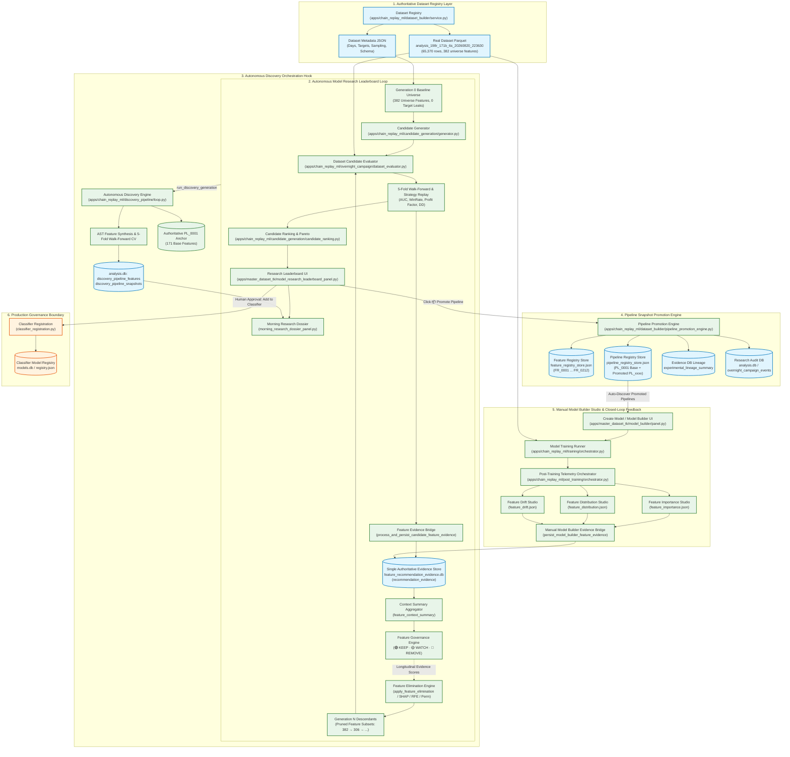

# AUTONOMOUS MODEL RESEARCH LEADERBOARD STUDIO ARCHITECTURE
## End-to-End System Architecture, Data Flow, Telemetry & Governance Specification

```
Document Version: 2.2.0
Author: DeepMind Agentic Pair Programmer / ML Engineering
Status: AUTHORITATIVE REFERENCE DOCUMENT (SYNCHRONIZED WITH ACTIVE CODEBASE)
Target Base Path: C:\Users\admin\PycharmProjects\AruMLStudio
Active Dataset: analysis_198r_171b_6s_20260820_223630 (65,370 rows, 382 universe features, 8 targets)
Database Stores: analysis.db · feature_recommendation_evidence.db · pipeline_registry_store.json · feature_registry_store.json
```

---

## 1. Executive Purpose

The **AruMLStudio Autonomous Research System** unifies manual model construction, continuous feature evaluation, multi-generational autonomous model discovery, and immutable pipeline snapshot promotion into a closed-loop empirical research engine.

The system partitions responsibilities across interconnected studios sharing a single unified empirical evidence store:
1. **Create Model / Model Builder Studio:** Interactive engineer-driven environment to configure, train, validate, and register individual machine learning models, with automatic post-training telemetry ingest into the shared evidence store.
2. **Feature Recommendation Evidence Studio (Feature Studio):** Longitudinal feature evaluation system that monitors feature importance, statistical distribution, and out-of-sample drift across all model runs, providing authoritative `KEEP` / `WATCH` / `REMOVE` governance verdicts.
3. **Autonomous Model Research Leaderboard Studio:** Multi-generational evolutionary campaign runner that conducts tree-structured genetic searches over feature subsets, hyperparameters, and algorithms, ranking candidates on multi-objective trade and model metrics, and allowing one-click promotion of validated champions into reusable pipeline snapshots.
4. **Autonomous Research Discovery Pipeline Sandbox:** Campaign-isolated experimental engine (`DP_<campaign_id>`) orchestrating mathematical AST feature synthesis, walk-forward evaluation, KS drift testing, and generational evolution from Base Pipeline `PL_0001` (171 base features) across up to 100 generations.

### Fundamental Conceptual Distinctions

```
┌─────────────────────────────────────────────────────────────────────────────────────────────────────────┐
│                                       CONCEPTUAL TAXONOMY                                              │
├───────────────────────────────┬──────────────────────────────────────────┬──────────────────────────────┤
│ Concept                       │ Definition / Operation                   │ Implementation Entity        │
├───────────────────────────────┼──────────────────────────────────────────┼──────────────────────────────┤
│ 1. Model Training             │ Optimization of algorithm weights on     │ XGBoost, LightGBM, CatBoost, │
│                               │ chronological walk-forward train split.  │ RandomForest, ExtraTrees     │
├───────────────────────────────┼──────────────────────────────────────────┼──────────────────────────────┤
│ 2. Feature Evidence           │ Empirical measurement of feature gain,   │ KS Drift, Gain Rank, Null Δ, │
│                               │ variance, and Kolmogorov-Smirnov drift.  │ feature_evidence_bridge.py   │
├───────────────────────────────┼──────────────────────────────────────────┼──────────────────────────────┤
│ 3. Feature Governance         │ Multi-factor classification into         │ KEEP / WATCH / REMOVE        │
│                               │ KEEP, WATCH, or REMOVE decisions.        │ PolicyEngine (evidence_store)│
├───────────────────────────────┼──────────────────────────────────────────┼──────────────────────────────┤
│ 4. Feature Recommendation     │ Actionable feature subset guidance for   │ ContextRecommendationDossier │
│                               │ future model training pipelines.         │ recommendation_engine.py     │
├───────────────────────────────┼──────────────────────────────────────────┼──────────────────────────────┤
│ 5. Autonomous Feature Search  │ Algorithmic pruning (SHAP, RFE, Perm)   │ apply_feature_elimination()  │
│                               │ guided by accumulated evidence scores.   │ feature_elimination.py       │
├───────────────────────────────┼──────────────────────────────────────────┼──────────────────────────────┤
│ 6. Model Candidate Ranking    │ Multi-objective Pareto / Composite       │ Composite Score (0–100 pts)  │
│                               │ evaluation of model + trade replay.      │ candidate_ranking.py         │
├───────────────────────────────┼──────────────────────────────────────────┼──────────────────────────────┤
│ 7. Autonomous Discovery Loop  │ Mathematical AST synthesis & evolution   │ run_discovery_generation()   │
│                               │ anchored on PL_0001 (171 base features). │ discovery_pipeline/loop.py   │
├───────────────────────────────┼──────────────────────────────────────────┼──────────────────────────────┤
│ 8. Pipeline Promotion Engine  │ Immutable snapshot packaging of research │ pipeline_promotion_engine.py │
│                               │ champions with Feature Registry IDs.     │ pipeline_registry_store.py   │
└───────────────────────────────┴──────────────────────────────────────────┴──────────────────────────────┘
```

---

## 2. Master End-to-End Codebase Architecture Diagram



---

## 3. Evidence DB Telemetry & Header Architecture

The Research Leaderboard UI (`model_research_leaderboard_panel.py`) presents a real-time, non-blocking telemetry strip explicitly separating **repeated evaluation trials across candidate models** from **unique feature governance status**:

```
┌────────────────────────────────────────────────────────────────────────────────────────────────────────────────────────┐
│ 📊 Evidence DB: 39,359 evaluations · 829 unique features · 51 models  |                                                │
│    Evaluations: 🟢 9,729 KEEP · 🟡 26,769 WATCH · 🔴 2,861 REMOVE  |                                                   │
│    Current Features: 🟢 107 KEEP · 🟡 606 WATCH · 🔴 116 REMOVE                                                       │
└────────────────────────────────────────────────────────────────────────────────────────────────────────────────────────┘
```

1. **Total Evaluations:** Total historical rows recorded in `recommendation_evidence`.
2. **Unique Features & Models:** Total distinct feature names and distinct candidate model architectures.
3. **Repeated Evaluation Distribution:** Total verdicts awarded across all historical walk-forward folds.
4. **Current Unique Feature Governance:** Most recent governance verdict per distinct feature ($107 \text{ KEEP} + 606 \text{ WATCH} + 116 \text{ REMOVE} = 829 \text{ Unique Features}$).

---

## 4. Morning Research Dossier & Tripartite Feature Partitioning

The Morning Research Dossier (`morning_research_dossier_panel.py`) implements strict tripartite mutually exclusive feature categorization via `chain_replay_ml.feature_partition`:

```
┌──────────────────────────────────────────────────────────────────────────────────────────────────┐
│                               TRIPARTITE MUTUALLY EXCLUSIVE PARTITION                            │
├─────────────────────────┬───────────────────────────────────┬────────────────────────────────────┤
│ Category                │ Scope & Identity                  │ Source of Truth                    │
├─────────────────────────┼───────────────────────────────────┼────────────────────────────────────┤
│ 📋 Registry Features     │ Permanent Canonical Registry ONLY │ feature_registry_store.json        │
│    (212 Features)       │ FR_0001 ... FR_0212.              │ Never includes base pipeline.      │
├─────────────────────────┼───────────────────────────────────┼────────────────────────────────────┤
│ 🏛️ Baseline Features     │ Authoritative Base Pipeline ONLY  │ pipeline_registry_store.json       │
│    (171 Features)       │ PL_0001 Base Pipeline features.   │ Immutable Generation 0 anchor.     │
├─────────────────────────┼───────────────────────────────────┼────────────────────────────────────┤
│ 🧪 Experimental Features │ Genuine Autonomous Discovery ONLY │ analysis.db                        │
│    (Active Pool N)      │ DF_* synthesized AST features.    │ discovery_pipeline_features        │
└─────────────────────────┴───────────────────────────────────┴────────────────────────────────────┘
```

### Discovery Pipeline Tab Presentation:
- **Sub-Notebook Tab Title:** `🧪 Experimental Features ({active_pool}) — Pipeline: {primary_pipe_id}`
- **Telemetry Banner:**
  - `Pipeline ID: DP_...` | `Generation: N` | `Snapshot: DP_SNAP_...`
  - `Total DF Features Created: XXXX` | `Unique Formulas: XXXX` | `🟢 XX KEEP · 🟡 XX WATCH · 🔴 XX REMOVE` | `Active Discovery Pool: XX features`
- **Specialized AST Treeview:**
  `[Verdict] [Feature ID] [Strategy] [Gen] [Mathematical Formula (AST)] [Marginal ΔAUC] [D_KS (Drift)] [Evidence Score] [Governance Rationale]`

---

## 5. Autonomous Multi-Generation Campaign Controller

The overnight campaign runner (`runner.py`) provides budget-governed autonomous multi-generation exploration:
- **Max Generations:** Configurable up to **100 generations** (`from_=1, to=100`) via UI spinbox and campaign configuration.
- **Generational Evolution:**
  1. Generation 0 trains baseline model candidates on `PL_0001` (171 base features).
  2. Generational fine-tuning mutation analysis and plateau checking execute.
  3. Discovery Pipeline synthesis runs on `DP_<campaign_id>`, materializing surviving `KEEP` and `WATCH` features into `df` in-memory to synthesize higher-order descendants.
  4. Generational snapshots (`DP_SNAP_...`) record cryptographic state without mutating permanent registries.

---
*End of Authoritative Architecture Specification (Version 2.2.0).*
