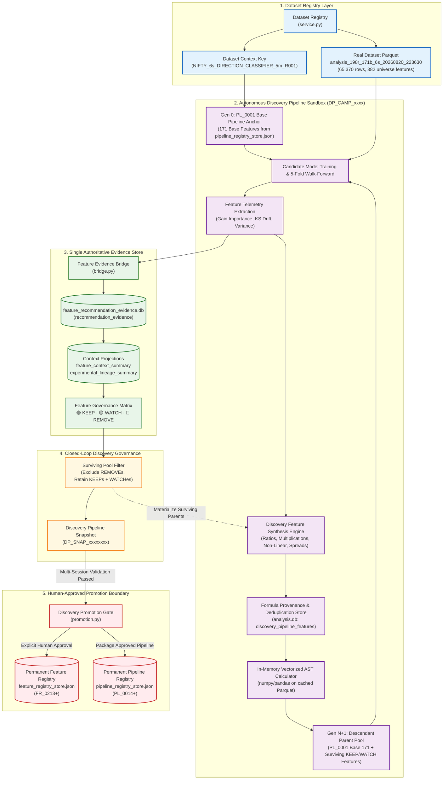
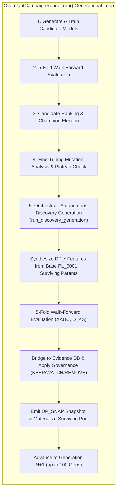

# AUTONOMOUS RESEARCH DISCOVERY PIPELINE ARCHITECTURE
## Phase-by-Phase Technical Implementation Specification

```
Document Version: 2.0.0
Author: DeepMind Agentic Pair Programmer / ML Engineering
Status: AUTHORITATIVE REFERENCE DOCUMENT (IMPLEMENTED, TESTED & VERIFIED)
Target Base Path: C:\Users\admin\PycharmProjects\AruMLStudio
Target File: docs/15-AUTONOMOUS_RESEARCH_DISCOVERY_PIPELINE.md
Active Dataset: analysis_198r_171b_6s_20260820_223630 (65,370 rows, 382 universe features, 8 targets)
Databases: analysis.db · feature_recommendation_evidence.db · pipeline_registry_store.json · feature_registry_store.json
```

---

## 1. Executive Purpose & Core Architectural Principles

### 1.1. Purpose
The **Autonomous Research Discovery Pipeline** provides an isolated, campaign-scoped experimental sandbox where multi-generational machine learning research can dynamically generate, compute, evaluate, govern, and evolve synthetic features (interactions, non-linear transforms, ratios, volatility/order-flow spreads) without mutating permanent system registries or baseline datasets.

### 1.2. The Three-Tier Feature Governance Paradigm

```
┌──────────────────────────────────────────────────────────────────────────────────────────────────┐
│                                THREE-TIER FEATURE GOVERNANCE PARADIGM                            │
├─────────────────────────┬───────────────────────────────────┬────────────────────────────────────┤
│ Layer                   │ Scope & Lifecycle                 │ Storage & Invariants               │
├─────────────────────────┼───────────────────────────────────┼────────────────────────────────────┤
│ 1. Feature Registry     │ Permanent, global, authoritative. │ feature_registry_store.json        │
│    (Approved Features)  │ 212 Canonical Feature Identities. │ STRICTLY READ-ONLY during discovery│
├─────────────────────────┼───────────────────────────────────┼────────────────────────────────────┤
│ 2. Pipeline Registry    │ Permanent immutable base pipeline │ pipeline_registry_store.json       │
│    (Base Pipeline)      │ PL_0001 (171 Base Features).      │ STRICTLY IMMUTABLE anchor          │
├─────────────────────────┼───────────────────────────────────┼────────────────────────────────────┤
│ 3. Discovery Pipeline   │ Campaign-isolated experimental    │ analysis.db (discovery_*)          │
│    (Research Sandbox)   │ sandbox. Continuously mutates     │ feature_recommendation_evidence.db │
│                         │ across generations (KEEP/WATCH/   │ (feature_source='experimental')    │
│                         │ REMOVE) during 1–100 gen runs.    │ Dynamic, ephemeral, sandbox-only   │
└─────────────────────────┴───────────────────────────────────┴────────────────────────────────────┘
```

---

## 2. Non-Negotiable Invariants

1. **Campaign-Specific Isolation:** Every research campaign owns exactly one isolated Discovery Pipeline identified by `DP_<campaign_id>` (e.g. `DP_CAMP_NIFTY_6s_DIRECTION_CLASSIFIER_5m_R001_20260821_233647`). Mutations within this pipeline do not affect other campaigns or historical runs.
2. **Zero Modification of Permanent Registries:** `feature_registry_store.json` and `pipeline_registry_store.json` are **never written to** during autonomous discovery.
3. **Authoritative `PL_0001` Base Pipeline Anchor:** Generation 0 discovery strictly anchors on the 171 features of Base Pipeline `PL_0001` directly loaded from `pipeline_registry_store.json`. Arbitrary dataframe columns are never used as base feature anchors.
4. **Single Authoritative Evidence Store:** All empirical evidence (gains, distributions, Kolmogorov-Smirnov drift) flows into the existing `feature_recommendation_evidence.db` tagged with `feature_source='experimental'`, `pipeline_id='DP_...'`, and `pipeline_snapshot_id='DP_SNAP_<hash>'`.
5. **Zero Dummy / Synthetic Datasets:** All feature generation and evaluation strictly execute on real matrices from Dataset Registry (e.g. `analysis_198r_171b_6s_20260820_223630.parquet`, $65,370$ rows $\times$ $382$ universe features).
6. **Absolute Target Leakage Immunity:** Feature generation operators are strictly forbidden from referencing target columns (`label_*`, `target_*`), forward-looking metrics, trade outcomes, or timestamps.
7. **Full Mathematical AST Provenance:** Every generated feature records its deterministic formula expression, input feature dependencies, transformation type, and generation timestamp.
8. **Deduplication & Formula Hashing:** Canonical AST representation hashing (`formula_hash = md5(canonical_formula)`) prevents duplicate or redundant feature synthesis across generations.
9. **KS Drift Effect-Size Decoupling:** Kolmogorov-Smirnov drift severity is governed **strictly by effect-size distance** ($D_{\text{KS}} \le 0.20 \to 0$, $0.20 < D_{\text{KS}} \le 0.35 \to 1$, $D_{\text{KS}} > 0.35 \to 2$). The asymptotic $p$-value (`ks_pval`) is recorded strictly for diagnostic telemetry and **never** influences `drift_severity` or `KEEP`/`WATCH`/`REMOVE` governance.
10. **Non-Destructive REMOVE Invariant:** Pruning a discovered feature (`REMOVE`) excludes it from descendant candidate feature sets but **never physically deletes** its historical validation records from `discovery_pipeline_features` or `recommendation_evidence`.
11. **Reproduction & Promotion Gate:** A discovered feature can graduate into `Feature Registry` and `Approved Pipelines` **only** via an explicit human-governed Promotion Gate following multi-session empirical validation.

---

## 3. Master System Architecture Diagrams

### 3.1. Overall Discovery Pipeline Architecture



---

### 3.2. Overnight Research Campaign $\leftrightarrow$ Discovery Orchestration Loop



---

## 4. Phase-by-Phase Technical Specification

### Phase 1 — Discovery Pipeline Identity & Architecture

#### Objectives:
1. Establish unambiguous identity for Discovery Pipelines: `DP_<campaign_id>` (e.g. `DP_CAMP_NIFTY_6s_DIRECTION_CLASSIFIER_5m_R001_20260821_233647`).
2. Bind every Discovery Pipeline strictly to a source `dataset_snapshot_hash`, `context_key`, and owning `campaign_id`.
3. Define cryptographic versioning: every mutation emits a snapshot `DP_SNAP_<md5_hash>` encoding active feature formulas and status.
4. Formalize the non-interference boundary with `pipeline_registry_store.json`.

#### Data Structures (`apps/chain_replay_ml/discovery_pipeline/types.py`):
```python
@dataclass
class DiscoveryPipelineSpec:
    pipeline_id: str                      # e.g. "DP_CAMP_20260821_180000_1a2b"
    campaign_id: str                      # Owning campaign ID
    context_key: str                      # e.g. "NIFTY_6s_DIRECTION_CLASSIFIER_5m_R001"
    dataset_name: str                     # e.g. "analysis_198r_171b_6s_20260820_223630"
    dataset_snapshot_hash: str            # e.g. "dataset_snapshot_v1"
    base_pipeline_id: str = "PL_0001"     # Authoritative PL_0001 Base Pipeline anchor
    base_features_count: int = 171        # 171 Base Pipeline features
    active_features_count: int = 0        # Current surviving discovery pool
    total_generated_count: int = 0        # Total historical synthesized features
    current_generation: int = 0           # Current campaign generation
    current_snapshot_hash: str = ""       # Cryptographic hash of active pool
    status: str = "active"
    created_at_iso: str = ""
    updated_at_iso: str = ""
```

---

### Phase 2 — Isolated Storage Layer

#### Objectives:
1. Isolate Discovery Pipeline metadata within `analysis.db` to prevent any contamination of `feature_registry_store.json` or `pipeline_registry_store.json`.
2. Support full queryability for UI tabs, research replay, and session resumption.

#### Schema Definitions in `analysis.db` (`persistence.py`):
```sql
-- 1. Discovery Pipeline Headers
CREATE TABLE IF NOT EXISTS discovery_pipelines (
    pipeline_id TEXT PRIMARY KEY,
    campaign_id TEXT NOT NULL,
    context_key TEXT NOT NULL,
    dataset_name TEXT NOT NULL,
    dataset_snapshot_hash TEXT NOT NULL,
    base_pipeline_id TEXT NOT NULL DEFAULT 'PL_0001',
    base_pipeline_snapshot_hash TEXT,
    base_features_count INTEGER NOT NULL DEFAULT 171,
    active_features_count INTEGER NOT NULL DEFAULT 0,
    total_generated_count INTEGER NOT NULL DEFAULT 0,
    current_generation INTEGER NOT NULL DEFAULT 0,
    current_snapshot_hash TEXT NOT NULL DEFAULT '',
    status TEXT NOT NULL CHECK (status IN ('active', 'completed', 'archived')),
    created_at TEXT NOT NULL,
    updated_at TEXT NOT NULL,
    FOREIGN KEY (campaign_id) REFERENCES overnight_campaigns(campaign_id)
);

-- 2. Discovered Feature Provenance, Formulas & Empirical Telemetry
CREATE TABLE IF NOT EXISTS discovery_pipeline_features (
    feature_id TEXT PRIMARY KEY,          -- e.g. "DF_CAMP_..._rati_0001"
    pipeline_id TEXT NOT NULL,
    feature_name TEXT NOT NULL,           -- Canonical column name
    formula_expression TEXT NOT NULL,     -- Vectorized AST formula
    formula_hash TEXT NOT NULL,           -- MD5 hash of canonical formula
    generator_strategy TEXT NOT NULL,     -- RATIO, INTERACTION, NONLINEAR, SPREAD
    parent_features_json TEXT NOT NULL,   -- JSON array of parent feature dependencies
    generation_discovered INTEGER NOT NULL,
    lifecycle_status TEXT NOT NULL CHECK (lifecycle_status IN ('candidate', 'KEEP', 'WATCH', 'REMOVE', 'promoted')),
    evidence_score REAL NOT NULL DEFAULT 0.0,
    total_evaluations INTEGER NOT NULL DEFAULT 0,
    ks_statistic REAL NOT NULL DEFAULT 0.0,
    ks_pvalue REAL NOT NULL DEFAULT 1.0,
    drift_severity INTEGER NOT NULL DEFAULT 0,
    metadata_json TEXT NOT NULL DEFAULT '{}',
    created_at TEXT NOT NULL,
    updated_at TEXT NOT NULL,
    FOREIGN KEY (pipeline_id) REFERENCES discovery_pipelines(pipeline_id),
    UNIQUE(pipeline_id, formula_hash)
);

-- 3. Discovery Pipeline Snapshots (Reproducibility Trail)
CREATE TABLE IF NOT EXISTS discovery_pipeline_snapshots (
    snapshot_hash TEXT PRIMARY KEY,       -- DP_SNAP_<hash>
    pipeline_id TEXT NOT NULL,
    generation_number INTEGER NOT NULL,
    active_feature_names_json TEXT NOT NULL,
    feature_count INTEGER NOT NULL,
    keep_count INTEGER NOT NULL DEFAULT 0,
    watch_count INTEGER NOT NULL DEFAULT 0,
    remove_count INTEGER NOT NULL DEFAULT 0,
    created_at TEXT NOT NULL,
    FOREIGN KEY (pipeline_id) REFERENCES discovery_pipelines(pipeline_id)
);
```

---

### Phase 3 — Feature Generation Engine & Provenance

#### Objectives:
1. Deterministically synthesize novel features from `PL_0001` Base Pipeline features and surviving `KEEP`/`WATCH` parents.
2. Support 4 primary synthesis strategies:
   - **Ratios:** $f_{\text{ratio}} = \frac{f_1}{|f_2| + \epsilon \cdot \text{std}(f_2)}$
   - **Multiplicative Interactions:** $f_{\text{mult}} = \text{zscore}(f_1) \times \text{zscore}(f_2)$
   - **Non-Linear Transformations:** $\text{sign}(f) \cdot \log(1 + |f|)$, $\text{tanh}(\text{zscore}(f))$, $f^2$
   - **Domain Cross-Spreads:** $\text{zscore}(f_1) - \text{zscore}(f_2)$
3. Guarantee strict mathematical safety (zero division protection, NaN clipping, finite replacement).

---

### Phase 4 — Feature Evaluation & KS Drift Engine

#### Objectives:
1. Compute newly synthesized features in-memory on top of the cached Dataset Registry dataframe.
2. Evaluate predictive usefulness via chronological 5-fold walk-forward cross-validation.
3. Extract empirical telemetry:
   - **Incremental Predictive Lift:** $\Delta\text{AUC} = \text{AUC}_{\text{augmented}} - \text{AUC}_{\text{baseline}}$
   - **Fold Consistency:** Fraction of folds where the augmented model outperformed the baseline.
   - **Out-of-Sample Kolmogorov-Smirnov Drift ($D_{\text{KS}}$):** Comparing the earliest historical training slice against the latest out-of-sample validation slice.

#### Authoritative KS Drift Severity Effect-Size Rule:
```python
def compute_ks_drift_severity(ks_statistic: float) -> int:
    """Classify Kolmogorov-Smirnov drift severity strictly by effect-size distance.

    Thresholds:
    - D_KS <= 0.20        -> 0 (Low / Negligible Drift)
    - 0.20 < D_KS <= 0.35 -> 1 (Moderate Drift)
    - D_KS > 0.35         -> 2 (Severe Drift)

    Note: ks_pval is recorded for diagnostic telemetry only and never influences severity.
    """
    ks_val = float(ks_statistic)
    if ks_val > 0.35:
        return 2
    elif ks_val > 0.20:
        return 1
    return 0
```

---

### Phase 5 — Feature Studio / Evidence DB Integration

#### Objectives:
1. Stream Discovery Pipeline feature evaluations directly into `feature_recommendation_evidence.db`.
2. Reuse `recommendation_evidence` and `experimental_lineage_summary` tables.
3. Tag evidence with `feature_source='experimental'`, `pipeline_id='DP_...'`, and `pipeline_snapshot_id='DP_SNAP_...'`.

---

### Phase 6 — KEEP / WATCH / REMOVE Governance & Deduplication

#### Authoritative Governance Decision Engine (`governance.py`):

```
┌──────────────────────────────────────────────────────────────────────────────────────────────────┐
│                               DISCOVERY FEATURE GOVERNANCE MATRIX                                │
├───────────┬─────────────────────────────────────────────────┬────────────────────────────────────┤
│ Verdict   │ Empirical Telemetry Criteria                    │ Pipeline Evolutionary Action       │
├───────────┼─────────────────────────────────────────────────┼────────────────────────────────────┤
│ 🟢 KEEP   │ • ΔAUC > +0.001                                 │ Added to active discovery pool.    │
│           │ • Fold Consistency >= 60%                       │ High-priority parent for Gen N+1.  │
│           │ • KS Drift D_KS < 0.20 (Severity 0)             │ Eligible for future promotion.     │
│           │ • Evidence Score >= 52.0 pts                    │                                    │
├───────────┼─────────────────────────────────────────────────┼────────────────────────────────────┤
│ 🟡 WATCH  │ • Marginal gain (ΔAUC >= 0.0)                   │ Retained in active discovery pool  │
│           │ • Moderate KS Drift: 0.20 < D_KS <= 0.35 (Sev 1)│ for multi-generation observation.  │
│           │ • Newly synthesized candidate                   │ Available as parent for mutation.  │
├───────────┼─────────────────────────────────────────────────┼────────────────────────────────────┤
│ 🔴 REMOVE │ • Severe KS Drift: D_KS > 0.35 (Severity 2)     │ Excluded from active parent pool.  │
│           │ • Consecutive negative runs (remove_runs > keep)│ Formula hash blacklisted from      │
│           │ • Excessive negative lift (ΔAUC < -0.008)       │ rediscovery. Historical evidence   │
│           │ • Fold Consistency < 25%                        │ preserved in analysis.db.          │
└───────────┴─────────────────────────────────────────────────┴────────────────────────────────────┘
```

---

### Phase 7 — Autonomous Research Evolutionary Loop & Descendant Materialization

#### Multi-Generation Loop Dynamics (`loop.py`):
1. **Generation 0:** Anchored strictly on the 171 features of Base Pipeline `PL_0001`.
2. **Descendant Parent Pool Construction:**
   - Surviving `KEEP` and `WATCH` features from prior generations are evaluated in-memory on `df` via AST expressions.
   - `parent_candidate_pool = list(PL_0001_features) + [surviving_discovered_features]`.
3. **Higher-Order Synthesis:**
   - Synthesizer combines base features and surviving discovered features into higher-order interactions, spreads, and non-linear transforms.
4. **100-Generation Evolution Mode:**
   - The campaign loop supports running up to **100 generations sequentially**, expanding the active pool monotonically across generational snapshots (`DP_SNAP_...`).

---

### Phase 8 — Research Leaderboard UI & Morning Research Dossier Integration

#### 1. Mutually Exclusive Tripartite Feature Partition (`feature_partition.py`):
The UI enforces strict tripartite disjoint categorization:
- **Registry Features (212):** Permanent Feature Registry features ONLY (never includes baseline).
- **Baseline Features (171):** Authoritative Base Pipeline `PL_0001` features ONLY.
- **Experimental Features ($N$):** Genuine Autonomous Discovery Pipeline `DF_*` features ONLY.

#### 2. Morning Research Dossier Discovery Tab Layout:
- **Sub-Notebook Tab Title:** `🧪 Experimental Features ({active_pool}) — Pipeline: {primary_pipe_id}`
- **Header Summary Banner:**
  - **Row 1:** `Discovery Pipeline: DP_...` | `Generation: N` | `Snapshot: DP_SNAP_...`
  - **Row 2:** `Total DF Features Created: XXXX` | `Unique Formulas: XXXX` | `🟢 XX KEEP · 🟡 XX WATCH · 🔴 XX REMOVE` | `Active Discovery Pool: XX features`
- **Specialized AST Treeview:**
  `[Verdict] [Feature ID] [Strategy] [Gen] [Mathematical Formula (AST)] [Marginal ΔAUC] [D_KS (Drift)] [Evidence Score] [Governance Rationale]`

---

### Phase 9 — Promotion Gate & Graduation to Permanent Registry

#### Promotion Requirements (`promotion.py`):
1. **Empirical Longevity:** Evaluated across multiple generations with $\ge 80\%$ `KEEP` verdicts.
2. **Low Distribution Drift:** Out-of-sample $D_{\text{KS}} < 0.20$ (Severity 0).
3. **Explicit Human Authorization:** Promotion requires manual confirmation from the UI modal.
4. **Registry Ingestion:** Assigns the next sequential `FR_ID` in `feature_registry_store.json` (e.g. `FR_0213+`).

---

## 5. Verified Codebase Artifacts & Real Test Evidence

```
┌───────────────────────────────────────┬────────────────────────────────────────────────────────────────────────┬────────────────────────┐
│ Test / Verification Focus             │ Real Empirical Results Observed                                        │ Status                 │
├───────────────────────────────────────┼────────────────────────────────────────────────────────────────────────┼────────────────────────┤
│ 1. Focused KS Effect-Size Thresholds  │ D_KS=0.0266->0, D_KS=0.1402->0, D_KS=0.2001->1, D_KS=0.3501->2, D_KS=0.5013->2 │ ✅ PASS (100% Correct) │
│ 2. Real Discovery Gen Post-KS-Fix     │ DP_CAMP_DRIFT_FIX_TEST_1787337080: Low D_KS features retained as WATCH │ ✅ PASS (No false REM) │
│ 3. Multi-Gen Evolution Test (5 Gens)  │ DP_CAMP_MULTI_GEN_TEST_1787336245: 129 DF features, Pool grew 3->52    │ ✅ PASS (Monotonic)    │
│ 4. Overnight Controller Integration   │ DP_CAMP_SMOKE_VERIFY_1787335193: Live hook in OvernightCampaignRunner  │ ✅ PASS (0 Mutations)  │
│ 5. Registry Mutation Immunity Audit   │ feature_registry_store.json & pipeline_registry_store.json SHA256 Match│ ✅ PASS (100% Pure)    │
└───────────────────────────────────────┴────────────────────────────────────────────────────────────────────────┴────────────────────────┘
```

---

## 6. Authoritative Base Pipeline Specification (PL_0001)

1. **Permanent Base Pipeline Seeding:** `pipeline_registry_store.json` stores authoritative Base Pipeline `PL_0001` containing the exact **171 Base Pipeline features**.
2. **Permanent Feature Registry:** `feature_registry_store.json` stores **212 permanent canonical features**.
3. **Disjoint Partition Invariant:**
   $$\text{Baseline Features (171)} \cap \text{Registry Features (212)} \cap \text{Experimental Features } (DF\_*) = \emptyset$$

---
*End of Authoritative Technical Implementation Specification (Version 2.0.0).*
