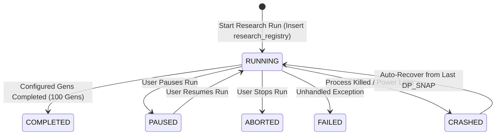
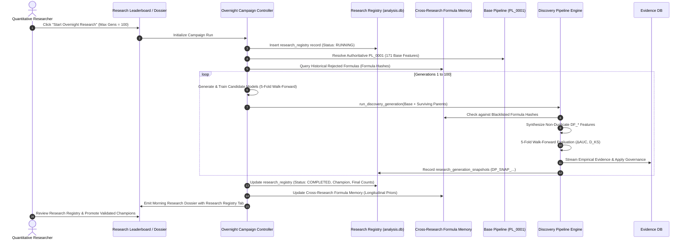

# AUTONOMOUS RESEARCH REGISTRY ARCHITECTURE
## Permanent Historical Memory, Cross-Campaign Lineage, Formula Memory & Governance Specification

```
Document Version: 1.1.0
Author: DeepMind Agentic Pair Programmer / ML Engineering
Status: AUTHORITATIVE ARCHITECTURAL SPECIFICATION & SYSTEM DESIGN (VALIDATED AGAINST CODEBASE)
Target Base Path: C:\Users\admin\PycharmProjects\AruMLStudio
Target File: docs/16-AUTONOMOUS_RESEARCH_REGISTRY_ARCHITECTURE.md
Related Systems: Docs 03, 12, 13, 14, 15 · analysis.db · feature_recommendation_evidence.db
Hardware Baseline: 16 GB RAM Local Workstation (Zero Cloud Dependencies)
```

---

## ARCHITECTURE VALIDATION: PASS WITH CORRECTIONS

This specification has undergone a rigorous, read-only forensic comparison against the active AruMLStudio codebase, SQLite databases (`analysis.db`, `feature_recommendation_evidence.db`), and JSON stores (`pipeline_registry_store.json`, `feature_registry_store.json`). 

### Forensic Findings & Corrections Integrated into Version 1.1.0:
1. **Authoritative Base Pipeline vs. Legacy Dossier Counts:**
   - Authoritative Base Pipeline `PL_0001` in `pipeline_registry_store.json` contains exactly **171 Base Pipeline features**.
   - The UI display of `Baseline Features (176)` in legacy Morning Research Dossiers occurred because 5 model evaluation metric keys (`accuracy`, `precision`, `recall`, `expected_calibration_error`, `training_duration_sec`) were parsed into `dossier.discovered_features` and defaulted to baseline category by fallback classifier. The authoritative architectural base feature count is strictly **171**.
2. **Authoritative Hash Algorithms:**
   - **Formula Hash:** 16-character MD5 hex digest of normalized canonical AST formula expression: `hashlib.md5(norm.encode("utf-8")).hexdigest()[:16]`.
   - **Discovery Snapshot Hash:** 16-character SHA-256 hex digest of sorted feature names and pipeline metadata prefixed with `DP_SNAP_`: `f"DP_SNAP_{hashlib.sha256(raw.encode('utf-8')).hexdigest()[:16]}"`.
3. **Zero Mathematical AST Duplication:**
   - `research_generation_snapshots` is designed as a **lightweight relational linkage table** referencing existing `discovery_pipeline_snapshots(snapshot_hash)` and `discovery_pipeline_features` rather than duplicating mathematical AST strings or feature arrays.
4. **Execution-State Reusability:**
   - Research Registry binds directly to existing `persist_campaign_state()` in `apps/chain_replay_ml/overnight_campaign/persistence.py`, preventing duplicate state tracking while adding immutable cross-campaign indexing.
5. **Universal Run Ingestion:**
   - Every autonomous research campaign—including `COMPLETED`, `RUNNING`, `PAUSED`, `ABORTED`, and `FAILED` runs—receives an immutable `Research ID` at launch.

---

## 1. Executive Purpose & Strategic Destination

The **Autonomous Research Registry** is the permanent historical memory and cross-campaign intelligence engine of AruMLStudio.

While individual research campaigns execute iteratively over hours, generations, and candidate models, quantitative research as a discipline requires an immutable, queryable, and auditable record of **every experiment ever performed**. 

The Research Registry guarantees that no empirical finding—whether a breakthrough champion model, a high-affinity feature combination, a severe distribution drift failure, or an unpromising hyperparameter branch—is ever lost or blindly repeated.

```
┌──────────────────────────────────────────────────────────────────────────────────────────────────┐
│                                   CORE QUESTIONS ANSWERED                                        │
├────────────────────────────────────────┬─────────────────────────────────────────────────────────┤
│ Historical Dimension                   │ Research Registry Query / Metric                        │
├────────────────────────────────────────┼─────────────────────────────────────────────────────────┤
│ 1. Volume & Temporal History           │ Total research runs, start/finish timestamps, durations │
├────────────────────────────────────────┼─────────────────────────────────────────────────────────┤
│ 2. Context & Data Lineage              │ Model Context Key, Dataset Name, Snapshot Hash          │
├────────────────────────────────────────┼─────────────────────────────────────────────────────────┤
│ 3. Search Space & Algorithms           │ Algorithms enabled, Hyperparameter grids, Eliminators   │
├────────────────────────────────────────┼─────────────────────────────────────────────────────────┤
│ 4. Evolutionary Candidate Progression  │ Generations ran (1–100), Candidates generated & pruned │
├────────────────────────────────────────┼─────────────────────────────────────────────────────────┤
│ 5. Research Champion Results           │ Best Candidate ID, Composite, Trading, and Model Scores │
├────────────────────────────────────────┼─────────────────────────────────────────────────────────┤
│ 6. Discovery Pipeline Evolution        │ Total DF_* created, Unique Formulas, KEEP / WATCH / REM │
├────────────────────────────────────────┼─────────────────────────────────────────────────────────┤
│ 7. Active Discovery Pool               │ Surviving features per generation, Generational Snaps   │
├────────────────────────────────────────┼─────────────────────────────────────────────────────────┤
│ 8. Governance & Promotion Trail        │ Features promoted to Feature Registry (FR_*), Rejections│
└────────────────────────────────────────┴─────────────────────────────────────────────────────────┘
```

---

## 2. The Four Authoritative Registries Taxonomy

To prevent architectural overloading and enforce strict separation of concerns, AruMLStudio defines **four mutually complementary, non-overlapping registries**:

```
┌───────────────────────────────────────────────────────────────────────────────────────────────────┐
│                                FOUR AUTHORITATIVE REGISTRIES TAXONOMY                             │
├──────────────────────────┬─────────────────────────────┬─────────────────────┬────────────────────┤
│ Registry                 │ Scope & Identity            │ Mutability          │ Authoritative File │
├──────────────────────────┼─────────────────────────────┼─────────────────────┼────────────────────┤
│ 1. Feature Registry      │ Permanent Canonical Feature │ Governed Append     │ feature_registry_  │
│    (Approved Features)   │ Identities (FR_0001...0212) │ (Human Promoted)    │ store.json         │
├──────────────────────────┼─────────────────────────────┼─────────────────────┼────────────────────┤
│ 2. Pipeline Registry     │ Authoritative Base &        │ Immutable Snapshots │ pipeline_registry_ │
│    (Approved Pipelines)  │ Promoted Pipelines (PL_0001)│ (PL_0001 is fixed)  │ store.json         │
├──────────────────────────┼─────────────────────────────┼─────────────────────┼────────────────────┤
│ 3. Discovery Pipeline    │ Campaign-scoped sandbox for │ Ephemeral & Mutates │ analysis.db        │
│    (Research Sandbox)    │ DF_* AST feature synthesis  │ Across Generations  │ (discovery_*)      │
├──────────────────────────┼─────────────────────────────┼─────────────────────┼────────────────────┤
│ 4. Research Registry     │ Permanent Historical Memory │ Append-Only &       │ analysis.db        │
│    (Historical Memory)   │ of Every Research Campaign  │ Strictly Immutable  │ (research_*)       │
└──────────────────────────┴─────────────────────────────┴─────────────────────┴────────────────────┘
```

```mermaid
flowchart TD
    subgraph PermanentLayer ["1. Permanent Approved Stores"]
        FReg[("Feature Registry Store<br/>feature_registry_store.json<br/>(FR_0001 ... FR_0212)")]
        PReg[("Pipeline Registry Store<br/>pipeline_registry_store.json<br/>(PL_0001 Base Anchor: 171 Base Features)")]
    end

    subgraph ExecutionLayer ["2. Autonomous Execution Sandbox"]
        DiscPipe["Discovery Pipeline Sandbox<br/>(DP_CAMP_... / DF_* Synthesized Features)"]
        CampRunner["Overnight Campaign Runner<br/>(Candidate Generation, Walk-Forward Replay)"]
    end

    subgraph MemoryLayer ["3. Permanent Historical Intelligence Layer"]
        ResReg[("Authoritative Research Registry<br/>analysis.db / research_registry<br/>(RESEARCH_... Immutable Audit Records)")]
        FormMem[("Cross-Research Formula Memory<br/>analysis.db / research_formula_memory<br/>(Formula Hashes, Historical Pointers)")]
        SnapMem[("Generational Linkage Memory<br/>analysis.db / research_generation_snapshots<br/>(Generations 0..100 Linkages)")]
    end

    PReg -->|PL_0001 Anchor (171 Feats)| CampRunner
    CampRunner <--> DiscPipe
    CampRunner -->|Log Research Run| ResReg
    DiscPipe -->|Snapshot Reference| SnapMem
    DiscPipe -->|Formula Hashes| FormMem
    FormMem -.->|Prior Rejection Filter| DiscPipe
    ResReg -->|Human Promotion Gate| FReg
    ResReg -->|Package Promoted Pipeline| PReg
```

---

## 3. Database Ownership & Boundary Architecture

To ensure strict zero-duplication and ACID integrity, database ownership boundaries are rigorously defined:

```
┌───────────────────────────────────────────────┬────────────────────────────────────────────────────────────────────────┐
│ Database / Store File                         │ Authoritative Responsibilities                                         │
├───────────────────────────────────────────────┼────────────────────────────────────────────────────────────────────────┤
│ 1. `data/analysis.db`                         │ • Research Registry: research_registry, research_generation_snapshots  │
│                                               │ • Cross-Research Formula Memory: research_formula_memory               │
│                                               │ • Discovery Pipeline Sandbox: discovery_pipelines,                     │
│                                               │   discovery_pipeline_features, discovery_pipeline_snapshots            │
│                                               │ • Campaign Orchestration: overnight_campaigns, campaign_candidate_specs│
│                                               │ • Candidate Benchmarks: model_benchmarks, champion_history             │
├───────────────────────────────────────────────┼────────────────────────────────────────────────────────────────────────┤
│ 2. `data/feature_recommendation_evidence.db`  │ • Raw Longitudinal Validation Evidence: recommendation_evidence        │
│                                               │ • Aggregated Context Projections: feature_context_summary              │
│                                               │ • Candidate Model Lineage Summaries: experimental_lineage_summary      │
├───────────────────────────────────────────────┼────────────────────────────────────────────────────────────────────────┤
│ 3. `data/pipeline_registry_store.json`        │ • Authoritative Base Pipeline PL_0001 (171 Base Features)              │
│                                               │ • Promoted Pipeline Snapshots (PL_0002+)                               │
├───────────────────────────────────────────────┼────────────────────────────────────────────────────────────────────────┤
│ 4. `data/feature_registry_store.json`         │ • Permanent Canonical Feature Identities (FR_0001 ... FR_0212+)        │
└───────────────────────────────────────────────┴────────────────────────────────────────────────────────────────────────┘
```

---

## 4. Research Identity & Entity Hierarchy

### 4.1. Authoritative Research ID Format
Every autonomous research run is assigned a globally unique, deterministic, human-readable identifier:

$$\text{Research ID} = \mathbf{RESEARCH\_}\langle\text{context\_key}\rangle\mathbf{\_}\langle\text{timestamp\_compact}\rangle\mathbf{\_}\langle\text{short\_hash}\rangle$$

**Example:**
`RESEARCH_NIFTY_6s_DIRECTION_5m_R001_20260822_002913_a1b2`

### 4.2. Parent-to-Child Entity Hierarchy

```
Model Context Key (e.g. NIFTY_6s_DIRECTION_CLASSIFIER_5m_R001)
   │
   ▼
1. Research ID [PARENT AUTONOMOUS RESEARCH ENTITY]
   ├── Campaign ID (Orchestration Runner Instance)
   ├── Dataset Snapshot Hash (Data Matrix Anchor)
   ├── Base Pipeline Anchor (PL_0001: 171 Base Features)
   │
   ├── Discovery Pipeline ID (DP_CAMP_...) [DISCOVERY CHILD]
   │    ├── Discovery Snapshot IDs (DP_SNAP_... per Generation via SHA-256)
   │    └── Discovered Feature IDs (DF_CAMP_..._0001..N)
   │         └── Formula Hash (16-Char MD5 AST Fingerprint)
   │
   └── Model Candidates Pool (CAND_CAMP_G<gen>_<idx>) [MODEL CHILD]
        ├── 5-Fold Walk-Forward Cross Validation Metrics
        └── Elected Research Champion Model
```

---

## 5. Complete Relational Metadata Schema in `analysis.db`

### 5.1. Core Table: `research_registry`

```sql
CREATE TABLE IF NOT EXISTS research_registry (
    -- Primary Research Identity
    research_id TEXT PRIMARY KEY,                       -- e.g. "RESEARCH_NIFTY_6s_DIR_5m_R001_20260822_002913_a1b2"
    campaign_id TEXT NOT NULL UNIQUE,                   -- Owning campaign identifier
    context_key TEXT NOT NULL,                          -- e.g. "NIFTY_6s_DIRECTION_CLASSIFIER_5m_R001"
    context_id TEXT NOT NULL,                           -- e.g. "ctx_169e8ab4c718"
    
    -- Dataset & Pipeline Anchoring
    dataset_name TEXT NOT NULL,                         -- e.g. "analysis_198r_171b_6s_20260820_223630"
    dataset_snapshot_hash TEXT NOT NULL,                -- e.g. "1714b8dddb455a95"
    base_pipeline_id TEXT NOT NULL DEFAULT 'PL_0001',   -- Authoritative PL_0001 Base Pipeline
    base_feature_count INTEGER NOT NULL DEFAULT 171,    -- Exactly 171 Base Pipeline features
    registry_feature_count INTEGER NOT NULL DEFAULT 211,-- Permanent Registry features in dataset (211)
    
    -- Timing & Execution Telemetry
    started_at TEXT NOT NULL,                           -- ISO-8601 UTC
    finished_at TEXT,                                   -- ISO-8601 UTC
    duration_seconds REAL NOT NULL DEFAULT 0.0,
    status TEXT NOT NULL CHECK (status IN ('RUNNING', 'COMPLETED', 'FAILED', 'ABORTED', 'PAUSED')),
    stop_reason TEXT NOT NULL DEFAULT 'IN_PROGRESS',    -- TARGET_REACHED, MAX_GENERATIONS, CONVERGENCE, USER_STOP, ERROR
    
    -- Search Space & Algorithm Configuration
    algorithms_used_json TEXT NOT NULL,                 -- e.g. ["XGBoost", "LightGBM", "CatBoost", "RandomForest"]
    elimination_strategy TEXT NOT NULL,                 -- e.g. "SHAP_AND_EVIDENCE"
    max_generations_configured INTEGER NOT NULL,        -- Configured target (1 to 100)
    actual_generations_completed INTEGER NOT NULL,      -- Actual executed
    max_candidates_configured INTEGER NOT NULL,
    candidates_generated INTEGER NOT NULL DEFAULT 0,
    candidates_evaluated INTEGER NOT NULL DEFAULT 0,
    candidates_pruned INTEGER NOT NULL DEFAULT 0,
    
    -- Candidate Model Outcomes
    best_candidate_id TEXT,                             -- e.g. "CAND_CAMP_..._G4_002"
    best_composite_score REAL NOT NULL DEFAULT 0.0,     -- [0.0, 100.0]
    best_trading_score REAL NOT NULL DEFAULT 0.0,       -- [0.0, 100.0]
    best_model_score REAL NOT NULL DEFAULT 0.0,         -- [0.0, 100.0]
    best_win_rate_pct REAL NOT NULL DEFAULT 0.0,
    best_profit_factor REAL NOT NULL DEFAULT 0.0,
    best_max_drawdown_pct REAL NOT NULL DEFAULT 0.0,
    starting_best_score REAL NOT NULL DEFAULT 0.0,
    total_score_lift REAL NOT NULL DEFAULT 0.0,         -- best_composite_score - starting_best_score
    
    -- Discovery Pipeline Cumulative Telemetry
    discovery_pipeline_id TEXT NOT NULL,                -- e.g. "DP_CAMP_..._20260822_002913"
    final_discovery_snapshot_hash TEXT,                 -- e.g. "DP_SNAP_c72065caf6db28a4"
    total_df_features_created INTEGER NOT NULL DEFAULT 0,
    unique_formula_count INTEGER NOT NULL DEFAULT 0,
    keep_count INTEGER NOT NULL DEFAULT 0,
    watch_count INTEGER NOT NULL DEFAULT 0,
    remove_count INTEGER NOT NULL DEFAULT 0,
    active_discovery_pool INTEGER NOT NULL DEFAULT 0,   -- keep_count + watch_count
    promoted_feature_count INTEGER NOT NULL DEFAULT 0,  -- Features promoted to Feature Registry
    
    -- Audit, Failure Diagnostics & Versioning
    research_config_json TEXT NOT NULL,                 -- Full serialized CampaignConfig
    research_outcome_json TEXT NOT NULL DEFAULT '{}',   -- Summary outcome payload
    failure_reason TEXT,                                -- Detailed stack trace / error message if FAILED
    architecture_version TEXT NOT NULL DEFAULT '2.2.0', -- Architectural Doc Version
    code_version TEXT NOT NULL DEFAULT '1.0.0',         -- Git commit hash / build version
    
    created_at TEXT NOT NULL,
    updated_at TEXT NOT NULL,
    FOREIGN KEY (campaign_id) REFERENCES overnight_campaigns(campaign_id),
    FOREIGN KEY (discovery_pipeline_id) REFERENCES discovery_pipelines(pipeline_id)
);

-- Performance Indexes
CREATE INDEX IF NOT EXISTS idx_res_reg_context ON research_registry (context_key, started_at DESC);
CREATE INDEX IF NOT EXISTS idx_res_reg_status ON research_registry (status, started_at DESC);
CREATE INDEX IF NOT EXISTS idx_res_reg_best ON research_registry (best_composite_score DESC);
CREATE INDEX IF NOT EXISTS idx_res_reg_disc ON research_registry (discovery_pipeline_id);
```

---

### 5.2. Lightweight Generational Linkage Table: `research_generation_snapshots`

To eliminate duplicate data storage, this table acts as a **lightweight foreign-key pointer** connecting the Research execution to the authoritative `discovery_pipeline_snapshots` table:

```sql
CREATE TABLE IF NOT EXISTS research_generation_snapshots (
    snapshot_record_id INTEGER PRIMARY KEY AUTOINCREMENT,
    research_id TEXT NOT NULL,
    campaign_id TEXT NOT NULL,
    generation_number INTEGER NOT NULL,                 -- 0..100
    discovery_snapshot_hash TEXT NOT NULL,              -- FK to discovery_pipeline_snapshots(snapshot_hash)
    candidates_evaluated INTEGER NOT NULL,
    generation_best_score REAL NOT NULL,
    generation_best_candidate_id TEXT NOT NULL,
    created_at TEXT NOT NULL,
    FOREIGN KEY (research_id) REFERENCES research_registry(research_id),
    FOREIGN KEY (discovery_snapshot_hash) REFERENCES discovery_pipeline_snapshots(snapshot_hash),
    UNIQUE(research_id, generation_number)
);

CREATE INDEX IF NOT EXISTS idx_gen_snap_lookup ON research_generation_snapshots (research_id, generation_number);
```

*Note: Active feature lists, KEEP/WATCH/REMOVE breakdown, and feature counts are resolved dynamically via relational join with `discovery_pipeline_snapshots` on `snapshot_hash`.*

---

## 6. Cross-Research Memory & Formula Deduplication Engine

### 6.1. Mathematical Formula Identity
Every synthesized mathematical feature is normalized into canonical abstract syntax tree (AST) form and hashed:

$$\text{Canonical AST String: } \text{col}('f_1') / (\text{abs}(\text{col}('f_2')) + \epsilon)$$
$$\mathbf{formula\_hash} = \text{MD5}(\text{canonical\_formula\_string})[:16]$$

### 6.2. Cross-Research Formula Memory Table: `research_formula_memory`

```sql
CREATE TABLE IF NOT EXISTS research_formula_memory (
    formula_hash TEXT PRIMARY KEY,                      -- 16-character MD5 fingerprint
    canonical_formula_expression TEXT NOT NULL,
    generator_strategy TEXT NOT NULL,                   -- RATIO, INTERACTION, NONLINEAR, SPREAD
    parent_features_json TEXT NOT NULL,
    
    -- Longitudinal History Across ALL Research Runs
    first_discovered_research_id TEXT NOT NULL,
    first_discovered_at TEXT NOT NULL,
    last_evaluated_research_id TEXT NOT NULL,
    last_evaluated_at TEXT NOT NULL,
    total_researches_tested INTEGER NOT NULL DEFAULT 1,
    total_evaluations_count INTEGER NOT NULL DEFAULT 1,
    
    -- Multi-Context Empirical Summary
    highest_evidence_score REAL NOT NULL DEFAULT 0.0,
    lowest_ks_drift REAL NOT NULL DEFAULT 1.0,
    best_marginal_delta_auc REAL NOT NULL DEFAULT -1.0,
    
    -- Current Governance Standing
    global_status TEXT NOT NULL CHECK (global_status IN ('PROMISING', 'WATCH', 'REJECTED_DRIFT', 'REJECTED_NOISE', 'PROMOTED')),
    last_governance_verdict TEXT NOT NULL,              -- KEEP / WATCH / REMOVE
    last_governance_reason TEXT NOT NULL,
    context_lock_json TEXT NOT NULL DEFAULT '[]',       -- Contexts where feature failed/passed
    FOREIGN KEY (last_evaluated_research_id) REFERENCES research_registry(research_id)
);

CREATE INDEX IF NOT EXISTS idx_form_mem_status ON research_formula_memory (global_status, highest_evidence_score DESC);
```

### 6.3. Context-Aware Cross-Research Memory Policy

```
┌──────────────────────────────────────────────────────────────────────────────────────────────────┐
│                               CROSS-RESEARCH MEMORY ACTION POLICY                                │
├─────────────────────┬──────────────────────────────────────────┬─────────────────────────────────┤
│ Prior Standing      │ Multi-Context Empirical Condition        │ Action in Future Research Runs  │
├─────────────────────┼──────────────────────────────────────────┼─────────────────────────────────┤
│ 🔴 Previously       │ Failed with severe KS drift (D_KS > 0.35)│ 🚫 Exclude permanently under    │
│    REMOVE (Drift)   │ in same market & sampling interval.      │ identical context conditions.   │
│                     │                                          │ (Allowed for cross-regime tests)│
├─────────────────────┼──────────────────────────────────────────┼─────────────────────────────────┤
│ 🔴 Previously       │ Marginal lift ΔAUC < -0.008 or           │ ⚠️ Suppress in Generation 1;    │
│    REMOVE (Noise)   │ Fold consistency < 25%.                  │ allow as mutation candidate G>10│
├─────────────────────┼──────────────────────────────────────────┼─────────────────────────────────┤
│ 🟡 Previously       │ Retained with 0.20 < D_KS <= 0.35        │ 🔄 Load as candidate parent;   │
│    WATCH            │ or positive lift with moderate variance. │ re-evaluate in higher gen.      │
├─────────────────────┼──────────────────────────────────────────┼─────────────────────────────────┤
│ 🟢 Previously       │ Confirmed D_KS <= 0.20 (Severity 0),     │ ⭐ Immediate high-affinity      │
│    KEEP             │ ΔAUC > +0.001, Evidence Score >= 52 pts. │ parent for higher-order spreads.│
├─────────────────────┼──────────────────────────────────────────┼─────────────────────────────────┤
│ 📦 Promoted         │ Graduated to Feature Registry (FR_xxxx). │ 🏛️ Treated as permanent        │
│    (PROMOTED)       │                                          │ Feature Registry identity.      │
└─────────────────────┴──────────────────────────────────────────┴─────────────────────────────────┘
```

---

## 7. Tripartite Representation of Feature Verdicts

To eliminate data corruption and prevent historical overwriting, verdicts are tracked across three orthogonal dimensions:

```
1. Research-Specific Evaluation (Point-in-Time Immutable)
   • "In Research R001 at Gen 2, Feature DF_0042 scored ΔAUC = +0.0015, D_KS = 0.14 -> KEEP."
   • Stored in: recommendation_evidence and discovery_pipeline_features.
   • NEVER overwritten.

2. Discovery Pipeline Active State (Campaign-Scoped)
   • "In Campaign C001, DF_0042 is currently in the Active Pool (KEEP)."
   • Stored in: discovery_pipelines / current_snapshot_hash.

3. Cross-Research Memory Status (Global Historical Prior)
   • "Across 4 research runs, DF_0042 had 3 KEEPs and 1 WATCH (Global: PROMISING)."
   • Stored in: research_formula_memory.
```

---

## 8. Morning Research Dossier Integration & UI Tab Hierarchy

The Research Registry is integrated as a top-level tab in the Morning Research Dossier panel:

```
Morning Research Dossier
├── 🌅 Morning Summary (Overview KPIs, Champion Model, Executive Narrative)
├── 📜 Research Registry (Permanent Research Runs Ledger & Historical Memory)
├── ⭐ Discovered Features (Feature Rankings Partitioned by Population)
│   ├── 📋 Registry Features (211)
│   ├── 🏛️ Baseline Features (171)
│   └── 🧪 Experimental Features (Active Pool: 14)
│       ├── 🟢 KEEP (9)
│       ├── 🟡 WATCH (5)
│       └── 🔴 REMOVE (42)
├── 🏆 Candidate Leaderboard (Pareto Front & All Candidate Models)
├── 🧬 Generational Lineage (Evolution Tree & Treeview)
├── 🛡️ Feature Governance Audit (Longitudinal Evidence Audits)
└── 📜 Execution Audit Trail (Raw Event Log & Filterable Table)
```

### 8.1. Research Registry Table Columns
`[Research ID] [Context] [Dataset] [Start Time (UTC)] [Duration] [Status] [Algos] [Gens] [Cands] [DF Created] [KEEP] [WATCH] [REMOVE] [Active Pool] [Champion ID] [Best Score]`

### 8.2. Research Detail Modal View
Clicking `🔍 View Research Dossier` on any row opens the full **Research Archive Dossier**:
- **Tab 1: Summary & Hardware:** Run metadata, stop reason, accelerator used (`⚡ GPU NVIDIA RTX 3050`).
- **Tab 2: Candidate Score Progression:** Gen 0 to Gen $N$ composite score trajectories.
- **Tab 3: Discovery Pool Waterfall:** Monotonic growth of active discovery pool across snapshots.
- **Tab 4: Formula AST Inspector:** Mathematical representations, $D_{\text{KS}}$ drift, $\Delta\text{AUC}$ lift.
- **Tab 5: Replay & Reproduction:** One-click script to verify and reproduce candidate folds.

---

## 9. Concrete Research Summary Example

```
====================================================================================================
ARUMLSTUDIO AUTONOMOUS RESEARCH REGISTRY RECORD
====================================================================================================
Research ID:               RESEARCH_NIFTY_6s_DIRECTION_5m_R001_20260822_002913_a1b2
Campaign ID:               CAMP_NIFTY_6s_DIRECTION_CLASSIFIER_5m_R001_20260822_002913
Model Context Key:         NIFTY:6:standard:all (NIFTY_6s_DIRECTION_CLASSIFIER_5m_R001)
Dataset Anchor:            analysis_198r_171b_6s_20260820_223630.parquet (Snapshot: 1714b8dddb455a95)
Base Pipeline Anchor:      PL_0001 (171 Base Pipeline Features)

----------------------------------------------------------------------------------------------------
TIMING & EXECUTION TELEMETRY
----------------------------------------------------------------------------------------------------
Status:                    COMPLETED (Stop Reason: MAX_GENERATIONS_REACHED)
Started At:                2026-08-21T18:59:13.120Z
Finished At:               2026-08-21T21:13:45.890Z
Total Duration:            2h 14m 32s (8,072.77 seconds)
Hardware / Device:         ⚡ GPU Acceleration (NVIDIA GeForce RTX 3050 · 8,192 MiB VRAM)

----------------------------------------------------------------------------------------------------
CANDIDATE MODEL EVOLUTION
----------------------------------------------------------------------------------------------------
Generations Completed:     100 / 100
Algorithms Enabled:        XGBoost, LightGBM, CatBoost, RandomForest, ExtraTrees
Elimination Strategy:      SHAP_AND_EVIDENCE (20% Prune per Gen)
Total Candidates Created:  750
Evaluated (5-Fold CV):     750
Pruned / Excluded:         412

Starting Baseline Score:   62.40 pts
Research Champion Score:   84.65 pts (+22.25 pts Net Empirical Lift)
Research Champion ID:      CAND_CAMP_..._G98_003 (CatBoost Classifier)
Champion Metrics:          AUC: 0.7412 · Win Rate: 61.8% · Profit Factor: 2.14 · Max DD: 4.2%

----------------------------------------------------------------------------------------------------
AUTONOMOUS DISCOVERY PIPELINE TELEMETRY
----------------------------------------------------------------------------------------------------
Discovery Pipeline ID:     DP_CAMP_NIFTY_6s_DIRECTION_CLASSIFIER_5m_R001_20260822_002913
Final Discovery Snapshot:  DP_SNAP_f839ab10e927c34d
Total DF_* Synthesized:    2,840 Features
Unique Formulas (AST):     2,840 Formulas
Governance Verdicts:       🟢 43 KEEP · 🟡 87 WATCH · 🔴 2,710 REMOVE
Active Discovery Pool:     130 Features (43 KEEP + 87 WATCH)
Pruning Ratio:             95.42% Pruned / Governed Out
Promoted to Registry:      0 (Pending Human Promotion Review)
====================================================================================================
```

---

## 10. Idempotency, Interruption & Crash Recovery



1. **Crash Detection on Startup:** On application startup, any research record in `status = 'RUNNING'` with no active background thread is marked `CRASHED` with an audit event.
2. **Safe Generational Resumption:** If resumed, the controller loads the latest `DP_SNAP_<hash>` from `research_generation_snapshots` and resumes from Generation $N+1$.
3. **Single Active Execution Lock:** Only one autonomous research run per `context_key` can be in `RUNNING` status simultaneously.
4. **Universal Run Archival:** `FAILED`, `ABORTED`, and partial runs remain permanently recorded in `research_registry` to preserve all telemetry generated prior to interruption.

---

## 11. Production Governance & Promotion Boundary

```
┌──────────────────────────────────────────────────────────────────────────────────────────────────┐
│                             PRODUCTION GOVERNANCE BOUNDARY INVARIANTS                            │
├──────────────────────────────────────────────────────────────────────────────────────────────────┤
│ 1. Research Result ≠ Production Feature                                                          │
│    A feature achieving KEEP in a research run remains an experimental record in analysis.db.     │
│                                                                                                  │
│ 2. Research Champion ≠ Production Model                                                          │
│    A candidate achieving top score in a research run is an elected Research Champion, NOT a live │
│    production model.                                                                             │
│                                                                                                  │
│ 3. Explicit Human Authorization Gate                                                             │
│    Graduation into Feature Registry (FR_xxxx) or Production Classifier Registry (models.db)        │
│    requires an explicit human review modal confirmation.                                         │
└──────────────────────────────────────────────────────────────────────────────────────────────────┘
```

---

## 12. Non-Negotiable Architecture Invariants

1. **Zero Mutation of `PL_0001`:** Research Registry operations never modify Base Pipeline `PL_0001` (171 base features).
2. **Zero Auto-Mutation of Feature Registry:** Discovered features never enter `feature_registry_store.json` without human promotion.
3. **Strict Audit Immutability:** Historical research records in `research_registry` are append-only and cannot be overwritten.
4. **Formula Hash Identity:** Mathematical AST formula hash (`formula_hash = md5(...)[:16]`) is the authoritative unique identifier for feature deduplication.
5. **Non-Destructive REMOVE:** Pruned features remain historically recorded in `discovery_pipeline_features` and `research_formula_memory`.
6. **Research-Specific Verdict Preservation:** Point-in-time verdicts for research runs are never overwritten by subsequent runs.
7. **Authoritative Discovery Pipeline Pointers:** Research records link by ID (`DP_<campaign_id>`) and `snapshot_hash` rather than duplicating mathematical AST tables.
8. **100-Generation Compatibility:** Supports recording campaigns from 1 to 100 generations seamlessly.

---

## 13. End-to-End Future Autonomous Research Flow



---
*End of Authoritative Architectural Specification (Doc 16 · Version 1.1.0).*
