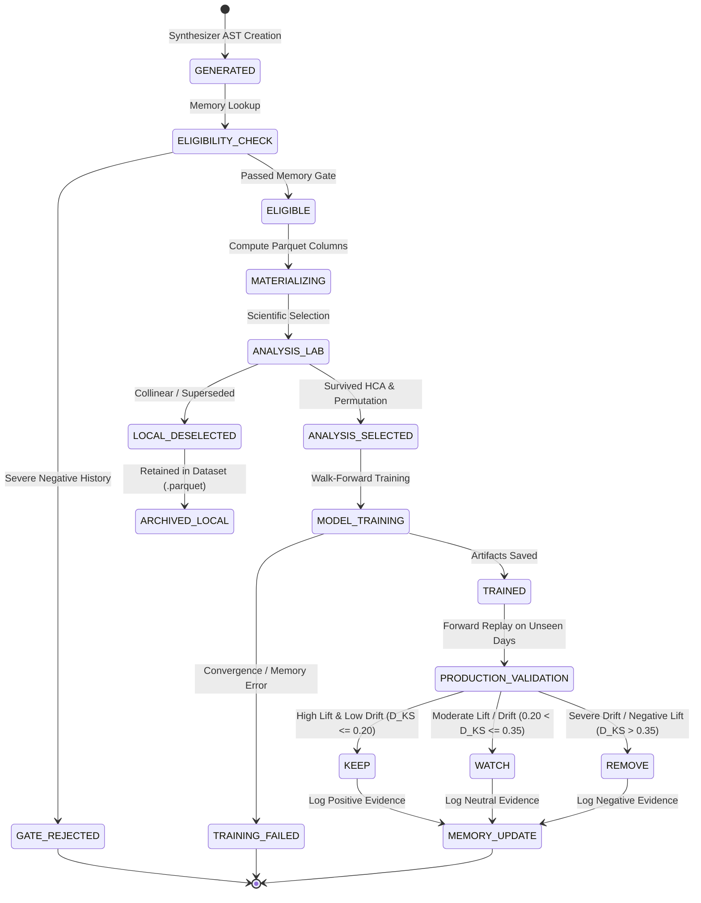

# AUTONOMOUS DISCOVERY TO MODEL RESEARCH LIFECYCLE
## End-to-End Architecture: Discovery → Scientific Analysis → Training → Production Validation → Research Memory

```
Document Version: 1.0.0
Author: DeepMind Agentic Pair Programmer / ML Systems Architecture
Status: AUTHORITATIVE ARCHITECTURAL SPECIFICATION & SYSTEM DESIGN
Target Base Path: C:\Users\admin\PycharmProjects\AruMLStudio
Target File: docs/17-AUTONOMOUS_DISCOVERY_TO_MODEL_RESEARCH_LIFECYCLE.md
Related Systems: Docs 02, 03, 04, 05, 06, 08, 12, 13, 14, 15, 16, 18
Databases: analysis.db · feature_recommendation_evidence.db · pipeline_registry_store.json · feature_registry_store.json
Workstation Baseline: 16 GB RAM Local Workstation (Zero Cloud Dependencies, Deterministic Offline Execution)
```

---

## 0. Version History & Status

| Version | Date | Author | Status | Key Architectural Milestone |
|---|---|---|---|---|
| **1.0.0** | 2026-08-22 | Agentic ML Team | **Authoritative Design** | Complete lifecycle formalization from Autonomous AST Discovery through Layer-2 Scientific Analysis, Model Training, Out-of-Sample Production Validation, and Longitudinal Research Formula Memory. |

---

## 1. Executive Purpose

The **Autonomous Discovery to Model Research Lifecycle** defines the rigorous, multi-stage pipeline through which automatically generated mathematical features ($DF\_*$) transition from raw symbolic expressions into validated, high-conviction candidate feature sets and production-ready machine learning models.

In quantitative financial machine learning, feature generation is trivial, but **discovering genuine, non-collinear, statistically robust predictive signals that survive out-of-sample forward execution** is extraordinarily difficult. A naïve autonomous pipeline creates thousands of synthetic features that overfit in-sample, exhibit high collinearity with existing baseline indicators, suffer severe distribution drift across market regimes, and fail under walk-forward evaluation.

This feature phase establishes an immutable, mathematically principled, multi-stage governance funnel:
1. **Generative Stage**: Autonomous Mathematical AST Discovery searches for non-linear combinations of base features.
2. **Context Eligibility Gate**: Longitudinal Formula Memory filters out historically deprecated formulas before resource allocation.
3. **Materialization & Scientific Down-Selection**: Feature Transformation & Analysis Lab performs correlation pruning, Hierarchical Cluster Analysis (HCA), and Permutation Importance ranking on in-sample data.
4. **Model Architecture Training**: Model Builder trains ensemble architectures (LightGBM, XGBoost, CatBoost) using the unified feature matrix.
5. **Empirical Out-of-Sample Validation**: Production Validation evaluates true forward generalization across unseen trading sessions, emitting definitive empirical $D_{\text{KS}}$ drift and $\Delta\text{AUC}$ evidence.
6. **Permanent Intelligence Accumulation**: Research Registry and Research Formula Memory record full generational lineage, cross-campaign co-discoveries, and empirical performance to guide future research runs.

```
┌──────────────────────────────────────────────────────────────────────────────────────────────────┐
│                                   COMPLETE END-TO-END LIFECYCLE                                   │
├──────────────────────────────────────────────────────────────────────────────────────────────────┤
│                                                                                                  │
│  Autonomous Discovery Pipeline (AST Expression Generation)                                       │
│          │                                                                                       │
│          ▼                                                                                       │
│  DF_* Candidate Generation (Symbolic Operators: RATIO, INTERACTION, NONLINEAR, SPREAD)          │
│          │                                                                                       │
│          ▼                                                                                       │
│  Historical & Context Eligibility Gate (research_formula_memory Check)                            │
│          │                                                                                       │
│          ▼                                                                                       │
│  Eligible Experimental Candidates                                                                │
│          │                                                                                       │
│          ▼                                                                                       │
│  Analysis Dataset Materialization (.parquet with Unified Feature Matrix)                         │
│          │                                                                                       │
│          ▼                                                                                       │
│  Layer-2 Feature Analysis Lab (HCA Clustering · Correlation Elimination · Permutation Importance)│
│          │                                                                                       │
│          ▼                                                                                       │
│  Scientific Feature Selection Bundle                                                             │
│          │                                                                                       │
│          ▼                                                                                       │
│  Model Builder Orchestrator (Walk-Forward Split Engine · HPO · Ensemble Training)                │
│          │                                                                                       │
│          ▼                                                                                       │
│  Trained Model Candidate (models/<name>/)                                                        │
│          │                                                                                       │
│          ▼                                                                                       │
│  Production Validation Replay (Unseen Days · Out-of-Sample Trading Evaluation)                    │
│          │                                                                                       │
│          ▼                                                                                       │
│  Empirical Governance Verdict (KEEP · WATCH · REMOVE in feature_recommendation_evidence.db)      │
│          │                                                                                       │
│          ▼                                                                                       │
│  Longitudinal Research Memory (analysis.db: research_registry · research_formula_memory)         │
│          │                                                                                       │
│          ▼                                                                                       │
│  Future Autonomous Research Campaigns (Informed Generation & Elimination)                       │
│                                                                                                  │
└──────────────────────────────────────────────────────────────────────────────────────────────────┘
```

---

## 2. Problem Statement & Architectural Scope

### 2.1. The Critical Failure Modes of Naïve Feature Lifecycles
Prior to this architectural phase, automated research suffered from four fundamental boundary confusions:
1. **Conflating Local Analysis Deselection with Global Rejection**: If an Analysis Lab run deselected a feature due to collinearity with an existing baseline feature in a specific model family, naïve logic treated this as a global `REMOVE`, polluting recommendation evidence for unrelated model families.
2. **Conflating In-Sample Generational Pruning with Empirical Validation**: Autonomous Discovery generation filters ($D_{\text{KS}} > 0.45$) prevent search explosion during a single run, but they do not constitute final out-of-sample Production Validation verdicts.
3. **Isolated Discovery Pipelines**: Features generated in Campaign A were completely siloed from Campaign B, preventing cross-campaign aggregation, multi-pipeline curation, and longitudinal convergence tracking.
4. **Lack of Invariant Preservation**: Uncontrolled promotion pipelines risked polluting the immutable `PL_0001` Base Pipeline (171 features) and the human-governed permanent Feature Registry.

### 2.2. Core Objectives of the New Feature Phase
- **Multi-Stage Separation of Concerns**: Establish explicit, non-overlapping semantic states (`GENERATED`, `ELIGIBLE`, `ANALYSIS_SELECTED`, `TRAINED`, `KEEP`, `WATCH`, `REMOVE`, `LOCAL_DESELECTED`).
- **Multi-Pipeline Discovery Curation**: Enable quantitative researchers to inspect, filter, and multi-select discovered features across dozens of autonomous campaigns simultaneously via the Discovery Feature Dashboard.
- **Cross-Pipeline Candidate Pipeline Construction**: Anchor candidate pipelines to authoritative `PL_0001` while attaching rich multi-source provenance for selected $DF\_*$ features.
- **Longitudinal Memory Feedback**: Accumulate cross-campaign formula performance in `research_formula_memory` to make successive autonomous campaigns progressively smarter.

---

## 3. Current Implemented Architecture vs. New Proposed Feature Phase

To maintain strict backward compatibility and architectural integrity, the system clearly delineates between **Current Implemented Baseline** and the **New Proposed Feature Phase**:

| Architectural Component | Current Implemented Baseline | New Proposed Feature Phase |
|---|---|---|
| **Autonomous Discovery** | Isolated per-campaign generator (`DP_<campaign_id>`); computes generational AST features anchored to `PL_0001`. | Generates candidates checked against `research_formula_memory` before materialization. |
| **Feature Partitioning** | Mutually exclusive partitions: Baseline (171) $\cap$ Registry $\cap$ Experimental = $\emptyset$. | Preserved identically across all stages. |
| **Analysis Lab (Layer 2)** | In-sample scientific selection (`hca_corr_perm`, `corr_perm`, `perm_only`) over single dataset `.parquet`. | Ingests materialized unified feature matrices containing Base + Registry + Eligible $DF\_*$ features; outputs Selection Bundles. |
| **Model Builder** | Trains candidate models on walk-forward folds; generates model packages in `models/<name>/`. | Records model training lineage referencing source Discovery Pipeline and Selection Bundle. |
| **Production Validation** | Evaluates trained models on unseen forward days; writes raw empirical events to `feature_recommendation_evidence.db`. | Acts as the **sole authoritative empirical judge** for final `KEEP` / `WATCH` / `REMOVE` verdicts. |
| **Discovery Dashboard** | Multi-pipeline selection table, global selection basket, candidate pipeline builder (`candidate_discovery`). | Full operational integration linking multi-pipeline basket directly into automated training workflows. |
| **Research Memory** | Research execution tracking (`research_registry`) and static formula memory in `analysis.db`. | Active feedback loop: Production Validation evidence flows back to update `research_formula_memory` confidence weights. |

---

## 4. Formal Decision Semantics & Ownership Boundaries

The system strictly decouples the semantic meaning and database ownership of every decision point:

$$\mathbf{Local\ Analysis\ Deselection} \ne \mathbf{Discovery\ Pruning} \ne \mathbf{Production\ Validation\ REMOVE} \ne \mathbf{Context\ Elimination\ Gate}$$

```
┌──────────────────────────────────────────────────────────────────────────────────────────────────┐
│                                   DECISION STATE TAXONOMY                                        │
├───────────────────┬───────────────────────────┬───────────────────────────────┬──────────────────┤
│ State Identifier  │ Owning Subsystem          │ Authoritative Storage         │ Semantic Meaning │
├───────────────────┼───────────────────────────┼───────────────────────────────┼──────────────────┤
│ 1. GENERATED      │ Autonomous Discovery      │ analysis.db                   │ Symbolic AST mathematical expression was constructed by synthesizer. |
├───────────────────┼───────────────────────────┼───────────────────────────────┼──────────────────┤
│ 2. ELIGIBLE       │ Eligibility Gate          │ analysis.db                   │ Formula passed longitudinal memory check (no severe negative history). |
├───────────────────┼───────────────────────────┼───────────────────────────────┼──────────────────┤
│ 3. ANALYSIS_SEL   │ Feature Analysis Lab      │ Dataset Selection Bundle JSON │ Feature survived in-sample correlation, HCA, and permutation filters. |
├───────────────────┼───────────────────────────┼───────────────────────────────┼──────────────────┤
│ 4. LOCAL_DESEL    │ Feature Analysis Lab      │ Transient UI State            │ Dropped locally due to collinearity with another feature in this bundle. NOT a global rejection. |
├───────────────────┼───────────────────────────┼───────────────────────────────┼──────────────────┤
│ 5. TRAINED        │ Model Builder             │ models/<name>/manifest.json   │ Feature was included in a trained, cross-validated model architecture. |
├───────────────────┼───────────────────────────┼───────────────────────────────┼──────────────────┤
│ 6. KEEP           │ Production Validation     │ feature_recommendation_ev.db  │ Empirical out-of-sample evidence proves positive marginal lift ($\Delta\text{AUC} > 0, D_{\text{KS}} \le 0.20$). |
├───────────────────┼───────────────────────────┼───────────────────────────────┼──────────────────┤
│ 7. WATCH          │ Production Validation     │ feature_recommendation_ev.db  │ Promising empirical signal with moderate drift or fold variance ($0.20 < D_{\text{KS}} \le 0.35$). |
├───────────────────┼───────────────────────────┼───────────────────────────────┼──────────────────┤
│ 8. REMOVE         │ Production Validation     │ feature_recommendation_ev.db  │ Empirical evidence shows negative lift or severe out-of-sample drift ($D_{\text{KS}} > 0.35$). |
└───────────────────┴───────────────────────────┴───────────────────────────────┴──────────────────┘
```

> [!IMPORTANT]
> **The Local Deselection Invariant**:
> `LOCAL_DESELECTED` in Analysis Lab **NEVER** mutates `feature_recommendation_evidence.db` and **NEVER** marks a feature as `REMOVE`. A feature may be locally deselected in an XGBoost tree model because a highly correlated sibling exists, yet remain the primary feature for a LightGBM or Linear model.

---

## 5. The End-to-End Execution Flow

### Stage 1: Autonomous Candidate Discovery
- The **Autonomous Discovery Synthesizer** parses Generation-$(N-1)$ active features and applies domain-specific mathematical operators:
  - $\text{RATIO}(A, B) = \frac{A}{|B| + \epsilon}$
  - $\text{INTERACTION}(A, B) = A \cdot B$
  - $\text{NONLINEAR}(A) = \log(1 + |A|), \sqrt{|A|}, \text{sigmoid}(A)$
  - $\text{SPREAD}(A, B) = A - B$
  - $\text{COMPOSITE}(A, B, C) = \frac{A - B}{|C| + \epsilon}$
- Computes deterministic 16-character MD5 hash of the normalized canonical AST expression:
  $$\text{formula\_hash} = \text{MD5}(\text{AST}_{\text{norm}})[:16]$$
- Emits candidate record with state `GENERATED`.

### Stage 2: Historical & Context Eligibility Gate
- Queries `research_formula_memory` in `analysis.db` matching `(context_key, formula_hash)`:
  - If formula has persistent `REMOVE` history ($S_{\text{accum}} < -40.0$ or severe drift $\ge 3$ times in this context): **REJECTED_AT_GATE**.
  - If formula is clean or holds positive prior evidence: **ELIGIBLE**.

### Stage 3: Analysis Dataset Materialization
- Evaluates the AST vector expressions over the master tabular time-series for the context sampling interval (e.g. 6-second NIFTY order flow).
- Appends computed columns to the dataset `.parquet`.
- Enforces strict tripartite partitioning:
  $$\text{Feature Universe} = \text{PL\_0001 Baseline (171)} \cup \text{Feature Registry (211)} \cup \text{Eligible Discovered } DF\_*$$

### Stage 4: Feature Transformation & Analysis Lab (Layer 2)
- Executes the configured scientific selection strategy:
  1. **Spearman / Pearson Correlation Analysis**: Identifies pairwise collinearity ($|r| \ge 0.95$).
  2. **Hierarchical Cluster Analysis (HCA)**: Groups features into collinear families based on topological distance:
     $$d(u, v) = 1 - |r(u, v)|$$
     Selects the family representative with highest individual variance or target mutual information.
  3. **Permutation Importance (PI)**: Computes multi-fold permutation loss drop on in-sample validation splits:
     $$\text{PermDrop}(f) = \mathcal{L}(\tilde{X}_f) - \mathcal{L}(X)$$
- Outputs **Feature Selection Bundle JSON** (`ANALYSIS_SELECTED` vs. `LOCAL_DESELECTED`).

### Stage 5: Model Builder & Training
- `orchestrator.train_model` trains the ensemble using Purged Group Time-Series Walk-Forward Cross-Validation (5 folds).
- Generates model artifacts in `models/<model_name>/` containing `manifest.json`, `weights.bin`, `feature_importance.json`, and `split_metrics.json`.
- State transitions to `TRAINED`.

### Stage 6: Production Validation (Out-of-Sample Empirical Replay)
- `ProductionValidationEngine` runs deterministic chronological replay over **unseen forward trading days**.
- Computes empirical out-of-sample metrics:
  - Marginal Out-of-Sample AUC Lift ($\Delta\text{AUC}_{\text{OOS}}$)
  - Two-Sample Kolmogorov-Smirnov Distribution Drift Statistic ($D_{\text{KS}}$)
  - Relative Feature Importance Retention ($\text{Imp}_{\text{OOS}} / \text{Imp}_{\text{IS}}$)
  - Multi-Day Walk-Forward Consistency Ratio ($C_{\text{WF}}$)
- Emits empirical verdict: `KEEP`, `WATCH`, or `REMOVE` to `feature_recommendation_evidence.db`.

### Stage 7: Longitudinal Memory Integration
- Updates `research_registry` with total candidates, survivor counts, and champion scores.
- Updates `research_formula_memory` with empirical evidence points, incrementing global discovery counters and refining context suitability scores.

---

## 6. Formal Research Pipeline State Machine



### Transition Invariants
1. `LOCAL_DESELECTED` is **not terminal** for the feature's lifecycle; it only excludes the feature from the current Selection Bundle.
2. `REMOVE` emitted by Production Validation is context-scoped; it prevents auto-regeneration in that specific context but does not erase historical discovery records.
3. `GATE_REJECTED` candidate expressions never consume CPU cycles for Parquet vector evaluation or model training.

---

## 7. Autonomous Discovery Boundary & Governance

### 7.1. Strict Separation Between Generations and Empirical Governance
The Autonomous Discovery Pipeline uses in-sample generational thresholds (e.g. $D_{\text{KS}} \le 0.45, \text{Gain} \ge 0.001$) solely for **search space bounding**:
- **Generational Active Pool**: Features that survive Generation $N$ to serve as mathematical parents for Generation $N+1$.
- **Generational Pruned**: Features that do not advance to the next search generation. This does **not** write to `feature_recommendation_evidence.db`.
- **Authoritative Feature Governance**: Handled **exclusively** by the Post-Training Production Validation Engine.

```
┌──────────────────────────────────────────────────────────────────────────────────────────────────┐
│                              SEARCH PRUNING VS. EMPIRICAL GOVERNANCE                             │
├───────────────────────────────────┬──────────────────────────────────────────────────────────────┤
│ Discovery Search Pruning          │ • Scope: Single campaign run                                 │
│ (In-Sample Exploration)           │ • Purpose: Controls exponential AST search space             │
│                                   │ • Storage: analysis.db (discovery_pipeline_features)         │
│                                   │ • Verdicts: candidate, KEEP, WATCH, REMOVE                   │
├───────────────────────────────────┼──────────────────────────────────────────────────────────────┤
│ Production Validation Governance  │ • Scope: Cross-campaign out-of-sample forward evaluation      │
│ (Empirical Reality Gate)          │ • Purpose: Authoritative statistical and financial validation│
│                                   │ • Storage: feature_recommendation_evidence.db                │
│                                   │ • Verdicts: Empirical KEEP, WATCH, REMOVE                    │
└───────────────────────────────────┴──────────────────────────────────────────────────────────────┘
```

---

## 8. Layer-2 Feature Analysis Lab Integration

### 8.1. Parquet Dataset Materialization
When autonomous candidates are selected for scientific analysis, they are vectorized into the analysis dataset:
- Feature names follow strict deterministic nomenclature: `DF_<strategy>_<hash>` (e.g. `DF_RATIO_f839ab10e927c34d`).
- Metadata header in `.parquet` stores `formula_expression`, `parent_features`, and `generator_strategy`.

### 8.2. Analysis Lab Scientific Modules
1. **Redundancy & Collinearity Matrix**:
   - Computes Spearman correlation across all pairs of Baseline (171) + Registry + Candidate $DF\_*$ features.
   - Flags any candidate $DF\_*$ that has $|r| \ge 0.95$ with an existing Base Pipeline feature, eliminating redundant computation.
2. **Hierarchical Clustering (HCA)**:
   - Aggregates features into semantic clusters (e.g. `Volatility Spreads`, `Order Book Momentum`).
   - If a new $DF\_*$ feature achieves a higher intra-cluster correlation with the target than existing cluster members, it is chosen as the **cluster representative**.
3. **Multi-Fold Permutation Importance**:
   - Assesses marginal feature utility across Purged Walk-Forward folds.
   - Discards features with zero or negative mean permutation gain.

### 8.3. The Feature Selection Bundle Schema
```json
{
  "bundle_id": "BUNDLE_NIFTY_6s_EXP002_20260822_120000",
  "dataset_name": "analysis_nifty_6s_direction",
  "dataset_snapshot_hash": "snap_9a8b7c6d",
  "strategy_applied": "hca_corr_perm",
  "parameters": {
    "max_correlation": 0.90,
    "hca_threshold": 0.35,
    "min_permutation_importance": 0.0005
  },
  "input_features_count": 227,
  "selected_features_count": 185,
  "selected_features": [
    "atm_straddle_change_5m",
    "iv_ema20_to_spot_ratio",
    "DF_RATIO_f839ab10e927c34d",
    "DF_INTERACTION_4c8d2e1a90bf6781"
  ],
  "deselected_features": [
    {
      "feature_id": "DF_SPREAD_12ab34cd56ef7890",
      "reason": "COLLINEAR_WITH_EXISTING_BASE",
      "correlated_with": "atm_pcr_change_5m",
      "correlation_value": 0.968
    }
  ]
}
```

---

## 9. Model Training & Orchestration Integration

1. `ModelBuilderPanel` receives the Selection Bundle directly from Analysis Lab.
2. Resolves feature arrays:
   $$\text{Training Features} = \text{Selected Baseline} \cup \text{Selected Registry} \cup \text{Selected } DF\_*$$
3. Passes configuration to `orchestrator.train_model(data_dir, config)`.
4. Saves immutable training manifest linking the model to:
   - `bundle_id`
   - `discovery_pipeline_ids`
   - `research_ids`
   - `dataset_snapshot_hash`

---

## 10. Production Validation & Empirical Evidence Generation

Production Validation runs after model training, executing out-of-sample forward replay over historical market sessions that were **never present in training, validation, or tuning splits**:
- Evaluates marginal lift $\Delta\text{AUC}_{\text{OOS}}$:
  $$\Delta\text{AUC}_{\text{OOS}} = \text{AUC}(\text{Model with } DF\_*) - \text{AUC}(\text{Model without } DF\_*)$$
- Computes Kolmogorov-Smirnov drift $D_{\text{KS}}$ against in-sample feature distribution:
  $$D_{\text{KS}} = \sup_x |F_{\text{IS}}(x) - F_{\text{OOS}}(x)|$$
- Multi-Criteria Governance Engine assigns final empirical verdict:

```
┌──────────────────────────────────────────────────────────────────────────────────────────────────┐
│                             MULTI-CRITERIA GOVERNANCE VERDICT ENGINE                             │
├─────────────────┬───────────────────┬─────────────────────┬───────────────────┬──────────────────┤
│ Empirical State │ Marginal Lift     │ Drift (D_KS)        │ Fold Consistency  │ Resulting Action │
├─────────────────┼───────────────────┼─────────────────────┼───────────────────┼──────────────────┤
│ 🟢 KEEP         │ ΔAUC >= +0.0010   │ D_KS <= 0.20        │ Fold Ratio >= 70% │ Eligible for Candidate Pipelines & Future Promotion |
├─────────────────┼───────────────────┼─────────────────────┼───────────────────┼──────────────────┤
│ 🟡 WATCH        │ ΔAUC >= 0.0000    │ 0.20 < D_KS <= 0.35 │ Fold Ratio >= 50% │ Retained in Observation Basket |
├─────────────────┼───────────────────┼─────────────────────┼───────────────────┼──────────────────┤
│ 🔴 REMOVE       │ ΔAUC < 0.0000     │ D_KS > 0.35         │ Fold Ratio < 50%  │ Permanently Locked from Candidate Pipelines |
└─────────────────┴───────────────────┴─────────────────────┴───────────────────┴──────────────────┘
```

---

## 11. Autonomous Research Registry

The `research_registry` table in `analysis.db` serves as the universal index of all research campaigns:

```sql
CREATE TABLE IF NOT EXISTS research_registry (
    research_id TEXT PRIMARY KEY,
    campaign_id TEXT NOT NULL,
    context_key TEXT NOT NULL,
    dataset_name TEXT NOT NULL,
    dataset_snapshot_hash TEXT NOT NULL,
    discovery_pipeline_id TEXT NOT NULL,
    status TEXT NOT NULL CHECK (status IN ('RUNNING', 'COMPLETED', 'FAILED', 'ABORTED', 'PAUSED')),
    started_at TEXT NOT NULL,
    finished_at TEXT,
    duration_seconds REAL,
    generations_completed INTEGER NOT NULL DEFAULT 0,
    candidates_generated INTEGER NOT NULL DEFAULT 0,
    candidates_eligible INTEGER NOT NULL DEFAULT 0,
    candidates_analyzed INTEGER NOT NULL DEFAULT 0,
    candidates_selected INTEGER NOT NULL DEFAULT 0,
    models_trained INTEGER NOT NULL DEFAULT 0,
    validation_runs INTEGER NOT NULL DEFAULT 0,
    keep_count INTEGER NOT NULL DEFAULT 0,
    watch_count INTEGER NOT NULL DEFAULT 0,
    remove_count INTEGER NOT NULL DEFAULT 0,
    best_candidate_id TEXT,
    best_composite_score REAL,
    best_trading_score REAL,
    outcome_summary TEXT NOT NULL DEFAULT '{}',
    error_message TEXT,
    created_at TEXT NOT NULL,
    updated_at TEXT NOT NULL
);
```

---

## 12. Longitudinal Research Formula Memory

The `research_formula_memory` table in `analysis.db` accumulates intelligence across all campaigns:

```sql
CREATE TABLE IF NOT EXISTS research_formula_memory (
    context_key TEXT NOT NULL,
    formula_hash TEXT NOT NULL,
    formula_expression TEXT NOT NULL,
    generator_strategy TEXT NOT NULL,
    parent_features_json TEXT NOT NULL,
    first_discovered_at TEXT NOT NULL,
    last_evaluated_at TEXT NOT NULL,
    total_discoveries INTEGER NOT NULL DEFAULT 1,
    total_evaluations INTEGER NOT NULL DEFAULT 0,
    cumulative_evidence_score REAL NOT NULL DEFAULT 0.0,
    mean_delta_auc REAL NOT NULL DEFAULT 0.0,
    mean_ks_statistic REAL NOT NULL DEFAULT 0.0,
    max_drift_severity INTEGER NOT NULL DEFAULT 0,
    consecutive_removes INTEGER NOT NULL DEFAULT 0,
    consecutive_keeps INTEGER NOT NULL DEFAULT 0,
    context_eligibility_status TEXT NOT NULL DEFAULT 'ELIGIBLE' 
        CHECK (context_eligibility_status IN ('ELIGIBLE', 'WATCHLIST', 'DEPRECATED', 'BLOCKED')),
    co_discovered_campaigns_json TEXT NOT NULL DEFAULT '[]',
    metadata_json TEXT NOT NULL DEFAULT '{}',
    created_at TEXT NOT NULL,
    updated_at TEXT NOT NULL,
    PRIMARY KEY (context_key, formula_hash)
);
```

### Multi-Campaign Evidence Accumulation Rules
- **Repeated Validation**: If Formula $X$ achieves `KEEP` in Research A and `KEEP` in Research B, its cumulative evidence score increases additively, and `consecutive_keeps` increments.
- **Context-Aware Rejection**: If Formula $X$ suffers severe drift ($D_{\text{KS}} > 0.40$) or negative lift in context `NIFTY:6s:Direction` for 3 consecutive campaigns, it transitions to `BLOCKED` in that context, preventing future generation loops from wasting compute.
- **Cross-Context Independence**: A formula blocked in `NIFTY:6s:Direction` remains eligible in `BANKNIFTY:1s:Volatility`.

---

## 13. Database Ownership & Invariant Boundaries

```
┌──────────────────────────────────────────────────────────────────────────────────────────────────┐
│                               DATABASE OWNERSHIP MATRIX                                          │
├───────────────────────────────────┬──────────────────────────────────────────────────────────────┤
│ Database / Store                  │ Authoritative Data Owned & Invariants                        │
├───────────────────────────────────┼──────────────────────────────────────────────────────────────┤
│ 1. analysis.db                    │ • discovery_pipelines (Header metadata, status, budget)      │
│                                   │ • discovery_pipeline_features (AST expressions, formulas)    │
│                                   │ • discovery_pipeline_snapshots (Generational snapshots)      │
│                                   │ • research_registry (Universal research run index)           │
│                                   │ • research_formula_memory (Longitudinal formula memory)      │
│                                   │ • Invariant: Pure research sandbox; zero registry mutation.  │
├───────────────────────────────────┼──────────────────────────────────────────────────────────────┤
│ 2. feature_recommendation_ev.db   │ • recommendation_evidence (Raw out-of-sample replay events)   │
│                                   │ • feature_context_summary (Aggregated empirical scores)      │
│                                   │ • Invariant: Authoritative empirical ground truth.           │
├───────────────────────────────────┼──────────────────────────────────────────────────────────────┤
│ 3. pipeline_registry_store.json   │ • Authoritative PL_0001 (171 Base Pipeline features)         │
│                                   │ • Candidate Discovery Pipelines (PL_XXXX, candidate_disc)    │
│                                   │ • Pipeline Provenance Metadata (Lineage & co-discoveries)    │
│                                   │ • Invariant: PL_0001 is strictly immutable.                  │
├───────────────────────────────────┼──────────────────────────────────────────────────────────────┤
│ 4. feature_registry_store.json   │ • Permanent Production Feature Registry (FR_XXXX)            │
│                                   │ • Invariant: Strictly human-governed; zero auto-promotion.   │
└───────────────────────────────────┴──────────────────────────────────────────────────────────────┘
```

---

## 14. Discovery Feature Dashboard & Multi-Pipeline Selection

The **Discovery Feature Dashboard** serves as the primary visual workspace for quantitative researchers to explore and curate discoveries:
1. **Multi-Pipeline Selection Table**: Displays all available Discovery Pipelines for the active context with interactive checkboxes (`☑` / `☐`).
2. **Aggregated Feature Pool**: Features from all checked pipelines are combined and dynamically deduplicated by `formula_hash`.
3. **Governance Verdict Filtering**: Real-time filtering by `☑ 🟢 KEEP`, `☑ 🟡 WATCH`, and `☐ 🔴 REMOVE (Locked)`.
4. **Rich Lineage Presentation**: Displays mathematical formula AST, primary source Discovery Pipeline, Research ID, marginal $\Delta\text{AUC}$, $D_{\text{KS}}$ drift, and co-discovery badges.
5. **Persistent In-Session Global Basket**: Selection state is maintained independently in `CrossPipelineSelectionBasket`, surviving pipeline filter changes.

---

## 15. Candidate Pipeline Construction & Provenance Schema

When the researcher selects $K$ features in the Global Selection Basket and clicks **`[+ CREATE NEW PIPELINE]`**:
1. **Direct `PL_0001` Resolution**: The engine loads `pipeline_registry_store.json` and authoritatively extracts the 171 Base Pipeline features from `PL_0001`.
2. **Deterministic Deduplication**: Deduplicates identically hashed mathematical expressions across participating discovery pipelines, retaining the highest evidence instance.
3. **Pipeline Assembly**:
   $$\text{Candidate Pipeline Features} = \text{Authoritative}(\text{PL\_0001}) \cup \{\text{Deduplicated Selected } DF\_*\}$$
4. **JSON Schema Record**: Creates a new pipeline record `PL_XXXX` with `type: "candidate_discovery"`:

```json
{
  "pipeline_id": "PL_0002",
  "name": "Pipeline_002 — Multi-Discovery Synthesis Alpha",
  "type": "candidate_discovery",
  "status": "ready",
  "context_key": "NIFTY_6s_DIRECTION_CLASSIFIER_5m_R001",
  "base_pipeline_anchor": "PL_0001",
  "base_feature_count": 171,
  "discovered_feature_count": 14,
  "total_feature_count": 185,
  "pipeline_snapshot_id": "PL_SNAP_98a7b6c5d4e3f2a1",
  "candidate_features": [
    "atm6_total_to_ltp_ratio",
    "...",
    "DF_CAMP_..._RATIO_00001",
    "DF_CAMP_..._INTERACTION_00004"
  ],
  "provenance_metadata": {
    "creation_source": "DISCOVERY_FEATURE_DASHBOARD",
    "creation_mode": "CROSS_DISCOVERY_PIPELINE_SELECTION",
    "created_by": "QUANTITATIVE_RESEARCHER",
    "created_at": "2026-08-22T12:00:00Z",
    "description": "Multi-campaign synthesis combining high-conviction order flow ratios.",
    "source_discovery_pipelines": [
      "DP_CAMP_NIFTY_6s_DIRECTION_CLASSIFIER_5m_R001_20260821_233647",
      "DP_CAMP_NIFTY_6s_DIRECTION_CLASSIFIER_5m_R001_20260822_002913"
    ],
    "source_research_ids": [
      "RESEARCH_NIFTY_6s_DIRECTION_5m_R001_20260821_233647_a1b2",
      "RESEARCH_NIFTY_6s_DIRECTION_5m_R001_20260822_002913_c3d4"
    ],
    "selected_features_provenance": [
      {
        "feature_id": "DF_CAMP_..._RATIO_00001",
        "formula_hash": "dd62c4e40f1283eb",
        "formula_expression": "col(atm_straddle_change_5m) / (abs(col(iv_ema20_to_spot_ratio)) + 1e-06)",
        "generator_strategy": "RATIO",
        "discovery_verdict": "KEEP",
        "marginal_delta_auc": 0.00214,
        "ks_statistic": 0.0812,
        "evidence_score": 64.2,
        "co_discovered_pipelines": [
          "DP_CAMP_NIFTY_6s_DIRECTION_CLASSIFIER_5m_R001_20260821_233647"
        ]
      }
    ]
  }
}
```

---

## 16. Comprehensive Governance Invariants

1. **Zero Base Contamination**: `PL_0001` contains exactly 171 Base Pipeline features and is strictly immutable.
2. **Zero Permanent Feature Registry Contamination**: Experimental features remain $DF\_*$ in candidate pipelines; only explicit human governance actions can graduate a feature to $FR\_*$.
3. **No Duplicate Mathematical Storage**: Mathematical AST expressions are uniquely identified by 16-character MD5 formula hashes. Relational tables reference these hashes rather than storing duplicate AST strings.
4. **Decoupled Deselection**: Local deselection in Analysis Lab does **not** write negative events to `feature_recommendation_evidence.db`.
5. **Deterministic Replay**: All out-of-sample metrics are computed via chronological event logs ensuring 100% bit-exact reproducibility.

---

## 17. Safe Phased Implementation Plan

```
┌──────────────────────────────────────────────────────────────────────────────────────────────────┐
│                                   PHASED IMPLEMENTATION ROADMAP                                  │
├─────────┬────────────────────────────────────────────┬─────────────────────────────┬─────────────┤
│ Phase   │ Objective                                  │ Core Modules & Stores       │ Test Scope  │
├─────────┼────────────────────────────────────────────┼─────────────────────────────┼─────────────┤
│ Phase 1 │ Eligibility Gate & Longitudinal Memory     │ chain_replay_ml/discovery/  │ Focused unit│
│         │ Integration into Generator Loop            │ research_formula_memory     │ memory test │
├─────────┼────────────────────────────────────────────┼─────────────────────────────┼─────────────┤
│ Phase 2 │ Unified Parquet Dataset Materialization    │ feature_transformation/     │ Parquet AST │
│         │ for Eligible Candidate Features            │ build_service.py            │ schema test │
├─────────┼────────────────────────────────────────────┼─────────────────────────────┼─────────────┤
│ Phase 3 │ Analysis Lab Layer-2 Ingestion & Selection │ master_dataset_tk/          │ HCA/Corr    │
│         │ Bundle Generation                          │ feature_analysis_panel.py   │ bundle test │
├─────────┼────────────────────────────────────────────┼─────────────────────────────┼─────────────┤
│ Phase 4 │ Model Builder Handoff & Training Manifest  │ model_builder/              │ Model train │
│         │ Lineage Recording                          │ orchestrator.py             │ manifest test│
├─────────┼────────────────────────────────────────────┼─────────────────────────────┼─────────────┤
│ Phase 5 │ Production Validation Feedback Loop into   │ production_validation/      │ End-to-end  │
│         │ research_formula_memory & Evidence DB      │ evidence_store.py           │ smoke test  │
└─────────┴────────────────────────────────────────────┴─────────────────────────────┴─────────────┘
```

---

## 18. Focused Smoke-Test Strategy

To prevent testing bloat and protect developer velocity, implementation testing strictly adheres to the following rules:
- **Zero Full-Suite Runs**: The full test suite must **never** be executed by default during feature phases.
- **Targeted Unit Tests**: Every phase executes only its corresponding focused test module (e.g. `apps/chain_replay_ml/tests/test_research_formula_memory.py`).
- **Headless UI Smoke Checks**: UI panels are tested in headless Tkinter mode using temporary directories and mock registries.
- **Clean Teardown**: All test harnesses create isolated SQLite databases and cleanup artifacts on exit.

---

## 19. Complete Realistic Acceptance Scenario

### Step 1: Autonomous Research Campaign #1
- **Target Context**: `NIFTY:6s:Direction:5m:R001`
- **Candidate Generator**: Synthesizes 100 $DF\_*$ AST formulas.
- **Eligibility Gate**: Memory check confirms all 100 are novel $\rightarrow$ 100 `ELIGIBLE`.
- **Materialization**: 100 columns added to temporary evaluation batch.
- **Analysis Lab (Layer 2)**:
  - Spearman correlation eliminates 40 collinear features.
  - HCA families down-select 30 redundant variations.
  - Permutation importance retains top 30 features $\rightarrow$ Emits Selection Bundle with 30 $DF\_*$ features (`ANALYSIS_SELECTED`).
- **Model Builder**: Trains LightGBM Walk-Forward ensemble using Base (171) + Selected (30) = 201 features.
- **Production Validation (Unseen Days Replay)**:
  - 8 features achieve $\Delta\text{AUC} \ge +0.0012, D_{\text{KS}} \le 0.18 \rightarrow$ **`KEEP`**
  - 10 features achieve $\Delta\text{AUC} \approx 0.0002, D_{\text{KS}} \le 0.30 \rightarrow$ **`WATCH`**
  - 12 features exhibit $D_{\text{KS}} > 0.40 \rightarrow$ **`REMOVE`**
- **Memory Update**: `research_formula_memory` records 8 positive, 10 neutral, and 12 negative evidence entries.

### Step 2: Autonomous Research Campaign #2
- **Candidate Generator**: Synthesizes 100 formulas.
- **Eligibility Gate**: Identifies that 5 formulas match the 12 previously blocked formulas $\rightarrow$ Immediately gates them out (**`GATE_REJECTED`**), preventing redundant compute.
- **Validation**: 6 novel features achieve `KEEP`, including 2 co-discoveries that reinforce Campaign #1's best formulas.

### Step 3: Researcher Multi-Pipeline Curation
1. Researcher opens **Discovery Feature Dashboard**.
2. Checks:
   - `☑ DP_CAMP_..._001`
   - `☑ DP_CAMP_..._002`
3. Filters: `☑ 🟢 KEEP` and `☑ 🟡 WATCH` (with `🔴 REMOVE` locked).
4. Table displays the **combined, deduplicated pool of 24 unique experimental features**, highlighting co-discovery badges.
5. Researcher selects 14 highest-conviction features into the **Global Selection Basket**.
6. Clicks **`[+ CREATE NEW PIPELINE]`**.
7. System constructs `PL_0002` containing:
   $$\text{PL\_0002} = 171 \text{ (Authoritative PL\_0001 Base)} + 14 \text{ (Selected } DF\_*) = 185 \text{ Total Features}$$
8. Lineage and co-discovery provenance are permanently stored in `pipeline_registry_store.json`. `PL_0001` and `feature_registry_store.json` remain pristine.

---

## 20. Architectural Contradiction & Alignment Audit

During the pre-documentation forensic inspection across existing documentation and codebase implementations, the following potential contradictions were analyzed and resolved:

1. **Base Pipeline Feature Count (171 vs. 176)**:
   - *Resolution*: Confirmed that authoritative `PL_0001` in `pipeline_registry_store.json` contains exactly **171 features**. The legacy 176 count in certain dossier views resulted from transient evaluation telemetry keys being misparsed. All specifications in Doc 17 strictly standardize on **171 Base Features**.
2. **Local Deselection vs. Global REMOVE**:
   - *Resolution*: Formally established that Layer-2 Analysis Lab local deselection has **zero impact** on `feature_recommendation_evidence.db`. Production Validation forward replay on unseen trading sessions is the sole authority for empirical `KEEP` / `WATCH` / `REMOVE` verdicts.
3. **Formula Deduplication Identity**:
   - *Resolution*: Standardized on the 16-character MD5 hash of the normalized canonical AST expression across all databases (`analysis.db`, `pipeline_registry_store.json`). Multi-pipeline selections automatically deduplicate by hash, preventing mathematical duplication.
