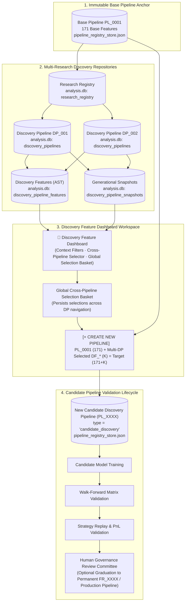

# DISCOVERY FEATURE DASHBOARD ARCHITECTURE
## Discovery → Pipeline Builder Workspace, Cross-Discovery-Pipeline Selection, Multi-Criteria Governance, Provenance Tracking, and Feature Selection Engine

```
Document Version: 1.2.0
Author: DeepMind Agentic Pair Programmer / ML Engineering
Status: AUTHORITATIVE ARCHITECTURAL SPECIFICATION & SYSTEM DESIGN
Target Base Path: C:\Users\admin\PycharmProjects\AruMLStudio
Target File: docs/18-DISCOVERY_FEATURE_DASHBOARD_ARCHITECTURE.md
Related Systems: Docs 03, 09, 11.4F, 12, 13, 14, 15, 16 · analysis.db · pipeline_registry_store.json
Hardware Baseline: 16 GB RAM Local Workstation (Zero Cloud Dependencies)
```

---

## 1. Executive Purpose & Strategic Mission

The **Discovery Feature Dashboard** is the interactive **Discovery $\longrightarrow$ Pipeline Builder Workspace** of AruMLStudio.

While the Autonomous Research Discovery Pipeline continuously synthesizes, evaluates, and governs mathematical AST features ($DF\_*$) during overnight campaigns, quantitative researchers require a specialized analytical environment to:
1. **Browse & Inspect:** Explore all Discovery Pipelines ($DP\_*$), associated Research executions, and generational evolution trees ($G_1 \dots G_{100}$).
2. **Cross-Discovery-Pipeline Selection:** Select high-evidence $\text{KEEP}$ and promising $\text{WATCH}$ features across **multiple Discovery Pipelines and Research Runs simultaneously** into a persistent global selection basket.
3. **Filter & Evaluate:** Filter discovered mathematical features by empirical lift ($\Delta\text{AUC}$), statistical drift ($D_{\text{KS}}$), evidence score, synthesis strategy, fold consistency, and multi-criteria governance verdicts ($\text{KEEP}$, $\text{WATCH}$, $\text{REMOVE}$).
4. **Assemble Candidate Pipelines:** Combine selected cross-pipeline $DF\_*$ discoveries with the immutable Base Pipeline $\text{PL\_0001}$ (171 base features) to construct unified candidate discovery pipelines (e.g. $\text{PL\_0002}$).
5. **Preserve End-to-End Lineage:** Establish permanent, auditable provenance linking every feature in a new pipeline directly back to its source Research ID, Discovery Pipeline ID, generation, snapshot hash, campaign ID, and original empirical verdict.

```
┌──────────────────────────────────────────────────────────────────────────────────────────────────┐
│                             THE TRI-FACETED RESEARCH SUITE IN ML STUDIO                          │
├──────────────────────────┬─────────────────────────────────────┬─────────────────────────────────┤
│ Component                │ Core Question Answered              │ Primary Artifacts Produced      │
├──────────────────────────┼─────────────────────────────────────┼─────────────────────────────────┤
│ 1. Research Leaderboard  │ "Which candidate models performed   │ Champion Candidate Specs,       │
│    (Model Space)         │ best on out-of-sample data?"        │ Walk-Forward Benchmarks (AUC)   │
├──────────────────────────┼─────────────────────────────────────┼─────────────────────────────────┤
│ 2. Research Registry     │ "What autonomous research runs      │ Research IDs, Durations,        │
│    (Execution Memory)    │ have executed historically?"        │ Global Formula Memory Priors    │
├──────────────────────────┼─────────────────────────────────────┼─────────────────────────────────┤
│ 3. Discovery Dashboard   │ "What mathematical features did     │ Curated Candidate Pipelines,    │
│    (Feature Builder)     │ research discover, and which ones   │ Cross-Pipeline Provenance       │
│                          │ do I want to build a pipeline from?"│ (PL_0001 + Multi-DP DF_*)       │
└──────────────────────────┴─────────────────────────────────────┴─────────────────────────────────┘
```

---

## 2. UI Location & Studio Navigation Integration

The Discovery Feature Dashboard is surfaced directly within the top-right navigation toolbar of **ML Research Studio** (`apps/master_dataset_tk/model_registry_panel.py`):

```
┌────────────────────────────────────────────────────────────────────────────────────────────────────────┐
│  ML Research Studio                                                                                    │
│  [Refresh]                              [Research Leaderboard] [🧬 Discovery Features] [Open Prediction Runs] │
└────────────────────────────────────────────────────────────────────────────────────────────────────────┘
```

- Clicking **`[🧬 Discovery Features]`** launches the Discovery Feature Dashboard workspace modal or panel.
- The button is positioned between `[Research Leaderboard]` and `[Open Prediction Runs]`, maintaining standard studio navigation ergonomics.

---

## 3. Authoritative Architecture & Storage Boundaries

The Discovery Feature Dashboard strictly consumes authoritative records and creates derived candidate pipelines without mutating production anchors:



### Storage Invariants:
1. **Zero Mathematical AST Duplication:** The dashboard queries `discovery_pipeline_features` and `discovery_pipeline_snapshots` in `analysis.db` directly. No secondary database of formulas is created.
2. **Immutable `PL_0001` Anchor:** Base Pipeline `PL_0001` (171 base features) is never overwritten.
3. **Pure Feature Registry (`feature_registry_store.json`):** Discovered features ($DF\_*$) in candidate pipelines do **NOT** enter the permanent Feature Registry until explicitly promoted via human governance.
4. **Authoritative `PL_0001` Direct Resolution Invariant:** Candidate Pipeline construction must resolve the authoritative `PL_0001` feature membership **directly from `pipeline_registry_store.json`**. The dashboard's displayed Registry or Baseline UI counts must **NEVER** be used as the source of truth for candidate pipeline composition. Candidate pipeline composition must **ALWAYS** be exactly:
   $$\text{Composition} = \text{Authoritative } \text{PL\_0001 Features} \cup \{\text{Deduplicated Selected } DF\_* \text{ Features}\}$$

---

## 4. Multi-Criteria Feature Governance Engine

Statistical drift ($D_{\text{KS}}$) determines **Drift Severity**, but **NOT the final governance verdict alone**.

The final governance verdict ($\text{KEEP}$, $\text{WATCH}$, or $\text{REMOVE}$) is determined by the **Multi-Criteria Feature Governance Engine**, which evaluates five orthogonal empirical dimensions:

```
                  Kolmogorov-Smirnov Test
                            │
                            ▼
                    D_KS Statistic
                            │
                            ▼
                      Drift Severity
           (0: Low <= 0.20 · 1: Mod <= 0.35 · 2: Sev > 0.35)
                            │
                            ▼
     ┌─────────────────────────────────────────────────────────────┐
     │           MULTI-CRITERIA FEATURE GOVERNANCE ENGINE          │
     │                                                             │
     │  1. Marginal Predictive Lift (ΔAUC vs Parent Pipeline)      │
     │  2. Statistical Drift (D_KS & Drift Severity Level)         │
     │  3. Multi-Factor Empirical Evidence Score (0–100 pts)       │
     │  4. Walk-Forward Positive Fold Consistency (>= 60%)         │
     │  5. AST Complexity & Noise Regularization Penalty           │
     │  6. Cross-Research Severe Drift Memory Blacklist            │
     └─────────────────────────────────────────────────────────────┘
                            │
            ┌───────────────┼───────────────┐
            ▼               ▼               ▼
        🟢 KEEP         🟡 WATCH        🔴 REMOVE
   (High-evidence   (Promising signals,  (Negative lift,
    lift, low drift, human review req,   severe drift, or
    high consistency) mod/low drift)     poor consistency)
```

### Multi-Criteria Decision Matrix:

```
┌────────────────────────────────────────────────────────────────────────────────────────────────────────────────────────────┐
│                                   MULTI-DIMENSIONAL FEATURE GOVERNANCE VERDICT RULES                                       │
├─────────┬──────────────┬───────────────┬────────────────┬──────────────────┬───────────────────────────────────────────────┤
│ Verdict │ Drift Level  │ Marginal ΔAUC │ Evidence Score │ Fold Consistency │ Empirical Condition                           │
├─────────┼──────────────┼───────────────┼────────────────┼──────────────────┼───────────────────────────────────────────────┤
│ 🟢 KEEP │ Severity 0   │ ΔAUC >= +0.001│ Score >= 52.0  │ Folds >= 60.0%   │ All criteria met: genuine predictive lift,    │
│         │ (D_KS <= 0.20│               │ pts            │                  │ stationary distribution, strong cross-val.   │
├─────────┼──────────────┼───────────────┼────────────────┼──────────────────┼───────────────────────────────────────────────┤
│ 🟡 WATCH│ Severity 0/1 │ ΔAUC > 0.0000 │ Score >= 45.0  │ Folds >= 50.0%   │ Positive signal, but moderate drift or mild   │
│         │ (D_KS <= 0.35│               │ pts            │                  │ fold inconsistency. Requires human review.    │
├─────────┼──────────────┼───────────────┼────────────────┼──────────────────┼───────────────────────────────────────────────┤
│ 🔴 REM  │ Any Severity │ ΔAUC <= 0.0000│ Score < 45.0   │ Folds < 50.0%    │ Negative or zero marginal contribution, or    │
│         │ OR           │ OR any        │ pts            │                  │ severe distribution drift (D_KS > 0.35).      │
│         │ Severity 2   │               │                │                  │ Excluded from candidate pools.                │
└─────────┴──────────────┴───────────────┴────────────────┴──────────────────┴───────────────────────────────────────────────┘
```

> [!IMPORTANT]
> **Low Drift Alone Does NOT Guarantee KEEP:**
> A synthetic feature with $D_{\text{KS}} = 0.08$ (Severity 0) but $\Delta\text{AUC} = -0.005$ or fold consistency of $20\%$ receives a verdict of **$\text{REMOVE}$**, because it fails the empirical predictive lift and stability requirements. Low drift is a necessary condition for $\text{KEEP}$, but not a sufficient one.

---

## 5. Main Dashboard Layout & Global Selection Basket

```
┌────────────────────────────────────────────────────────────────────────────────────────────────────────────────────────┐
│ 🧬 Discovery Feature Dashboard — Discovery → Pipeline Builder Workspace                                               │
├────────────────────────────────────────────────────────────────────────────────────────────────────────────────────────┤
│ Context Filters:                                                                                                       │
│ [Market: NIFTY ▼] [Interval: 6s ▼] [Task: Direction ▼] [Horizon: 5m ▼] [Regime: R001 ▼]                               │
│                                                                                                                        │
│ Active Discovery Pipeline: [DP_CAMP_NIFTY_6s_DIRECTION_CLASSIFIER_5m_R001_20260822_002913 (100 Gens · 14 Pool) ▼]     │
│ Research Run:              [RESEARCH_NIFTY_6s_DIRECTION_5m_R001_20260822_002913_a1b2 ▼]                                │
│ Generation Milestone:      [All Generations (1–100) ▼]                                                                 │
│                                                                                                                        │
│ Governance Filter:  ☑ 🟢 KEEP (9)   ☑ 🟡 WATCH (5)   ☐ 🔴 REMOVE (42)   [Select All Usable in View]                   │
│ Search Filter:      [ Search by Formula, Parent Feature, or Strategy...                                             ] │
├────────────────────────────────────────────────────────────────────────────────────────────────────────────────────────┤
│ 🧺 Global Selection Basket: 16 features selected (across 3 Discovery Pipelines)              [📋 View / Manage Basket] │
└────────────────────────────────────────────────────────────────────────────────────────────────────────────────────────┘
```

---

## 6. Cross-Discovery-Pipeline Selection Architecture

Researchers conduct autonomous research across multiple overnight campaigns, dates, and market regimes. High-performing mathematical features often emerge across disparate discovery runs.

The **Cross-Discovery-Pipeline Selection Engine** enables the researcher to assemble features from multiple Discovery Pipelines into a single unified candidate pipeline while strictly maintaining individual feature provenance.

```
┌──────────────────────────────────────────────────────────────────────────────────────────────────┐
│                           CROSS-PIPELINE SELECTION BASKET ARCHITECTURE                           │
├──────────────────────────────────────────────────────────────────────────────────────────────────┤
│                                                                                                  │
│  Discovery Pipeline A (DP_20260820_100000) ──▶ [☑ Select 5 KEEP Features]  ──┐                  │
│                                                                               │                  │
│  Discovery Pipeline B (DP_20260821_233647) ──▶ [☑ Select 8 KEEP/WATCH Feats] ─┼──▶ Global Basket │
│                                                                               │    (16 Features) │
│  Discovery Pipeline C (DP_20260822_002913) ──▶ [☑ Select 3 KEEP Features]  ──┘         │        │
│                                                                                        ▼        │
│                                              Immutable PL_0001 (171 Base Features) ──▶ [+]      │
│                                                                                        │        │
│                                                                                        ▼        │
│                                              New Candidate Discovery Pipeline (PL_0002)         │
│                                              (171 Base + 16 Discovered = 187 Features)          │
│                                                                                                  │
└──────────────────────────────────────────────────────────────────────────────────────────────────┘
```

### 6.1. Persistent Selection State Model
When the researcher navigates between different Discovery Pipelines in the dropdown selector, previously checked items from other pipelines remain active in the **Global Selection Basket**:

```python
@dataclass
class SelectedDiscoveryFeatureRef:
    """In-memory selection reference across Discovery Pipelines."""
    feature_id: str                          # e.g. "DF_CAMP_..._RATIO_00003"
    pipeline_id: str                         # e.g. "DP_CAMP_..._20260822_002913"
    research_id: str                         # e.g. "RESEARCH_..._20260822_002913_a1b2"
    campaign_id: str                         # e.g. "CAMP_..._20260822_002913"
    formula_hash: str                        # 16-char MD5 hash
    formula_expression: str                  # Canonical AST formula
    generator_strategy: str                  # RATIO, INTERACTION, etc.
    parent_features: list[str]               # Input base features
    generation_discovered: int               # e.g. 2
    discovery_snapshot_hash: str             # e.g. "DP_SNAP_f839ab10e927c34d"
    discovery_verdict: str                   # "KEEP" or "WATCH"
    marginal_delta_auc: float                # e.g. +0.00182
    ks_statistic: float                      # e.g. 0.0842
    drift_severity: int                      # 0 or 1
    evidence_score: float                    # e.g. 58.4
    fold_consistency: float                  # e.g. 0.80
    selection_timestamp_iso: str             # e.g. "2026-08-22T07:20:00Z"
```

### 6.2. Cross-Pipeline Validation & Compatibility Rules
Before allowing pipeline creation from the selection basket, the engine enforces four strict validation rules:

1. **Context Key Compatibility:** All selected features must belong to Discovery Pipelines targeting the **same or strictly compatible model context** (e.g. `NIFTY:6s:Direction:5m:R001`). Mixing features across incompatible task targets (e.g. Direction Classifier vs. Continuous Volatility Regressor) is blocked with an explicit error.
2. **Duplicate Formula Deduplication:** If two separate Discovery Pipelines independently discovered the exact same mathematical formula (identical 16-character MD5 formula hash), the engine includes the formula **only once** in the resulting pipeline, retaining the instance with the higher Evidence Score / $\Delta\text{AUC}$ and logging co-discovery provenance.
3. **`REMOVE` Safety Invariant:** Discovered features holding `REMOVE` verdict can **never** be added to the selection basket (`⛔` locked).
4. **Authoritative `PL_0001` Direct Resolution:** Candidate Pipeline construction must resolve the authoritative `PL_0001` feature membership directly from `pipeline_registry_store.json`. The dashboard's displayed Registry or Baseline UI counts must **never** be used as the source of truth for candidate pipeline composition. Candidate pipeline composition must **always** be exactly:
   $$\text{Candidate Pipeline Features} = \text{Authoritative } \text{PL\_0001 Features} \cup \{\text{Deduplicated Selected } DF\_* \text{ Features}\}$$

---

## 7. Feature Table Specification with Cross-Pipeline Basket

The table displays features for the currently active Discovery Pipeline, indicating which items are currently in the Global Selection Basket:

```
┌────┬─────────┬──────────────┬──────────────┬─────────────┬─────┬───────────────────────┬──────────────────────────────────────────┬──────────┬──────────┬──────────┬──────────┬──────────┐
│ ☑  │ Verdict │ DF Feat ID   │ Formula Hash │ Strategy    │ Gen │ Parent Features       │ Mathematical Formula (AST)               │ ΔAUC     │ D_KS     │ Score    │ Folds    │ Rationale│
├────┼─────────┼──────────────┼──────────────┼─────────────┼─────┼───────────────────────┼──────────────────────────────────────────┼──────────┼──────────┼──────────┼──────────┼──────────┤
│ ☑  │ 🟢 KEEP │ DF_00003     │ a1b2c3d4e5f6 │ RATIO       │ G1  │ atm_straddle, iv_mean │ col(atm_straddle_5m) / (abs(col(iv))+1e-6)│ +0.00182 │ 0.0842   │ 58.4 pts │ 80.0%    │ High Lift│
│ ☑  │ 🟢 KEEP │ DF_00008     │ 9f8e7d6c5b4a │ INTERACTION │ G2  │ delta_x_spot, rsi_14  │ col(delta_x_spot) * col(rsi_14)          │ +0.00145 │ 0.1210   │ 55.2 pts │ 60.0%    │ Low Drift│
│ ☐  │ 🟡 WATCH│ DF_00012     │ 112233445566 │ NONLINEAR   │ G2  │ macd_diff             │ log1p(abs(col(macd_diff)))               │ +0.00042 │ 0.2450   │ 48.0 pts │ 60.0%    │ Mod Drift│
│ ⛔  │ 🔴 REM  │ DF_00019     │ 778899aabbcc │ RATIO       │ G2  │ gamma_x_spot, vwap    │ col(gamma_x_spot) / (col(vwap)+1e-6)     │ -0.00310 │ 0.5210   │ 28.0 pts │ 20.0%    │ KS Drift │
└────┴─────────┴──────────────┴──────────────┴─────────────┴─────┴───────────────────────┴──────────────────────────────────────────┴──────────┴──────────┴──────────┴──────────┴──────────┘
```

### Table Columns:
1. `Select` (`☑ / ☐ / ⛔`): Checkbox selector (disabled for `REMOVE`).
2. `Verdict` (`status`): `🟢 KEEP`, `🟡 WATCH`, `🔴 REMOVE`.
3. `DF Feature ID` (`feature_id`): Deterministic ID `DF_<camp>_<strategy>_<seq>`.
4. `Formula Hash` (`formula_hash`): 16-character MD5 hash of canonical AST string.
5. `Strategy` (`generator_strategy`): Mathematical generator type.
6. `Gen` (`generation_discovered`): Generation milestone (`G1` ... `G100`).
7. `Parent Feature(s)` (`parent_features`): Comma-separated parent input features.
8. `Mathematical Formula (AST)` (`formula_expression`): Canonical formula expression.
9. `Marginal ΔAUC` (`delta_auc`): Out-of-sample predictive lift over parent pipeline baseline.
10. `D_KS (Drift)` (`ks_statistic`): Kolmogorov-Smirnov test statistic vs. training baseline.
11. `Drift Severity` (`drift_severity`): `0` ($D_{\text{KS}} \le 0.20$), `1` ($0.20 < D_{\text{KS}} \le 0.35$), `2` ($D_{\text{KS}} > 0.35$).
12. `Evidence Score` (`evidence_score`): Multi-factor composite empirical evidence score $[0, 100]$.
13. `Fold Consistency` (`fold_consistency`): Walk-forward positive cross-validation fold ratio $[0\%, 100\%]$.
14. `Governance Rationale` (`governance_rationale`): Concise algorithmic verdict justification.
15. `Research ID` (`research_id`): Owning research campaign execution identifier.
16. `Discovery Snapshot ID` (`snapshot_hash`): Cryptographic generation snapshot `DP_SNAP_*`.

---

## 8. Selection Curation & Multi-Pipeline Action Toolbar

```
┌────────────────────────────────────────────────────────────────────────────────────────────────────────┐
│ Current Pipeline Selection: 3 features in view                                                         │
│ Global Basket Selection:    16 features total (from 3 Discovery Pipelines)                             │
│ [Select All KEEP in View]   [Select All WATCH in View]   [Clear View Selection]   [Clear Global Basket]│
│                                                                                                        │
│                                                     [+ CREATE NEW PIPELINE (16 Selected Features) ▶]   │
└────────────────────────────────────────────────────────────────────────────────────────────────────────┘
```

---

## 9. "Create New Pipeline" Construction Engine (Multi-Source Pipeline Dialog)

Clicking **`[+ CREATE NEW PIPELINE]`** opens the **Multi-Pipeline Construction Dialog**:

```
┌────────────────────────────────────────────────────────────────────────────────────────────────────────┐
│ 🛠️ Create New Candidate Discovery Pipeline from Discovered Features                                    │
├────────────────────────────────────────────────────────────────────────────────────────────────────────┤
│ Parent Base Pipeline Anchor:  PL_0001 (Authoritative NIFTY 6s Base Anchor · 171 Base Features)         │
│                                                                                                        │
│ Source Discovery Pipelines Contributing to Basket:                                                     │
│   1. DP_CAMP_...20260820_100000 (Research: RESEARCH_...0820_100000) ── 5 Features (5 KEEP)            │
│   2. DP_CAMP_...20260821_233647 (Research: RESEARCH_...0821_233647) ── 8 Features (5 KEEP + 3 WATCH)  │
│   3. DP_CAMP_...20260822_002913 (Research: RESEARCH_...0822_002913) ── 3 Features (3 KEEP)            │
│                                                                                                        │
│ Feature Population Accounting:                                                                         │
│   • Base Pipeline Features (PL_0001 Anchor):        171 features                                       │
│   • Discovered Features Selected from Basket:        16 features (13 KEEP + 3 WATCH)                   │
│   • Resulting Candidate Pipeline Universe:          187 total features                                 │
│                                                                                                        │
│ Target Pipeline Configuration:                                                                         │
│ Pipeline ID:               [ PL_0002                                                                 ] │
│ Pipeline Display Name:     [ Pipeline_002 — Multi-Discovery Synthesis V1                             ] │
│ Pipeline Type:             Candidate Discovery Pipeline (type: "candidate_discovery")                  │
│ Context Key:               [ NIFTY_6s_DIRECTION_CLASSIFIER_5m_R001                                   ] │
│                                                                                                        │
│ Description / Notes:                                                                                   │
│ [Cross-discovery candidate pipeline assembling 16 high-conviction features across 3 overnight         ] │
│ [campaigns (Aug 20–22). Features combine straddle ratios, IV non-linearities, and delta interactions.  ] │
│                                                                                                        │
│ ☑ Generate Immutable Cryptographic Pipeline Snapshot (SHA-256)                                         │
│ ☑ Record Cross-Pipeline Multi-Source Lineage in pipeline_registry_store.json                           │
│                                                                                                        │
│                                                                  [ Cancel ]   [ Create Pipeline ▶ ]    │
└────────────────────────────────────────────────────────────────────────────────────────────────────────┘
```

---

## 10. Complete Multi-Pipeline Lineage & Provenance Schema

When a candidate pipeline is constructed from multiple discovery pipelines, unbroken lineage is permanently persisted in `pipeline_registry_store.json`:

```json
{
  "pipeline_id": "PL_0002",
  "name": "Pipeline_002 — Multi-Discovery Synthesis V1",
  "type": "candidate_discovery",
  "status": "ready",
  "context_key": "NIFTY_6s_DIRECTION_CLASSIFIER_5m_R001",
  "base_pipeline_anchor": "PL_0001",
  "base_feature_count": 171,
  "discovered_feature_count": 16,
  "total_feature_count": 187,
  "candidate_features": [
    "atm6_total_to_ltp_ratio",
    "...",
    "DF_CAMP_NIFTY_6s_..._20260820_100000_RATIO_00003",
    "DF_CAMP_NIFTY_6s_..._20260821_233647_INTERACTION_00012",
    "DF_CAMP_NIFTY_6s_..._20260822_002913_NONLINEAR_00008"
  ],
  "provenance_metadata": {
    "creation_source": "DISCOVERY_FEATURE_DASHBOARD",
    "creation_mode": "CROSS_DISCOVERY_PIPELINE_SELECTION",
    "created_by": "QUANTITATIVE_RESEARCHER",
    "created_at": "2026-08-22T07:25:00.000Z",
    "source_discovery_pipelines": [
      "DP_CAMP_NIFTY_6s_DIRECTION_CLASSIFIER_5m_R001_20260820_100000",
      "DP_CAMP_NIFTY_6s_DIRECTION_CLASSIFIER_5m_R001_20260821_233647",
      "DP_CAMP_NIFTY_6s_DIRECTION_CLASSIFIER_5m_R001_20260822_002913"
    ],
    "source_research_ids": [
      "RESEARCH_NIFTY_6s_DIRECTION_5m_R001_20260820_100000_f1a2",
      "RESEARCH_NIFTY_6s_DIRECTION_5m_R001_20260821_233647_b4c8",
      "RESEARCH_NIFTY_6s_DIRECTION_5m_R001_20260822_002913_a1b2"
    ],
    "selected_features_provenance": [
      {
        "feature_id": "DF_CAMP_NIFTY_6s_..._20260820_100000_RATIO_00003",
        "formula_hash": "a1b2c3d4e5f6",
        "formula_expression": "col('atm_straddle_change_5m') / (abs(col('iv_mean')) + 1e-6)",
        "source_pipeline_id": "DP_CAMP_NIFTY_6s_DIRECTION_CLASSIFIER_5m_R001_20260820_100000",
        "source_research_id": "RESEARCH_NIFTY_6s_DIRECTION_5m_R001_20260820_100000_f1a2",
        "generation_discovered": 1,
        "discovery_snapshot_hash": "DP_SNAP_1122334455667788",
        "discovery_verdict": "KEEP",
        "marginal_delta_auc": 0.00182,
        "ks_statistic": 0.0842,
        "drift_severity": 0,
        "evidence_score": 58.4,
        "fold_consistency": 0.80,
        "selection_timestamp": "2026-08-22T07:20:10.000Z"
      },
      {
        "feature_id": "DF_CAMP_NIFTY_6s_..._20260822_002913_NONLINEAR_00008",
        "formula_hash": "9f8e7d6c5b4a",
        "formula_expression": "log1p(abs(col('macd_diff_5m')))",
        "source_pipeline_id": "DP_CAMP_NIFTY_6s_DIRECTION_CLASSIFIER_5m_R001_20260822_002913",
        "source_research_id": "RESEARCH_NIFTY_6s_DIRECTION_5m_R001_20260822_002913_a1b2",
        "generation_discovered": 3,
        "discovery_snapshot_hash": "DP_SNAP_f839ab10e927c34d",
        "discovery_verdict": "KEEP",
        "marginal_delta_auc": 0.00145,
        "ks_statistic": 0.1210,
        "drift_severity": 0,
        "evidence_score": 55.2,
        "fold_consistency": 0.60,
        "selection_timestamp": "2026-08-22T07:22:45.000Z"
      }
    ],
    "co_discovery_features": []
  },
  "pipeline_snapshot_id": "PL_SNAP_9e8d7c6b5a4f3e2d",
  "created_at": "2026-08-22T07:25:00.000Z",
  "updated_at": "2026-08-22T07:25:00.000Z"
}
```

---

## 11. Exact End-to-End Cross-Discovery Architecture Diagram

```
                 Model Context Key: NIFTY:6s:Direction:5m:R001
                                       │
                                       ▼
                         Authoritative PL_0001
                          (171 Base Features)
                                       │
            ┌──────────────────────────┼──────────────────────────┐
            ▼                          ▼                          ▼
   Research Campaign A        Research Campaign B        Research Campaign C
 (RESEARCH_...0820_100000)  (RESEARCH_...0821_233647)  (RESEARCH_...0822_002913)
            │                          │                          │
            ▼                          ▼                          ▼
   Discovery Pipeline A       Discovery Pipeline B       Discovery Pipeline C
  (DP_CAMP_...0820_100000)   (DP_CAMP_...0821_233647)   (DP_CAMP_...0822_002913)
            │                          │                          │
            ▼                          ▼                          ▼
      DF_* Features              DF_* Features              DF_* Features
            │                          │                          │
            ▼                          ▼                          ▼
    Governance Engine          Governance Engine          Governance Engine
 (ΔAUC, D_KS, Folds, IC)    (ΔAUC, D_KS, Folds, IC)    (ΔAUC, D_KS, Folds, IC)
            │                          │                          │
            ├───────────────┐          ├───────────────┐          ├───────────────┐
            ▼               ▼          ▼               ▼          ▼               ▼
         🟢 KEEP         🟡 WATCH   🟢 KEEP         🟡 WATCH   🟢 KEEP         🟡 WATCH
         (5 Feats)       (0 Feats)  (5 Feats)       (3 Feats)  (3 Feats)       (0 Feats)
            │               │          │               │          │               │
            └───────────────┴──────────┼───────────────┴──────────┴───────────────┘
                                       ▼
                   Global Cross-Pipeline Selection Basket
                   (16 Discovered Features: 13 KEEP + 3 WATCH)
                                       │
                                       ▼
                   Discovery Feature Dashboard Workspace
                         [+ CREATE NEW PIPELINE]
                                       │
                                       ▼
                    New Candidate Discovery Pipeline
                                (PL_0002)
                   PL_0001 (171) + Selected DF_* (16)
                          = 187 Total Features
                                       │
                                       ▼
                     Candidate Model Training (XGB/LGBM)
                                       │
                                       ▼
                     Walk-Forward Replay & Validation
                                       │
                                       ▼
                     Strategy Replay & PnL Validation
                                       │
                                       ▼
                     Human Governance Review Committee
                                       │
                                       ▼
                   Optional Permanent Feature Promotion
                                (FR_XXXX)
```

---

## 12. Governance Boundaries: Discovered Features vs. Permanent Feature Registry

```
┌──────────────────────────────────────────────────────────────────────────────────────────────────┐
│                             FEATURE REGISTRY ISOLATION INVARIANTS                                │
├──────────────────────────────────────────────────────────────────────────────────────────────────┤
│ 1. Zero Automatic Promotion:                                                                     │
│    Achieving KEEP in a Discovery Pipeline or being selected in the Discovery Feature Dashboard   │
│    does NOT promote a feature into the permanent Feature Registry (feature_registry_store.json). │
│                                                                                                  │
│ 2. Candidate Pipeline Boundary:                                                                  │
│    The newly created pipeline (e.g. PL_0002) is a Candidate Discovery Pipeline. Its DF_*        │
│    features retain their synthetic names (e.g. DF_CAMP_..._00003) and AST formulas.              │
│                                                                                                  │
│ 3. Explicit Human Governance Gate:                                                              │
│    Only after the candidate pipeline is trained, backtested, and proven in Strategy Replay can   │
│    the quantitative researcher graduate individual DF_* features to permanent FR_xxxx status.   │
└──────────────────────────────────────────────────────────────────────────────────────────────────┘
```

---

## 13. Architectural Coherence & Summary

### 13.1. Verified Alignments Across Docs 09, 11.4F, 12, 13, 14, 15, 16, 18
- **Base Feature Count:** Authoritatively fixed at **171 Base Features** for `PL_0001`.
- **Formula Identity:** Verified as **16-character MD5** of canonical AST string: `hashlib.md5(norm.encode("utf-8")).hexdigest()[:16]`.
- **Snapshot Identity:** Verified as **16-character SHA-256** prefixed with `DP_SNAP_` or `PL_SNAP_`.
- **Cross-Discovery-Pipeline Selection:** Allows selecting $\text{KEEP}$ and $\text{WATCH}$ features from across multiple Discovery Pipelines simultaneously into a persistent Global Selection Basket.
- **Multi-Criteria Governance:** Verdict is produced by composite evaluation ($\Delta\text{AUC}$, $D_{\text{KS}}$ / Drift Severity, Evidence Score, Fold Consistency, Noise Regularization).
- **Candidate Discovery Pipeline Lifecycle:** Preserves complete provenance linking every selected feature to its owning research run, discovery pipeline, generation, snapshot hash, and original verdict.

---

```
DOCUMENT UPDATED:
docs/18-DISCOVERY_FEATURE_DASHBOARD_ARCHITECTURE.md (Version 1.2.0)

CODE CHANGES: NONE
DATABASE CHANGES: NONE
UI IMPLEMENTATION: NONE
```
