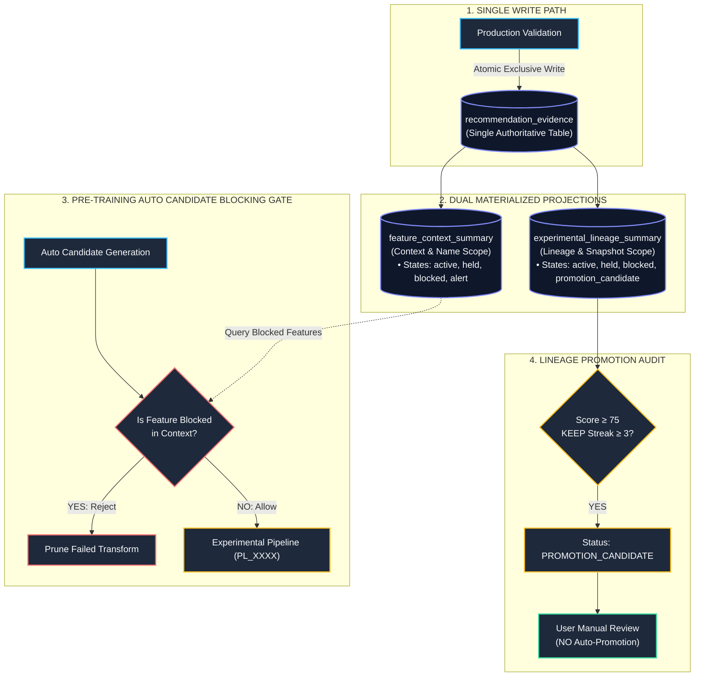

# Architecture Pre-Implementation Investigation Report

---

## 1. Executive Summary

This investigation report provides a comprehensive, source-code verified audit of the four critical pre-implementation architectural questions in **AruMLStudio**:

1. **Feature Recommendation JSON $\rightarrow$ SQLite Migration**: How to safely transition `<data_dir>/feature_recommendation_history.json` to `feature_recommendation_evidence.db` without data loss, race conditions, or blocking Production Validation.
2. **Experimental $\rightarrow$ Base Pipeline Promotion**: How the Base Pipeline is actually stored and persisted today, and how a clean, data-driven promotion mechanism should be architected for the future without Python code mutation.
3. **Auto Candidate Generation Throttling**: Why the current 40-feature interaction cap exists, how combinatorial explosion occurs, and how a hybrid exploitation/exploration architecture preserves discovery of non-linear synergies without target bias.
4. **Model Research Lab vs. Strategy Lab Databases**: The structural differences, data duplication, and schemas between `model_lab_<name>_v1.db` and `prediction_runs/registry.db`, with a recommended Canonical Prediction architecture.

> [!IMPORTANT]
> **Zero Code Modifications Made**: This document represents a pure codebase inspection and architectural blueprint. No source files, databases, or schemas have been altered.

---

## 2. Question 1 — Feature Recommendation JSON $\rightarrow$ SQLite Migration

### 2.1. Current Implementation Flow
- **Source Module**: [`apps/chain_replay_ml/production_validation/recommendation_store.py`](file:///c:/Users/admin/PycharmProjects/AruMLStudio/apps/chain_replay_ml/production_validation/recommendation_store.py).
- **Read Path**: `load_recommendation_store(data_dir)` reads `<data_dir>/feature_recommendation_history.json` on demand in `update_registry_recommendations()` ([`recommendation_store.py#L495`](file:///c:/Users/admin/PycharmProjects/AruMLStudio/apps/chain_replay_ml/production_validation/recommendation_store.py#L495)), `recommended_for_removal()` ([`#L247`](file:///c:/Users/admin/PycharmProjects/AruMLStudio/apps/chain_replay_ml/production_validation/recommendation_store.py#L247)), and `ignore_feature_recommendation()` ([`#L342`](file:///c:/Users/admin/PycharmProjects/AruMLStudio/apps/chain_replay_ml/production_validation/recommendation_store.py#L342)).
- **Write Path**: `save_recommendation_store(data_dir, doc)` completely overwrites the JSON file on disk using `json.dump` ([`recommendation_store.py#L75-L86`](file:///c:/Users/admin/PycharmProjects/AruMLStudio/apps/chain_replay_ml/production_validation/recommendation_store.py#L75-L86)).
- **UI Trigger**: `_on_update_registry_recommendations()` in [`apps/master_dataset_tk/production_validation_panel.py#L995-L1080`](file:///c:/Users/admin/PycharmProjects/AruMLStudio/apps/master_dataset_tk/production_validation_panel.py#L995-L1080) runs asynchronously in a worker thread and calls `persist_registry_recommendations()`.

### 2.2. Migration Analysis & Answers

| Investigation Item | Finding & Source Code Evidence | Recommended Resolution |
|---|---|---|
| **1. Existing Migration Framework** | [`apps/chain_replay_ml/dataset_builder/feature_migration_engine.py`](file:///c:/Users/admin/PycharmProjects/AruMLStudio/apps/chain_replay_ml/dataset_builder/feature_migration_engine.py) handles Master SQLite feature column additions with temp tables. No general registry migration framework exists. | Use a simple schema version table `migration_meta (key, value, migrated_at)` inside `feature_recommendation_evidence.db`. |
| **2. Startup vs Background Worker** | Production Validation JSON is typically small (< 5 MB, < 10,000 entries). Reading JSON and inserting into SQLite takes < 150 ms. | Execute **synchronous idempotent migration on first DB initialization**; fast and prevents startup race conditions. |
| **3. Concurrency with PV** | PV writes to JSON only when the user clicks "Update Registry Recommendations". | Acquire an exclusive file lock / SQLite transaction during migration. If DB exists and `schema_version >= 1`, skip migration immediately. |
| **4. Duplicate Migration Prevention** | Check `migration_meta` table for `json_migration_completed == 'true'`. | If true, ignore JSON and read directly from SQLite. Archive `feature_recommendation_history.json` as `.bak`. |
| **5. `legacy_unknown` Context Records** | Missing `dataset_metadata` when model packages are deleted. | Stored with `context_id = 'legacy_unknown'`. Displayed in Feature Studio historical logs, but **strictly excluded** from dataset-scoped candidate blocking queries (`WHERE context_id != 'legacy_unknown'`). |
| **6. Semantic Preservation** | Historical JSON contains `recommendation` (`KEEP`/`WATCH`/`REMOVE`), `model_name`, `production_validation_run_id`, `generated_date`. | All original recommendation strings and details are imported verbatim into `recommendation_evidence` without altering historical meaning. |

---

## 3. Question 2 — Experimental $\rightarrow$ Base Pipeline Promotion

### 3.1. Current Base Pipeline Implementation Audit
- **Source Module**: [`apps/chain_replay_ml/dataset_builder/pipeline_registry_store.py`](file:///c:/Users/admin/PycharmProjects/AruMLStudio/apps/chain_replay_ml/dataset_builder/pipeline_registry_store.py).
- **Physical Storage**: `<chart_data_dir>/pipeline_registry_store.json`.
- **Base Pipeline Record**:
  ```json
  {
    "pipelines": {
      "PL_0001": {
        "pipeline_id": "PL_0001",
        "name": "Pipeline_001 — Base",
        "type": "base",
        "status": "ready",
        "registry_feature_ids": [],
        "candidate_features": ["oi_pcr", "ce_pe_diff_ratio", ...],
        "transformation_config": { ... },
        "created_at": "2026-08-16T10:00:00Z",
        "updated_at": "2026-08-16T10:00:00Z"
      }
    }
  }
  ```
- **Code Provenance**:
  - `is_base_pipeline_record(rec)` ([`pipeline_registry_store.py#L32`](file:///c:/Users/admin/PycharmProjects/AruMLStudio/apps/chain_replay_ml/dataset_builder/pipeline_registry_store.py#L32)) checks `type == 'base'`.
  - `delete_pipeline(doc, pid)` ([`#L250`](file:///c:/Users/admin/PycharmProjects/AruMLStudio/apps/chain_replay_ml/dataset_builder/pipeline_registry_store.py#L250)) explicitly prevents deletion of the Base pipeline (`"The Base pipeline cannot be deleted."`).
  - Python source files are **never modified** at runtime; pipeline membership is 100% data-driven JSON serialization.

### 3.2. Future Promotion Architecture (Manual Review Only)
When an experimental candidate achieves `PROMOTION_CANDIDATE` in `experimental_lineage_summary`:

```
                       PROMOTION AUDIT WORKFLOW (MANUAL ONLY)
                       
   Experimental Lineage Summary ──► [UI: Promotion Review Tab] ──► User Clicks "Promote to Base"
   (Score ≥ 75, KEEP streak ≥ 3)                                                 │
                                                                                 ▼
                                                                Update pipeline_registry_store.json:
                                                                1. Add feature to PL_0001.candidate_features
                                                                2. Merge transform config into PL_0001
                                                                3. Compute NEW Base snapshot_id
                                                                4. Record promotion event in evidence log
```

- **Metadata Preserved Upon Promotion**:
  1. `source_pipeline_id` (e.g. `PL_0005`) and `source_pipeline_snapshot_id` (e.g. `ca5945f58f8b`).
  2. `promoted_at_utc` timestamp and `promoted_by_user` indicator.
  3. `promotion_evidence_score` at the time of acceptance.
- **Snapshot ID Handling**:
  - The Base Pipeline computes a **new** `pipeline_snapshot_id` because its membership changed.
  - The experimental pipeline lineage retains its original snapshot ID for historical provenance.

---

## 4. Question 3 — Auto Candidate Generation Throttling

### 4.1. Root Cause of the 40-Feature Cap
- **Source Location**: [`apps/master_dataset_tk/auto_candidate_generation.py#L355`](file:///c:/Users/admin/PycharmProjects/AruMLStudio/apps/master_dataset_tk/auto_candidate_generation.py#L355) & [`#L457`](file:///c:/Users/admin/PycharmProjects/AruMLStudio/apps/master_dataset_tk/auto_candidate_generation.py#L457):
  ```python
  # Cap pairwise explosion for very wide source sets.
  ix_feats = feats[:40]
  for op in ops:
      pairs.extend(bulk_interaction_pairs(ix_feats, ix_feats, op=op, skip_identical=True))
  ```
- **Combinatorial Explosion**:
  - Pairwise interactions scale as $O(N^2 \cdot |\text{ops}|)$.
  - For $N = 40$ features with 4 operations: $40 \times 39 \times 4 = 6,240$ interaction candidates.
  - For $N = 300$ features with 4 operations: $300 \times 299 \times 4 = 358,800$ candidates.
  - Generating 350k Polars transformation expressions causes massive memory spikes (> 8 GB RAM) and Tkinter UI freezes.
- **Limitation**: The current `feats[:40]` simply slices the first 40 alphabetically/arbitrarily ordered features, ignoring signal quality, feature families, and non-linear synergy.

### 4.2. Comparative Evaluation of Candidate Selection Approaches

| Strategy | Mechanism | Pros | Cons |
|---|---|---|---|
| **A. First-40 Static Cutoff** *(Current)* | Arbitrary slice `feats[:40]`. | Simple, fast. | High bias; completely ignores feature families outside the first 40. |
| **B. Mutual Information Top-N** | Rank by target MI. | Selects high univariate signal. | **Severe Target Bias**: Discards weak individual features that form strong interactions; target-specific. |
| **C. HCA Cluster Medoids** | Select 1 representative per correlation cluster. | Completely target-independent; eliminates collinear redundancy. | Excludes exploratory candidate variations. |
| **D. Correlation Filter** | Drop pairwise $|r| > 0.85$. | Simple variance retention. | Hard cutoff does not guarantee cross-family diversity. |
| **E. Hybrid Exploitation + Exploration** *(Recommended)* | **70% HCA Medoids + 30% Stratified Exploratory Budget**. | **Optimal**: Guarantees family coverage while allowing low-individual-signal features to form non-linear interaction pairs. | Requires reading Feature Analysis HCA cluster outputs when available. |

---

## 5. Question 4 — Model Research Lab vs. Strategy Lab Databases

### 5.1. Database Inventory & Provenance

```
┌────────────────────────────────────────────────────────────────────────────────────────┐
│                        LAB DATABASE ARCHITECTURE COMPARISON                            │
├──────────────────────────┬─────────────────────────────┬───────────────────────────────┤
│ Dimension                │ Model Research Lab          │ Strategy Lab                  │
├──────────────────────────┼─────────────────────────────┼───────────────────────────────┤
│ **Database File**        │ `model_lab_<name>_v1.db`    │ `prediction_runs/registry.db` │
│                          │ (Workspace per model)       │ (Central system registry)     │
├──────────────────────────┼─────────────────────────────┼───────────────────────────────┤
│ **Primary Schema File**  │ `model_lab/prediction_schema`│ `prediction_runs/store.py`    │
├──────────────────────────┼─────────────────────────────┼───────────────────────────────┤
│ **Dataset Scope**        │ Seen & Unseen Trading Days  │ Walk-Forward Folds & OOS Runs │
├──────────────────────────┼─────────────────────────────┼───────────────────────────────┤
│ **Prediction Columns**   │ `predicted_future_ltp`,     │ `spot`, `ltp`, `predicted_ltp`│
│                          │ `current_spot`, `actual_ltp`│ `actual_ltp`, `confidence`    │
├──────────────────────────┼─────────────────────────────┼───────────────────────────────┤
│ **Trade Simulation**     │ `maximum_profit` (MFE),     │ Simulated via Strategy Engine │
│                          │ `maximum_drawdown` (MAE),   │ (`strategies/registry.db`)    │
│                          │ `time_to_target`, `rr_hits` │                               │
├──────────────────────────┼─────────────────────────────┼───────────────────────────────┤
│ **Primary Lab Function** │ 10-Tab Deep Model Diagnosis │ Multi-Fold Replay & Portfolio │
└──────────────────────────┴─────────────────────────────┴───────────────────────────────┘
```

### 5.2. Evaluation of Database Unification Architectures
- **Architecture A (Keep Completely Separate)**: Research Lab and Strategy Lab duplicate prediction generation on identical trading days.
- **Architecture B (Canonical Prediction Evidence Store + Lab-Specific Workspaces — Recommended)**:
  - Centralize canonical row-level predictions (`trading_day`, `timestamp`, `token`, `spot`, `ltp`, `predicted_ltp`, `actual_ltp`) into a single queryable store.
  - Model Research Lab reads from the canonical store and maintains its local analytics cache.
  - Strategy Lab executes strategy backtests directly against canonical prediction runs without re-running model inference.
- **Architecture C (Merge into One Monolithic DB)**: Unifying research scratchpads into a single multi-gigabyte SQLite file creates severe write-lock contention across concurrent UI workers.

---

## 6. Current Architecture Diagrams

### 6.1. Current Recommendation Storage Flow
```mermaid
flowchart LR
    PV["Production Validation\n(compute.py)"] -->|Writes| JSON["feature_recommendation_history.json\n(Flat Unindexed JSON)"]
    JSON -->|rebuild_summary()| SUMM["In-Memory Feature Summary\n(No Dataset Scoping)"]
    SUMM -->|Advisory Stars| UI["Feature Studio UI\n(Advisory only; No Blocking Gate)"]
```

---

## 7. Recommended Future Architecture



---

## 8. Risks & Mitigations

| Risk | Impact | Mitigation Strategy |
|---|---|---|
| **Legacy JSON Import Corruption** | Incomplete historical records could corrupt SQLite tables. | Validate each entry schema; assign `context_id = 'legacy_unknown'` if model config missing. Wrap migration in a single rollback-safe transaction. |
| **Over-Aggressive Candidate Blocking** | Blocking useful features across all contexts. | Scope all blocking queries strictly to `context_id` (`market + interval + window + project`). |
| **High Write Contention in SQLite** | UI freezes during concurrent validation runs. | Use WAL mode (`PRAGMA journal_mode = WAL;`) and short exclusive write transactions. |
| **Explosion in Interaction Features** | Memory exhaustion during candidate generation. | Implement the **Hybrid HCA Medoid + Exploration Budget** cap to limit source pairs strictly to 40 diverse features. |

---

## 9. Decisions Already Approved

- [x] **Single Authoritative SQLite DB**: `feature_recommendation_evidence.db` containing `dataset_contexts`, `recommendation_evidence`, `feature_context_summary`, and `experimental_lineage_summary`.
- [x] **Dual Projection Architecture**: Separation between Context-Level summary and Lineage-Specific summary.
- [x] **Pre-Training Elimination Gate**: Evaluates `context_id + feature_name` to block failed mathematical transforms during Auto Candidate Generation.
- [x] **Zero Automated Promotion / Deletion**: Base features are never auto-deleted; Experimental features are never auto-promoted.
- [x] **Configurable Scoring & Thresholds**: Managed via `recommendation_policy.json`.

---

## 10. Decisions Requiring User Approval

1. **Auto Candidate Throttling Policy**: Approve the **Hybrid 70% HCA Medoid + 30% Exploratory Budget** as the replacement for the static `feats[:40]` slice.
2. **Prediction Evidence Store Unification**: Approve **Architecture B** (Canonical Prediction Storage with independent research workspaces) for future Model Research Lab and Strategy Lab alignment.

---

## 11. Implementation Dependencies

```
[recommendation_policy.json]
             │
             ▼
[dataset_context.py] ──► [evidence_store.py (SQLite Tables & DDL)]
                                     │
             ┌───────────────────────┴───────────────────────┐
             ▼                                               ▼
[recommendation_migration.py]                     [auto_candidate_generation.py]
(JSON → SQLite Importer)                          (Pre-Training REMOVE Gate)
             │                                               │
             ▼                                               ▼
[production_validation/api.py]                    [production_validation_panel.py]
(Write Path Update)                               (Evidence UI & History)
```

---

## 12. Recommended Implementation Order

### Phase 1: Storage Layer & Migration (Zero UI Impact)
1. Implement `recommendation_policy.json` loader with default configurable thresholds.
2. Implement `dataset_context.py` resolver (`context_id` derivation).
3. Implement `evidence_store.py` (SQLite schema, connection management, WAL mode, transaction helpers).
4. Implement `recommendation_migration.py` (Idempotent JSON $\rightarrow$ SQLite backfill).

### Phase 2: Write Path & Projection Rebuild
5. Update `persist_registry_recommendations()` in `recommendation_store.py` to write to `recommendation_evidence` and update both projection tables atomically.
6. Implement `rebuild_all_projections()` for disaster recovery.

### Phase 3: Pre-Training Blocking Gate
7. Integrate the REMOVE blocking query into `generate_pipeline_candidate_names()` in `auto_candidate_generation.py`.
8. Update Candidate Generation Report metrics to track blocked candidates.

### Phase 4: UI & Production Validation Panel
9. Update `production_validation_panel.py` to display dataset-scoped recommendations and evidence scores.
10. Run regression tests (`test_feature_recommendation_lifecycle.py`) to verify 100% backward compatibility.
