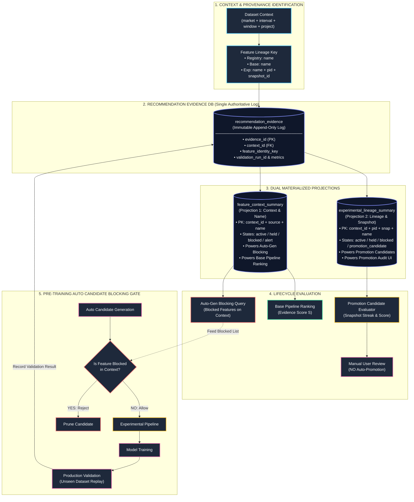

# Feature Recommendation Evidence DB Architecture — Approved Design Specification

---

## 1. Executive Summary & Core Architectural Principle

This document provides the complete, approved design specification for the **Feature Recommendation Evidence Database** (`feature_recommendation_evidence.db`) in **AruMLStudio**.

### Core Architecture: Single Authoritative Evidence Store + Dual Projections

```
                        SINGLE AUTHORITATIVE WRITE PATH
                                       │
                                       ▼
                   ┌───────────────────────────────────────┐
                   │        recommendation_evidence        │
                   │      (Single Immutable Log Table)     │
                   │ • Complete Provenance & Raw Evidence  │
                   │ • Never mutated / Append-only         │
                   └───────────────────┬───────────────────┘
                                       │
           ┌───────────────────────────┴───────────────────────────┐
           │ (Single Transaction Async Projection Update)          │
           ▼                                                       ▼
┌───────────────────────────────────────┐   ┌───────────────────────────────────────────┐
│        feature_context_summary        │   │       experimental_lineage_summary        │
│   (Projection 1: Context & Name)      │   │    (Projection 2: Lineage & Snapshot)     │
├───────────────────────────────────────┤   ├───────────────────────────────────────────┤
│ Primary Key:                          │   │ Primary Key:                              │
│ (context_id, feature_source,          │   │ (context_id, pipeline_id,                 │
│  feature_name)                        │   │  pipeline_snapshot_id, feature_name)      │
│                                       │   │                                           │
│ Valid Context States:                 │   │ Valid Lineage States:                     │
│ ('active', 'held', 'blocked', 'alert')│   │ ('active', 'held', 'blocked',             │
│                                       │   │  'promotion_candidate')                   │
│ Primary Responsibilities:             │   │                                           │
│ • Context-level failure scoring       │   │ Primary Responsibilities:                 │
│ • Auto Candidate Generation blocking  │   │ • Lineage-specific candidate lifecycle    │
│ • Base Pipeline health & priority rank│   │ • Exact snapshot validation evaluation    │
│ • Feature Registry health monitoring  │   │ • Snapshot-specific KEEP streaks          │
│ • Powers the Pre-Training Gate        │   │ • Promotion Candidate determination       │
│                                       │   │ • Powers the Promotion Audit UI           │
└───────────────────────────────────────┘   └───────────────────────────────────────────┘
```

1. **One Authoritative Evidence Table**: `recommendation_evidence` is the sole source of truth. It records every unseen validation result and full lineage provenance.
2. **Zero Evidence Duplication**: The two summary tables are pure mathematical projections (materialized caches). They contain no independent raw data and can be recomputed from `recommendation_evidence` at any time.
3. **No Disconnected Databases**: No separate `remove.db`, `watch.db`, or `keep.db`.
4. **Strict Separation of Promotion State**: `PROMOTION_CANDIDATE` is an experimental lineage-specific state and is owned **exclusively** by `experimental_lineage_summary`. `feature_context_summary` tracks only context-level operational states (`active`, `held`, `blocked`, `alert`).
5. **No Automated Promotion or Deletion**: Experimental features are flagged as `PROMOTION_CANDIDATE` for human review only; Base Pipeline features accumulate stability evidence without automatic deletion.

---

# PART A — CURRENT IMPLEMENTATION AUDIT

## 2. Current Codebase Findings

### 2.1. Recommendation Storage & Location
- **Store Location**: Single flat JSON file at `<chart_data_dir>/feature_recommendation_history.json`.
- **Implementation**: [`apps/chain_replay_ml/production_validation/recommendation_store.py`](file:///c:/Users/admin/PycharmProjects/AruMLStudio/apps/chain_replay_ml/production_validation/recommendation_store.py).
- **Current Entry Schema**:
  ```json
  {
    "id": 1,
    "feature_id": "feat_001",
    "feature_name": "oi_pcr",
    "model_name": "Future_LTP_5m_WF_1168f_XGB_2243_14",
    "recommendation": "REMOVE",
    "generated_date": "2026-08-16T10:00:00Z",
    "production_validation_run_id": "8f3b2a1c-6d4e-4f1a-8c2e-9a1b2c3d4e5f",
    "recommendation_detail": "{\"rank_severity\": 2, \"imp_severity\": 2, \"drift_severity\": 1}"
  }
  ```

### 2.2. Current Calculation of REMOVE Run Counts
In `rebuild_summary()` ([`recommendation_store.py#L170-L237`](file:///c:/Users/admin/PycharmProjects/AruMLStudio/apps/chain_replay_ml/production_validation/recommendation_store.py#L170-L237)):
- Tallies raw counts: `remove_runs`, `watch_runs`, `keep_runs`.
- Counts unique `model_name` occurrences: `remove_models`, `watch_models`, `keep_models`.
- Computes an advisory 1–5 star rating via hardcoded thresholds in `compute_recommendation_strength()`.

### 2.3. Current Auto Candidate Generation Flow
- **UI Trigger**: `_generate_candidates()` in [`apps/master_dataset_tk/auto_feature_transform_panel.py`](file:///c:/Users/admin/PycharmProjects/AruMLStudio/apps/master_dataset_tk/auto_feature_transform_panel.py).
- **Generator Engine**: `generate_pipeline_candidate_names()` in [`apps/master_dataset_tk/auto_candidate_generation.py`](file:///c:/Users/admin/PycharmProjects/AruMLStudio/apps/master_dataset_tk/auto_candidate_generation.py).
- **Current Filter**: Calls `_policy_reject_names()` to filter out static retired names (`_excluded_feature_names()`) and duplicate names.
- **Current Limitation**: Does **not** query recommendation history or check whether candidate features have prior `REMOVE` marks for that market/interval dataset context.

---

# PART B — PROPOSED ENHANCEMENT

## 3. Final Verified Dataset Context

Inspection of `dataset_metadata`, `dataset_build_snapshot.json`, and `MasterBuildConfig` confirms that the following four parameters uniquely and exhaustively define the physical observation universe in AruMLStudio:

```
┌────────────────────────────────────────────────────────────────────────────────────────┐
│                              FINAL VERIFIED DATASET CONTEXT                            │
├──────────────────────────┬──────────────────────────┬──────────────────────────────────┤
│ Parameter Field          │ Source Code Provenance   │ Exact Architectural Role         │
├──────────────────────────┼──────────────────────────┼──────────────────────────────────┤
│ **market**               │ `dataset_metadata.market`│ Isolates instrument tick regimes │
│                          │                          │ (e.g. NIFTY vs SENSEX vs BANK)   │
├──────────────────────────┼──────────────────────────┼──────────────────────────────────┤
│ **sampling_interval_sec**│ `sampling_interval_sec`  │ Isolates observation granularity │
│                          │ (Label: `sampling_label`)│ (e.g. 1s vs 3s vs 6s)            │
├──────────────────────────┼──────────────────────────┼──────────────────────────────────┤
│ **sliding_window**       │ `strike_selection`       │ Isolates option chain depth      │
│                          │ (`atm_band` window)      │ (e.g. atm_15 vs standard)        │
├──────────────────────────┼──────────────────────────┼──────────────────────────────────┤
│ **feature_project_id**   │ `feature_project_id`     │ Isolates Feature Registry domain │
│                          │ (e.g. "all", "chart")    │ ownership & baseline partition   │
└──────────────────────────┴──────────────────────────┴──────────────────────────────────┘
```

### 3.1. Context Key & Hash Resolution
$$\text{context\_key} = \text{market} \mathbin{\Vert} \text{sampling\_interval\_sec} \mathbin{\Vert} \text{sliding\_window} \mathbin{\Vert} \text{feature\_project\_id}$$
$$\text{context\_id} = \text{SHA256}(\text{context\_key})[:12] \quad (\text{e.g. } \texttt{ctx\_9a4f21bc08d1})$$

### 3.2. Target Column Scope Decision
- **Architecture Decision**: `target_column` (e.g. `future_ltp_5m`) is stored on **every immutable evidence record** (`recommendation_evidence.target_column`), but is **NOT** part of the `dataset_contexts` primary key.
- **Rationale**:
  1. **Physical Universe Invariance**: A dataset context defines the underlying time-series data environment on which features are computed. Features are generated from historical tick bars before downstream models choose specific targets.
  2. **Dual Query Flexibility**: Storing `target_column` on the immutable evidence row allows:
     - **Context-Wide Queries**: Auto Candidate Generation can check if a feature is structurally broken across the entire market context.
     - **Target-Specific Queries**: Model Builder and Feature Studio can query evidence filtered by a specific target horizon when training a specialized model.

---

## 4. Feature Identity, Blocking Identity & Promotion Identity

To prevent evidence bleed across experimental candidate iterations while supporting active candidate blocking, feature identity is formalized across two distinct operational scopes:

```
┌────────────────────────────────────────────────────────────────────────────────────────┐
│                        FEATURE IDENTITY ACROSS OPERATIONAL SCOPES                      │
├──────────────────────────┬─────────────────────────────────────────────────────────────┤
│ Operational Scope        │ Canonical Identity Key                                      │
├──────────────────────────┼─────────────────────────────────────────────────────────────┤
│ **Immutable Evidence**   │ Registry:     `registry:{feature_name}`                     │
│ (Lineage-Specific)       │ Base:         `base_pipeline:{feature_name}`                │
│                          │ Experimental: `exp:{feature_name}:{pipeline_id}:{snapshot}` │
├──────────────────────────┼─────────────────────────────────────────────────────────────┤
│ **Pre-Training Gate**    │ `(context_id, feature_name)`                                │
│ (Auto-Gen Blocking)      │ Queries `feature_context_summary`                           │
├──────────────────────────┼─────────────────────────────────────────────────────────────┤
│ **Promotion Audit**      │ `(context_id, pipeline_id, pipeline_snapshot_id, feat_name)`│
│ (Experimental Lifecycle) │ Queries `experimental_lineage_summary`                      │
└──────────────────────────┴─────────────────────────────────────────────────────────────┘
```

---

## 5. Single Authoritative SQLite Schema (`feature_recommendation_evidence.db`)

Consolidates all evidence into `<chart_data_dir>/feature_recommendation_evidence.db`:

```
┌──────────────────────────────────────────────────────────────────────────────────────┐
│                  FEATURE RECOMMENDATION EVIDENCE DB SCHEMA (SQLite)                  │
├──────────────────────────────────────────────────────────────────────────────────────┤
│                                                                                      │
│  ┌───────────────────────┐             ┌──────────────────────────────────────────┐  │
│  │   dataset_contexts    │             │         recommendation_evidence          │  │
│  ├───────────────────────┤             │   (Level 1: Immutable Append-Only Log)   │  │
│  │ context_id (PK)       │◄────────────┤──────────────────────────────────────────┤  │
│  │ market                │      1:N    │ evidence_id (PK)                         │  │
│  │ sampling_interval_sec │             │ context_id (FK)                          │  │
│  │ sampling_label        │             │ feature_name                             │  │
│  │ sliding_window        │             │ feature_source (registry/base/exp)       │  │
│  │ feature_project_id    │             │ feature_identity_key (Full Lineage)      │  │
│  │ context_key           │             │ pipeline_id                              │  │
│  │ created_at            │             │ pipeline_snapshot_id                     │  │
│  └───────────────────────┘             │ recommendation (KEEP/WATCH/REMOVE)       │  │
│             ▲                          │ validation_run_id                        │  │
│             │                          │ model_name                               │  │
│             │ 1:N                      │ target_column                            │  │
│             │                          │ holdout_rank                             │  │
│  ┌──────────┴────────────┐             │ unseen_rank                              │  │
│  │feature_context_summary│             │ rank_change                              │  │
│  │ (Projection 1: Name)  │             │ relative_imp_drop                        │  │
│  ├───────────────────────┤             │ drift_severity                           │  │
│  │ summary_id (PK)       │             │ evidence_detail_json                     │  │
│  │ context_id (FK)       │             │ run_timestamp                            │  │
│  │ feature_source        │             └──────────────────────────────────────────┘  │
│  │ feature_name          │                                  ▲                        │
│  │ total_runs            │                                  │ 1:N                    │
│  │ keep_runs / models    │             ┌────────────────────┴─────────────────────┐  │
│  │ watch_runs / models   │             │       experimental_lineage_summary       │  │
│  │ remove_runs / models  │             │         (Projection 2: Lineage)          │  │
│  │ consecutive_removes   │             ├──────────────────────────────────────────┤  │
│  │ consecutive_keeps     │             │ lineage_id (PK)                          │  │
│  │ evidence_score        │             │ context_id (FK)                          │  │
│  │ priority_rank         │             │ pipeline_id                              │  │
│  │ lifecycle_status      │             │ pipeline_snapshot_id                     │  │
│  │ last_recommendation   │             │ feature_name                             │  │
│  │ last_validated_at     │             │ feature_identity_key                     │  │
│  └───────────────────────┘             │ total_runs                               │  │
│                                        │ keep_runs / models                       │  │
│                                        │ watch_runs / models                      │  │
│                                        │ remove_runs / models                     │  │
│                                        │ consecutive_keep_count                   │  │
│                                        │ consecutive_remove_count                 │  │
│                                        │ lineage_evidence_score                   │  │
│                                        │ lifecycle_status                         │  │
│                                        │ last_recommendation                      │  │
│                                        │ last_validated_at                        │  │
│                                        └──────────────────────────────────────────┘  │
└──────────────────────────────────────────────────────────────────────────────────────┘
```

### 5.1. DDL Specification

```sql
-- 1. Canonical Dataset Contexts
CREATE TABLE IF NOT EXISTS dataset_contexts (
    context_id TEXT PRIMARY KEY,
    market TEXT NOT NULL,
    sampling_interval_sec INTEGER NOT NULL,
    sampling_label TEXT NOT NULL,
    sliding_window TEXT NOT NULL DEFAULT 'standard',
    feature_project_id TEXT NOT NULL DEFAULT 'all',
    context_key TEXT UNIQUE NOT NULL,
    created_at TEXT NOT NULL
);
CREATE INDEX IF NOT EXISTS idx_ctx_market_interval 
    ON dataset_contexts(market, sampling_interval_sec);

-- 2. Level 1: Immutable Evidence Log (Lineage-Specific Provenance)
CREATE TABLE IF NOT EXISTS recommendation_evidence (
    evidence_id TEXT PRIMARY KEY,
    context_id TEXT NOT NULL,
    feature_name TEXT NOT NULL,
    feature_source TEXT NOT NULL CHECK (feature_source IN ('registry', 'base_pipeline', 'experimental')),
    feature_identity_key TEXT NOT NULL,
    pipeline_id TEXT,
    pipeline_snapshot_id TEXT,
    recommendation TEXT NOT NULL CHECK (recommendation IN ('KEEP', 'WATCH', 'REMOVE')),
    validation_run_id TEXT NOT NULL,
    model_name TEXT NOT NULL,
    target_column TEXT,
    holdout_rank INTEGER,
    unseen_rank INTEGER,
    rank_change INTEGER,
    relative_imp_drop REAL,
    drift_severity INTEGER,
    evidence_detail_json TEXT,
    run_timestamp TEXT NOT NULL,
    FOREIGN KEY (context_id) REFERENCES dataset_contexts(context_id)
);
CREATE INDEX IF NOT EXISTS idx_evidence_lookup 
    ON recommendation_evidence(context_id, feature_name, run_timestamp DESC);
CREATE INDEX IF NOT EXISTS idx_evidence_lineage 
    ON recommendation_evidence(context_id, feature_identity_key);
CREATE INDEX IF NOT EXISTS idx_evidence_run 
    ON recommendation_evidence(validation_run_id, model_name);

-- 3. Level 2 Projection 1: Context-Level Summary (Context & Feature-Name Scope)
-- Powers: Auto Candidate Generation Blocking Gate, Base Pipeline & Registry Health
CREATE TABLE IF NOT EXISTS feature_context_summary (
    summary_id TEXT PRIMARY KEY,
    context_id TEXT NOT NULL,
    feature_source TEXT NOT NULL,
    feature_name TEXT NOT NULL,
    total_runs INTEGER NOT NULL DEFAULT 0,
    keep_runs INTEGER NOT NULL DEFAULT 0,
    watch_runs INTEGER NOT NULL DEFAULT 0,
    remove_runs INTEGER NOT NULL DEFAULT 0,
    unique_models_count INTEGER NOT NULL DEFAULT 0,
    consecutive_remove_count INTEGER NOT NULL DEFAULT 0,
    consecutive_keep_count INTEGER NOT NULL DEFAULT 0,
    evidence_score REAL NOT NULL DEFAULT 0.0,
    priority_rank INTEGER,
    lifecycle_status TEXT NOT NULL DEFAULT 'active' 
        CHECK (lifecycle_status IN ('active', 'held', 'blocked', 'alert')),
    last_recommendation TEXT,
    last_validated_at TEXT NOT NULL,
    FOREIGN KEY (context_id) REFERENCES dataset_contexts(context_id),
    UNIQUE(context_id, feature_source, feature_name)
);
CREATE INDEX IF NOT EXISTS idx_ctx_summary_gate 
    ON feature_context_summary(context_id, feature_name, lifecycle_status);
CREATE INDEX IF NOT EXISTS idx_ctx_summary_ranking 
    ON feature_context_summary(context_id, feature_source, evidence_score DESC);

-- 4. Level 2 Projection 2: Lineage-Specific Experimental Summary (Snapshot Scope)
-- Powers: Experimental Feature Promotion Audits, Snapshot Streaks & Review UI
CREATE TABLE IF NOT EXISTS experimental_lineage_summary (
    lineage_id TEXT PRIMARY KEY,
    context_id TEXT NOT NULL,
    pipeline_id TEXT NOT NULL,
    pipeline_snapshot_id TEXT NOT NULL,
    feature_name TEXT NOT NULL,
    feature_identity_key TEXT NOT NULL,
    total_runs INTEGER NOT NULL DEFAULT 0,
    keep_runs INTEGER NOT NULL DEFAULT 0,
    watch_runs INTEGER NOT NULL DEFAULT 0,
    remove_runs INTEGER NOT NULL DEFAULT 0,
    unique_models_count INTEGER NOT NULL DEFAULT 0,
    consecutive_keep_count INTEGER NOT NULL DEFAULT 0,
    consecutive_remove_count INTEGER NOT NULL DEFAULT 0,
    lineage_evidence_score REAL NOT NULL DEFAULT 0.0,
    lifecycle_status TEXT NOT NULL DEFAULT 'active' 
        CHECK (lifecycle_status IN ('active', 'held', 'blocked', 'promotion_candidate')),
    last_recommendation TEXT,
    last_validated_at TEXT NOT NULL,
    FOREIGN KEY (context_id) REFERENCES dataset_contexts(context_id),
    UNIQUE(context_id, pipeline_id, pipeline_snapshot_id, feature_name)
);
CREATE INDEX IF NOT EXISTS idx_lineage_summary_prom 
    ON experimental_lineage_summary(context_id, lifecycle_status, lineage_evidence_score DESC);
```

---

## 6. Lifecycle States & Interpretation Across Feature Sources

To prevent semantic confusion, lifecycle states are strictly separated between context summary and lineage summary, and interpreted according to `feature_source`:

```
┌────────────────────────────────────────────────────────────────────────────────────────────────────────┐
│                        LIFECYCLE STATES & SOURCE-SPECIFIC BEHAVIOR                             │
├──────────────────────────┬──────────────────────────┬──────────────────────────────────────────────────┤
│ Feature Source           │ Context Status           │ Operational Behavior & Meaning                   │
├──────────────────────────┼──────────────────────────┼──────────────────────────────────────────────────┤
│ **Experimental Pipeline**│ `active`                 │ Normal candidate undergoing validation runs.     │
│                          │ `held`                   │ Inconclusive / WATCH evidence; awaiting runs.    │
│                          │ `blocked`                │ Repeated REMOVE ≥ threshold. Rejected in Auto.   │
│                          │ *(No promotion in ctx)*  │ (Promotion Candidate exists ONLY in Lineage DB). │
├──────────────────────────┼──────────────────────────┼──────────────────────────────────────────────────┤
│ **Base Pipeline**        │ `active`                 │ Healthy accepted baseline feature.               │
│                          │ `held`                   │ Neutral / mixed evidence. Retained in baseline.  │
│                          │ `alert`                  │ Evidence score ≤ -40. Flagged for human review.  │
│                          │                          │ **NEVER automatically blocked or deleted**.      │
├──────────────────────────┼──────────────────────────┼──────────────────────────────────────────────────┤
│ **Feature Registry**     │ `active`                 │ Canonical Master Dataset feature.                │
│                          │ `held`                   │ Inconclusive evidence.                           │
│                          │ `alert`                  │ Repeated REMOVE marks in unseen testing.         │
│                          │                          │ Flagged for audit. **NEVER auto-blocked**.       │
└──────────────────────────┴──────────────────────────┴──────────────────────────────────────────────────┘
```

### 6.1. State Behavior Rules
1. **`blocked`**: Applies **ONLY** to Experimental Pipeline features. Feature Registry and Base Pipeline features are accepted/canonical and are **never** blocked from dataset exports or training.
2. **`alert`**: Applies to Base Pipeline and Feature Registry features when unseen validation demonstrates significant performance collapse. It flags the feature in UI tables for engineer review without mutating codebase files.
3. **`promotion_candidate`**: Owned **exclusively** by `experimental_lineage_summary`. It requires that a specific experimental snapshot (`pipeline_id + snapshot_id`) achieves the configured streak of consecutive `KEEP` results on that dataset context.

---

## 7. Single Write Path & Projection Rebuild Strategy

```
                                  SINGLE WRITE PATH TRANSACTION
                                  
                       Production Validation Run Completed
                                       │
                                       ▼
                       BEGIN SQLITE EXCLUSIVE TRANSACTION
                                       │
      1. INSERT INTO recommendation_evidence (Raw Event with Full Provenance)
                                       │
      2. UPSERT feature_context_summary (Rollup by context + source + name)
                                       │
      3. (If Experimental) UPSERT experimental_lineage_summary (Rollup by snapshot)
                                       │
                                       ▼
                       COMMIT TRANSACTION (Atomic & Synchronous)
```

### 7.1. Disaster Recovery & Zero-Data-Loss Invariant
Because the two summary tables are strict materialized projections, if either summary table is corrupted or deleted:
1. An administrator or service invokes `rebuild_all_projections(data_dir)`.
2. The engine executes:
   ```sql
   DELETE FROM feature_context_summary;
   DELETE FROM experimental_lineage_summary;
   ```
3. Re-scans `recommendation_evidence` in chronological order, reapplying scoring policy rules to restore both projections with 100% mathematical fidelity.

---

## 8. Configurable Thresholds & Scoring Policy

Thresholds and scoring weights are separated into a dedicated configuration layer (`recommendation_policy.json`).

### 8.1. Configurable Policy Schema (`recommendation_policy.json`)
```json
{
  "version": 1,
  "scoring": {
    "weight_keep": 25.0,
    "weight_remove": -35.0,
    "weight_watch": -10.0,
    "bonus_consecutive_keep": 15.0,
    "penalty_consecutive_remove": -25.0,
    "min_score": -100.0,
    "max_score": 100.0
  },
  "experimental_lifecycle": {
    "remove_block_consecutive_threshold": 2,
    "remove_block_total_threshold": 4,
    "promotion_candidate_consecutive_keep": 3,
    "promotion_candidate_min_score": 75.0,
    "min_unique_models": 2
  },
  "base_pipeline": {
    "negative_alert_score_threshold": -40.0,
    "strong_keep_min_score": 50.0,
    "min_validation_runs_for_ranking": 2
  },
  "feature_registry": {
    "remove_audit_alert_threshold": 3,
    "min_unique_models": 2
  }
}
```

---

## 9. Final Verified REMOVE Blocking Rule

### 9.1. Pre-Training Elimination Gate in Auto Candidate Generation
During Auto Candidate Generation, candidate feature names (e.g. `nifty_spot_lag_6s`, `oi_diff_30s_ratio`) are formulated by applying mathematical operators across source features.

The **Pre-Training Elimination Gate** executes:
```sql
SELECT feature_name FROM feature_context_summary
WHERE context_id = :active_context_id
  AND feature_source = 'experimental'
  AND lifecycle_status = 'blocked'
  AND feature_name IN (:candidate_names);
```

- **Blocking Target**: `context_id + feature_name`.
- **Integration Location**: Inside `generate_pipeline_candidate_names()` in [`apps/master_dataset_tk/auto_candidate_generation.py#L540-L575`](file:///c:/Users/admin/PycharmProjects/AruMLStudio/apps/master_dataset_tk/auto_candidate_generation.py#L540-L575). Blocked candidates are pruned from `report.new_names` before reaching `add_pipeline_candidates()`.

---

## 10. Historical JSON Migration Strategy

```
feature_recommendation_history.json
                │
                ▼
Inspect Each Entry's model_name
                │
  ┌─────────────┴─────────────┐
  ▼                           ▼
Model Package Exists?   Model Package Missing?
  │                           │
  ▼                           ▼
Recover Real Context     Mark as 'legacy_unknown'
(market, interval, etc.) (Retain for display only;
  │                      DO NOT use in blocking gate)
  ▼                           ▼
Insert into dataset_contexts & recommendation_evidence (SQLite)
```

1. **Exact Context Recoverable**: If `models/<model_name>/config.json` exists on disk, read its `dataset_metadata` (`market`, `sampling_interval_sec`, `feature_project_id`), resolve `context_id`, and insert into SQLite with full integrity.
2. **Context Unavailable**: If the model package was deleted, insert with `context_id = 'legacy_unknown'`. These records remain viewable in UI history but are **strictly excluded** from dataset-scoped candidate blocking.

---

## 11. Complete Visual Architecture Diagram



---

# PART C — IMPLEMENTATION READINESS

### Status: **READY FOR IMPLEMENTATION (Awaiting User Approval)**

1. **Clean State Encapsulation**:
   - `feature_context_summary.lifecycle_status` strictly constrained to `('active', 'held', 'blocked', 'alert')`.
   - `experimental_lineage_summary.lifecycle_status` strictly owns `('active', 'held', 'blocked', 'promotion_candidate')`.
2. **Population Behavior Invariants**:
   - `blocked` applies **exclusively** to Experimental features.
   - Base Pipeline and Feature Registry features are never blocked/deleted; they transition to `alert` on persistent degradation.
3. **Pre-Training Gate Query**: Fully formalized to match `context_id + feature_source = 'experimental' + feature_name + status = 'blocked'`.
4. **Zero Application Source Code Modified**: Architecture specification is 100% consistent and ready for coding upon user signal.
